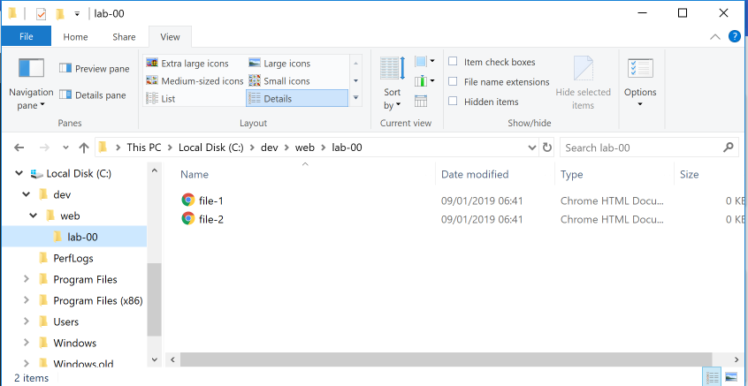
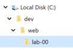
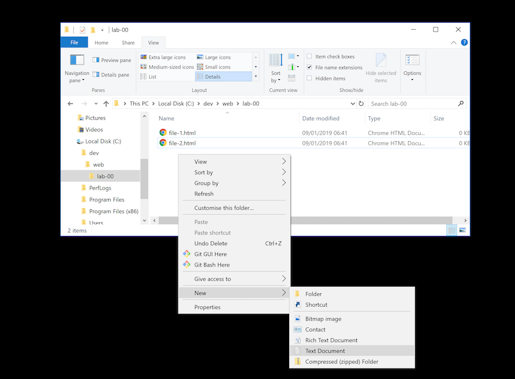
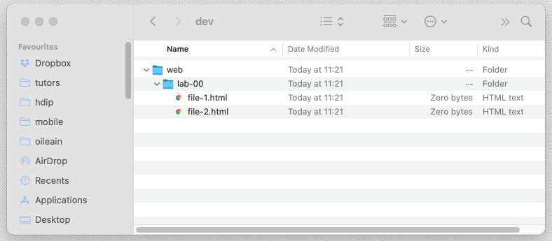
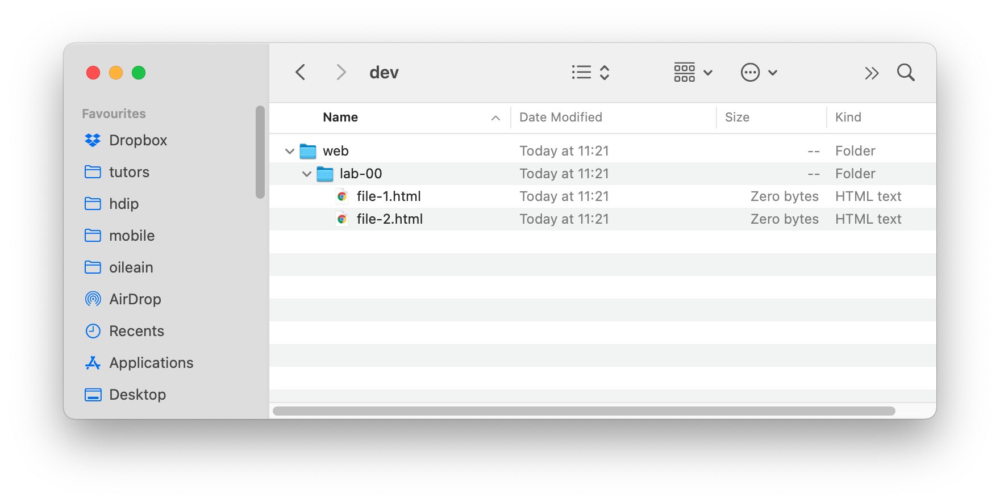
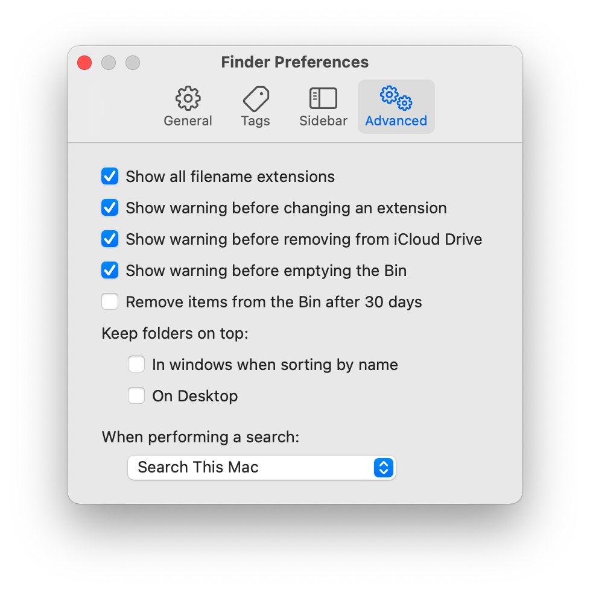

# File Explorer

When working on windows - an important setting in the File Explorer tool is to always reveal the `file name extensions` of files when browsing the file system.

## File Explorer Configuration

Open File Explorer now on Windows - locate and show the `ribbon` (the panel with buttons along the top)

Under the `View` tab, select the `file name extensions` item, and notice the subtle change on the way file1 and file2 are represented.

## Creating Folders

With this setting in place, now create the following folder structure on your workstation:

That is, we have created

- a folder called `dev` on the C: drive,
- a folder `web` inside that
- another folder `lab-00` in `web`.

You should be able to do all of this from within file File Explore itself.

## Creating Files

Create some empty files in lab-00 - called `file-1.html` and `file-2.html`

One way of doing this is to create the files from inside the file explorer windows via a right mouse click:

In the above, notice that we are selecting "Text Document" as the file type. Also notice that we rename the files we create to 'file-1.html' and 'file-2.html' from the default name windows suggests.

See if you can replicate the above precisely.

## Mac Finder

On the Mac - the equivalent of Explorer is Finder:

And it operates in a similar manner. Make sure in Finder Preferences you show all file name extensions:

