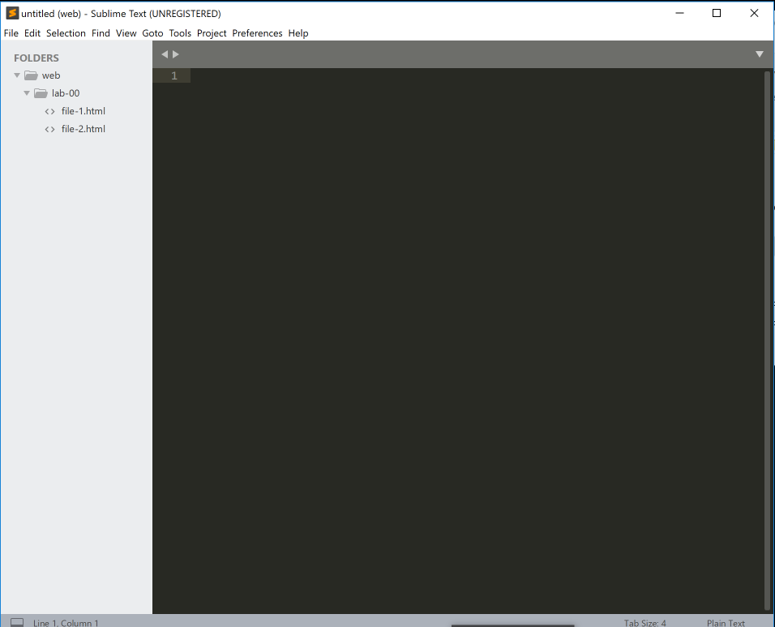

## Editing in Sublime

With this folder structure created, we an open Sublime

Then we open the `web` folder so that the folder + subfolders and files are visible from a side bar in Sublime:

There are a number of ways of enabling this view. One way is to `drag and drop` the web folder onto the sublime canvas. The sidebar may appear immediately - or you may need to specifically show it via the `view->sidebar` menu option.

You should now be able to select and edit any file in the folders. Try it now and verify that you can enter some random text, save the files, close and reopen sublime to verify that the contents have been retained.

It is important to regularly save your work. In sublime if you go to close your files it will prompt you to see if you want to save your work (if it has changed). However better practice to regularly save as you work.
