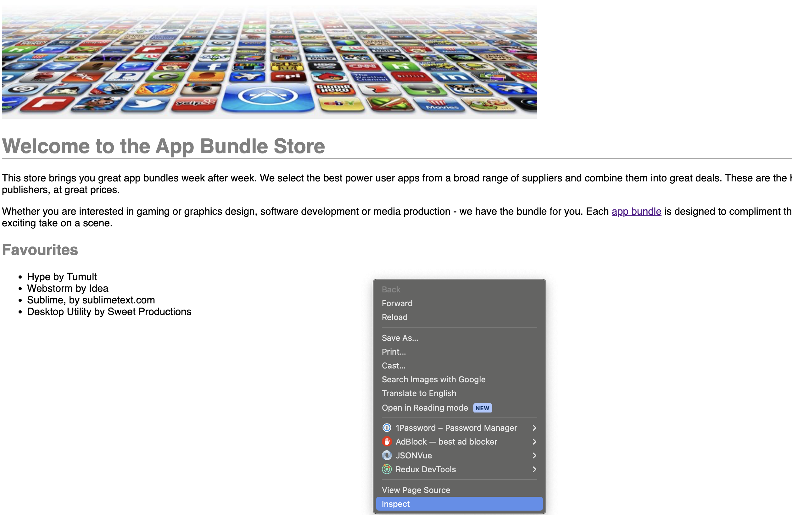
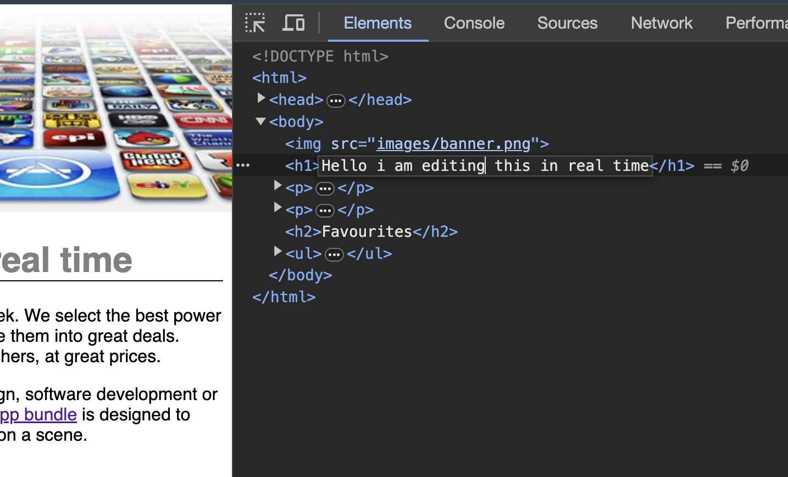
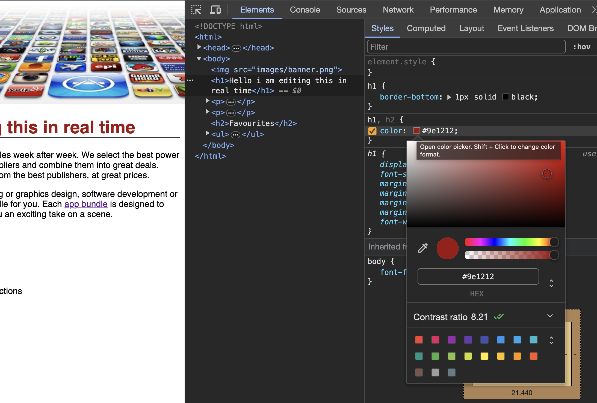

# The Chrome Dev Console

If you do not have the Google Chrome Web Browser installed on your workstation - then please do so now. You can download it here:

[Download Chrome Here](https://www.google.com/chrome/)

The Chrome browser is a very popular browser, and is used by many web developers. It has a very useful feature called the "Developer Console". This is a tool that allows you to inspect the HTML and CSS of a web page. It also allows you to interact with the page in real time, and see the effect of changes to the HTML and CSS.

The Chrome Dev Console is a very useful tool for web development. It is also available in other browsers, but we will use Chrome for this course.

## Opening the Dev Console

To open the Dev Console, open the Chrome browser on index.html page. Then, right click on the page, and select "Inspect" from the context menu:

## Editing HTML in the Dev Console

Ensure the Element tab is selected, expand all the HTML elements in the Element tab by clicking on the arrows, and then click on the `<h1>` element, double clicking will allow you to edit the text.  Edit it and press enter.  Your webpage will change immediately.

Refresh the page, you will see that the change you made is not permanent.  This is because you are editing the HTML in the browser, not the file on your computer.  The Dev Console is a great tool for experimenting with HTML and CSS.

## Editing CSS in the Dev Console

With the Elements tab select and the `<h1>` element still selected, click on the Styles tab.  You will see the CSS that is applied to the `<h1>` element.  Click on the color value and change it to red.  Your webpage will change immediately.  This can be done in the `h1,h2` rule.

That's it!  You are now a web developer! Your paycheck is in the mail.

Please move on to the next section.