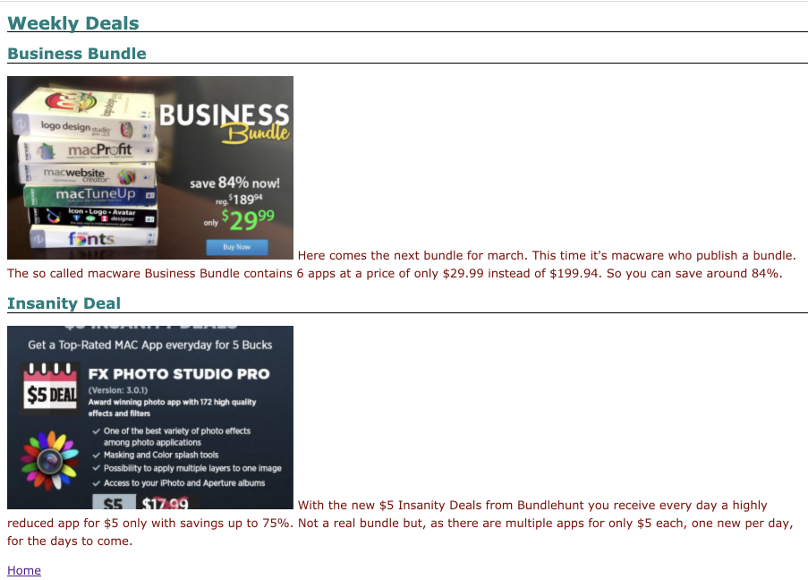
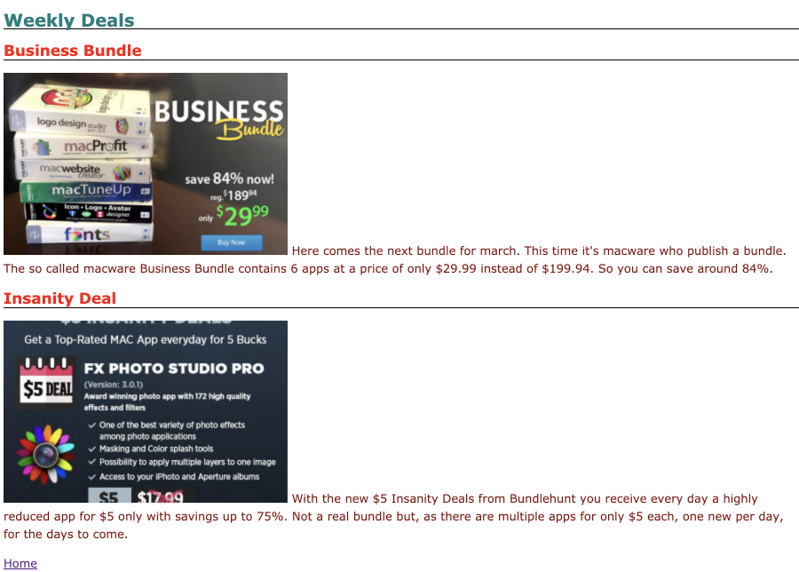

# Classes

Open the deals page:

## deals.html

```html
<!DOCTYPE html>
<html>
  <head>
    <title>App Bundle Deals</title>
    <link rel="stylesheet" href="../style.css" />
  </head>
  <body>
    <h1>Weekly Deals</h1>
    <h2>Business Bundle</h2>
    <p>
       Here comes the next bundle for march. This time it's
      macware who publish a bundle. The so called macware Business Bundle contains 6 apps at a price of only $29.99
      instead of $199.94. So you can save around 84%.
    </p>
    <h2>Insanity Deal</h2>
    <p>
       With the new $5 Insanity Deals from Bundlehunt you
      receive every day a highly reduced app for $5 only with savings up to 75%. Not a real bundle but, as there are
      multiple apps for only $5 each, one new per day, for the days to come.
    </p>
    <a href="../index.html">Home</a>
  </body>
</html>
```

Modify the two `<h2>` elements as follows:

```html
...
<h2 class="special">Business Bundle</h2>
...
<h2 class="special">Insanity Deal</h2>
...
```

We are 'marking' these elements - this will have no difference on the current display:



Back in our style sheet, include this extra rule:

```html
.special { color: red; }
```

Save, and reload the page:



The targeted headings should be red.
