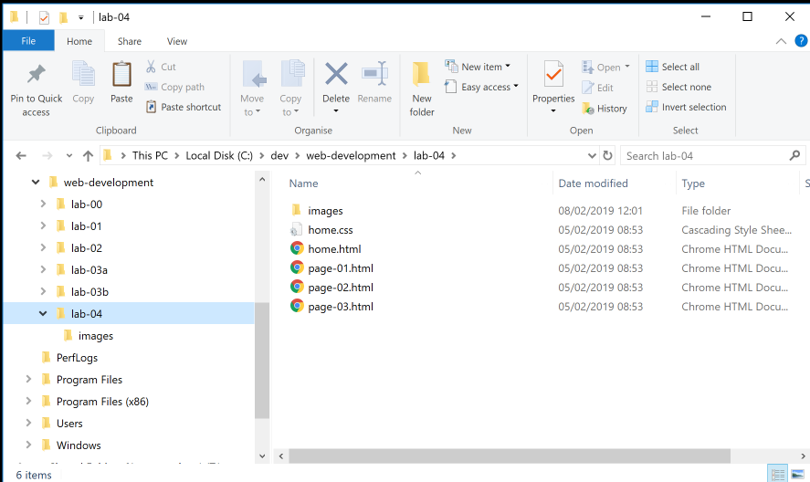

# Explorer & Command Prompt (Windows)

## Explorer

You may be already familiar with the windows Explorer application:

In particular, you should get used to understanding and managing the structure of folders based in on your `C:` drive:

Your web development folder might be something like this:

It is not essential that it mirrors this precisely, but it should be comparable.

## Command Prompt

Open a command prompt on Windows. The easiest way to do this is in Windows to type 'cmd' in the Search Box on the Windows start menu:

From now on, you will be using this command line regularly - so we can 'pin' it to the task par for convenience (do this by right clicking):

This should make it appear on the end of the taskbar like this (icon on extreme right):

Now, you can launch it from the taskbar whenever you need it:

Try out the `dir` command:

Also experiment with closing and reopening the console application.

# Finder & Terminal

On Mac, the equivalent of Explorer is Finder:

The equivalent of the Command prompt is Terminal, to launch the terminal, check out this website:

[Launching the Terminal on OSX](https://support.apple.com/en-ie/guide/terminal/apd5265185d-f365-44cb-8b09-71a064a42125/mac)

It is also possible to open the terminal by searching for it in the spotlight search (magnifying glass in the top right of the screen or by pressing `cmd` + `space`).

# Alterative Terminal Application

If you are using OSX, you might want to consider using iTerm2 instead of the built in terminal application.

- <https://www.iterm2.com>

This is a more convenient implementation of the built in terminal application. 
