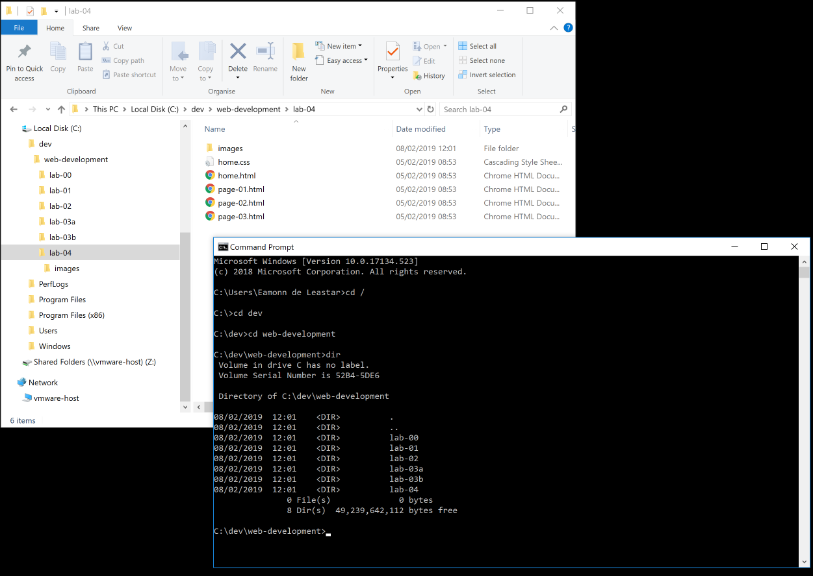

# Command Line (Windows)

The command line is an alternative interface to Windows which, as a developer, is important to become familiar with. In this window you can type what are sometimes called `DOS` commands. These commands let you have a finer level of control of your PC, and are particularly important for programmers to master.

Here are some simple commands:

- **dir**: list all files in a directory
- **cd ..**: change to a parent directory
- **cd  *directory_name***: change to a specific directory

It is important that you become adept at these commands over time. In particular, it is important to relate the command prompt and the explorer view. The command prompt is always opened *inside* a specific folder 



In the above, we have started a command prompt, and entered the following commands:

```bash
cd /
cd dev
cd web-development
dir
```

These commands did the following:

- change the folder the `root` of the current drive
- change into the `dev` folder in root
- change into the `web-development` folder in `dev`
- list all the files and folders in that folder

Note in all of the above that the 'prompt' in the command window is always showing the `current` drive/directory. Try now to perform the equivalent on your workstation. You may not have exactly the same file names ... so adjust as necessary.

Also, if you have a 'space' in your directory name (a bad idea generally), then you will have to use quotation marks in the commands. This can get difficulty to type, so in general it is best to adopt the following conventions:

- Never use spaces in directory or file names
- Never use upper case in directory or file names
- If you wish to use readable multiple words for a directory or file name, separate the words with '-'. e.g.
  - web-development
  - java-projects

Perhaps you might take this opportunity to adjust your workspace and projects to adopt the above conventions. If you do, then you will find that using commands to navigate your folders will be considerably easier.

Before going on to the next step, make sure you are comfortable navigating in the command console around the file system, and in particular make sure you can navigate to your web development workspace.

Also, get used to using File Explorer/Finder in parallel - keeping an eye on where you are in the folder tree structure.

Finally, this 15 minute tutorial on the DOS command line might be worth skimming:

- <https://bit.ly/cmd-prompt-tutorial>

The Command line we have been touring here has largely been superseded by a newer application called `Powershell`. However, we will stick to the this one here for the moment.

## Command Line (Mac)

Commands on the mac as similar - review this short tutorial here for the basics:

- <https://www.macworld.co.uk/feature/mac-software/how-use-terminal-on-mac-3608274/>
