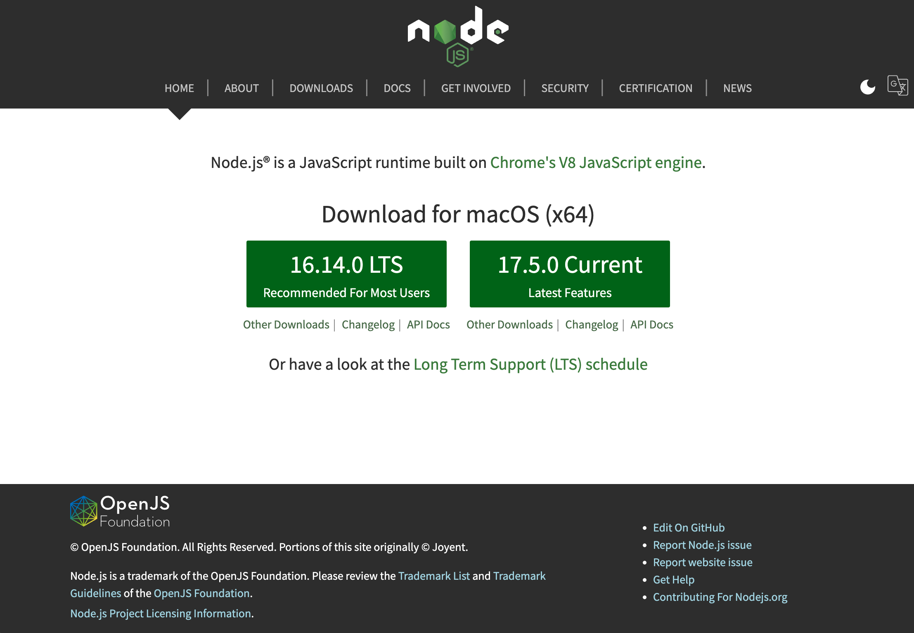

# Installing Git & Node.js

## Install Git

Although we will not be using it directly for the moment, download and install Git:

- <https://git-scm.com/>

You can accept all defaults during the install.

## Installing Node

We will now install a platform to enable us to use a local web server + templating tools.

First, install an application called node.js on your workstation:

- <https://nodejs.org/en/>



Download, select and install the `LTS` version (on the left) for your platform. Accept all defaults during the installation.

If the installation was successful, then you will have a new command called `node` installed on your system. You can test it by entering this on a command prompt:

```
node -v
```

The response should be a version number. Make sure it matches the latest LTS version above.
