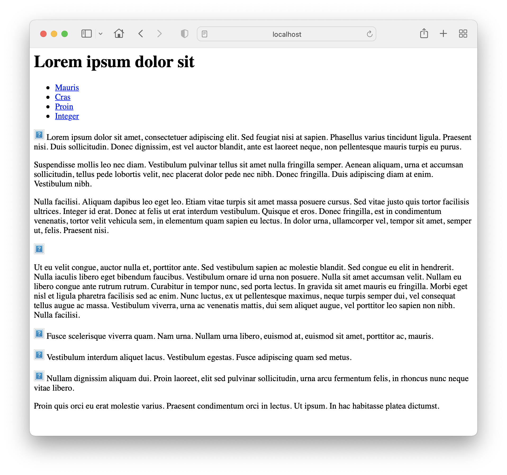

# Project Setup

As an experiment, get the solution to last weeks lab:

- <https://github.com/wit-hdip-comp-sci-2022/grid-layout/releases/tag/lab.04.exercises>

Unzip the project, and place its contents into a folder called **lab-05a**:

Look carefully in explorer/finder at your project, it should be structured something like this:

```bash
└── lab-05a
    ├── css
    │   ├── grid.css
    │   ├── home.css
    │   ├── image.css
    │   └── nav.css
    ├── home.html
    ├── images
    │   └── placeholder.png
    ├── page-01.html
    ├── page-02.html
    └── page-03.html
```

Verify the folder structure by inspecting it in Explorer/Finder - make sure it is as above.

Now, rename **home.html** to **index.html**

Open **index.html** and verify that you can navigate the site. You will notice that it seems to load ok initially, but the link to the home page is broken. This is because of the link to this page is still set to **home.html**. Edit *all* the html files, and fix this link:

~~~html
          <li class="active"><a href="index.html">Mauris</a></li>
~~~

Make sure all links work now.

Now, open a command prompt/shell, and change into the **lab05a** folder using the **cd** command.

Note: A shortcut to doing this is to open a shell, enter "cd " (include the space) and then *drag & drop* a folder from explorer/finder directly onto the command prompt - then press return.

 To confirm that the current folder is correctly set, enter:

##### On Windows

~~~bash
dir
~~~

##### On Mac/Linux

~~~bash
ls
~~~

You should see a list of the files:

~~~bash
css		
index.html	
images		
page-01.html	
page-02.html	
page-03.html
~~~

### Eleventy

Still on the command line, and inside the lab05a folder, enter:

~~~bash
npm init -y
~~~

This will respond with:

~~~bash
{
  "name": "lab05a",
  "version": "1.0.0",
  "description": "",
  "main": "index.js",
  "scripts": {
    "test": "echo \"Error: no test specified\" && exit 1"
  },
  "keywords": [],
  "author": "",
  "license": "ISC"
}
~~~

This will have created a new file in your folder:

- package.json

It will contain the contents just listed above.

Your folder should look like this now:

~~~bash
└── lab-05a
    ├── css
    │   ├── grid.css
    │   ├── home.css
    │   ├── image.css
    │   └── nav.css
    ├── index.html
    ├── images
    │   └── placeholder.png
    ├── package.json
    ├── page-01.html
    ├── page-02.html
    └── page-03.html
~~~

Now enter the following command:

~~~bash
eleventy
~~~

It will respond with:

~~~bash
[11ty] Writing _site/page-03/index.html from ./page-03.html (liquid)
[11ty] Writing _site/page-02/index.html from ./page-02.html (liquid)
[11ty] Writing _site/index.html from ./index.html (liquid)
[11ty] Writing _site/page-01/index.html from ./page-01.html (liquid)
[11ty] Wrote 4 files in 0.06 seconds (v1.0.0)
~~~

Your project will now have an additional folder called **_site**, structured like this:

~~~bash
└── lab-05a
    ├── _site
    │   ├── index/html
    │   ├── page-01
    │   │   └── index.html
    │   ├── page-02 
    │   │   └── index.html    
    │   └── page-03    
    │       └── index.html    
    ├── css
    │   ├── grid.css
    │   ├── home.css
    │   ├── image.css
    │   └── nav.css
    ├── index.html
    ├── images
    │   └── placeholder.png
    ├── package.json
    ├── page-01.html
    ├── page-02.html
    └── page-03.html
~~~

This is a generated version of the site, created when we ran the **eleventy** command. It will be generated afresh every time you run the command. To verify this:

- Delete the **_site** folder

- Run **eleventy** again
- Verify that **_site** has been regenerated

Try opening **_site/index.html**. You will notice that, although the content is available, the styles are not applied and also the links no longer work.

Now try the following command:

~~~bash
eleventy --serve
~~~

You should see on the command line:

~~~bash
[11ty] Writing _site/index.html from ./index.html (liquid)
[11ty] Writing _site/page-02/index.html from ./page-02.html (liquid)
[11ty] Writing _site/page-01/index.html from ./page-01.html (liquid)
[11ty] Writing _site/page-03/index.html from ./page-03.html (liquid)
[11ty] Wrote 4 files in 0.23 seconds (v1.0.0)
[11ty] Watching…
[Browsersync] Access URLs:
 ----------------------------------
    Local: http://localhost:8080
 External: http://192.168.1.90:8080
 ----------------------------------
[Browsersync] Serving files from: _site
~~~

Now open a browser at this address:

- <http://localhost:8080>

The Local address may vary slightly on your installation, so use whatever is reported on your console.

The page should open, however it will still be 'broken' - no styles and no links working:



On the command prompt/shell where you ran the eleventy server, Press Ctrl-C to stop the server - bringing you back to the command line prompt.
