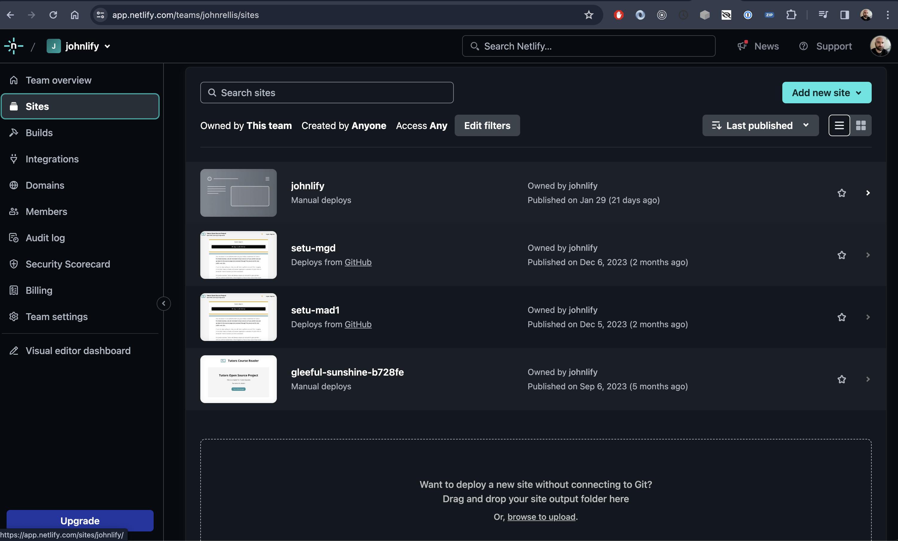
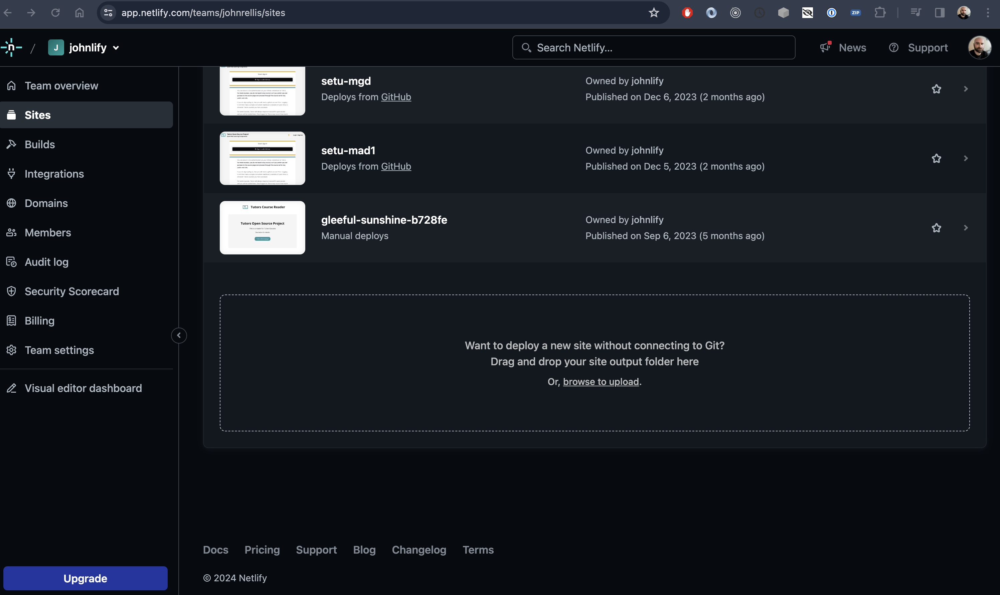
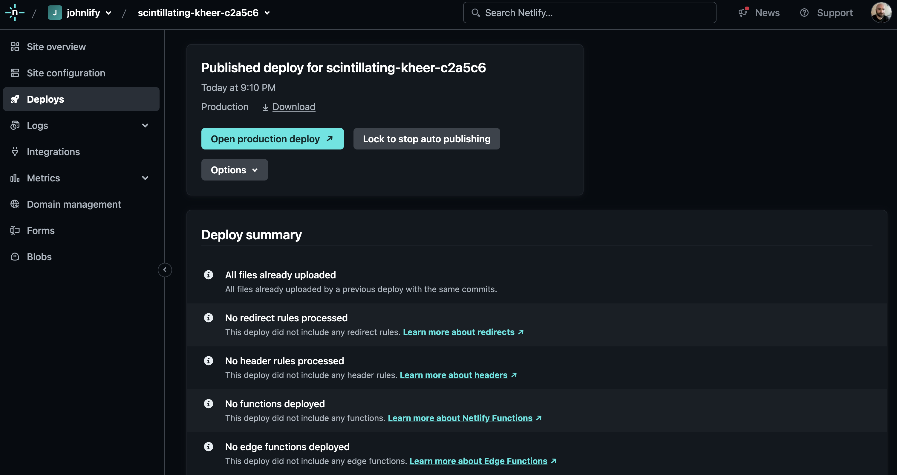
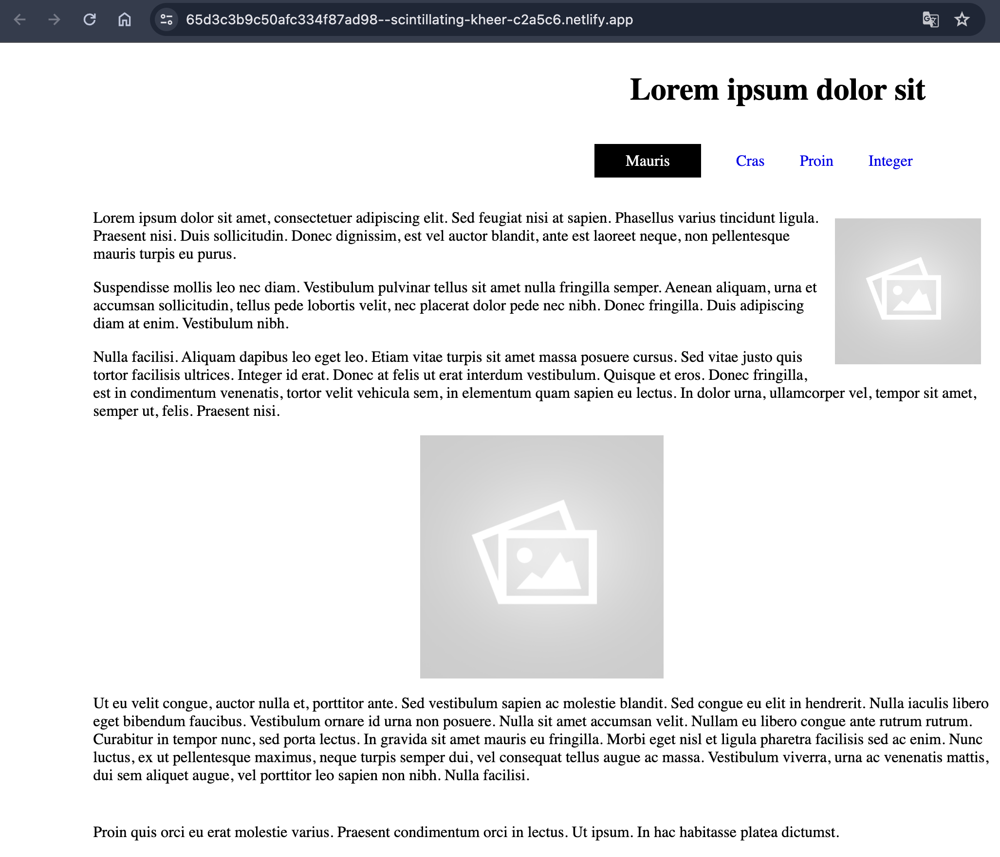
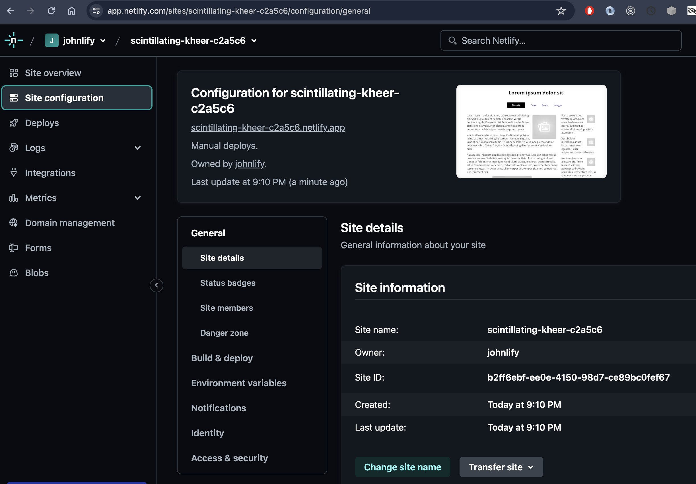
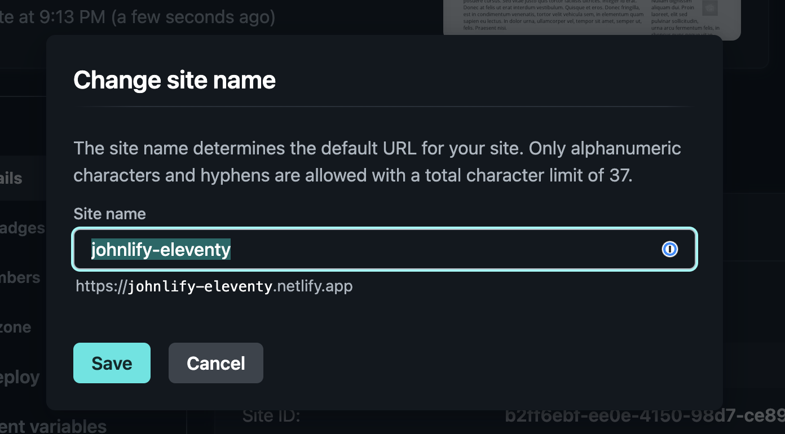

# Deploy

Create an account on this service:

- <https://www.netlify.com/>

When you log in, you should see a page something like this:

Make sure you have generated the latest version of your site:

~~~bash
eleventy
[11ty] Writing _site/page-01/index.html from ./page-01.html (liquid)
[11ty] Writing _site/page-03/index.html from ./page-03.html (liquid)
[11ty] Writing _site/index.html from ./index.html (liquid)
[11ty] Writing _site/page-02/index.html from ./page-02.html (liquid)
[11ty] Copied 5 files / Wrote 4 files in 0.09 seconds (v1.0.0)
~~~

Now, drag and drop the generated **_site** folder to the drop zone as shown above. This will deploy the site in a few seconds:

The site is available on the link shown, click "Open Production deploy"

Open the site now and confirm that it works as expected. This site is now available globally via this link.

This link is not very friendly however, so we should change it. Navigate back to Netlify and select the `Site Configuration` tab and then "Change site name"

The name must be unique globally - so the above name will not work as is, so append your initials, the date or whatever scheme make sense.
