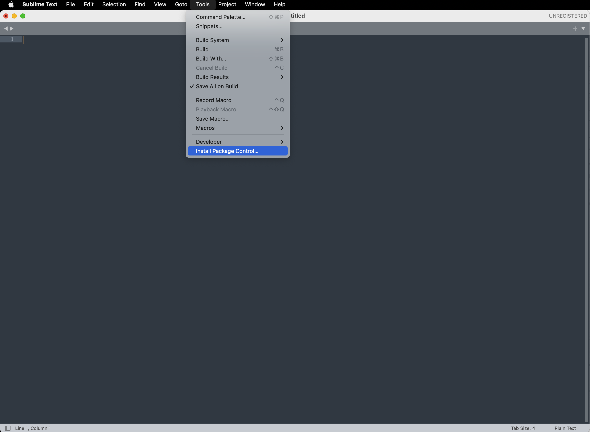
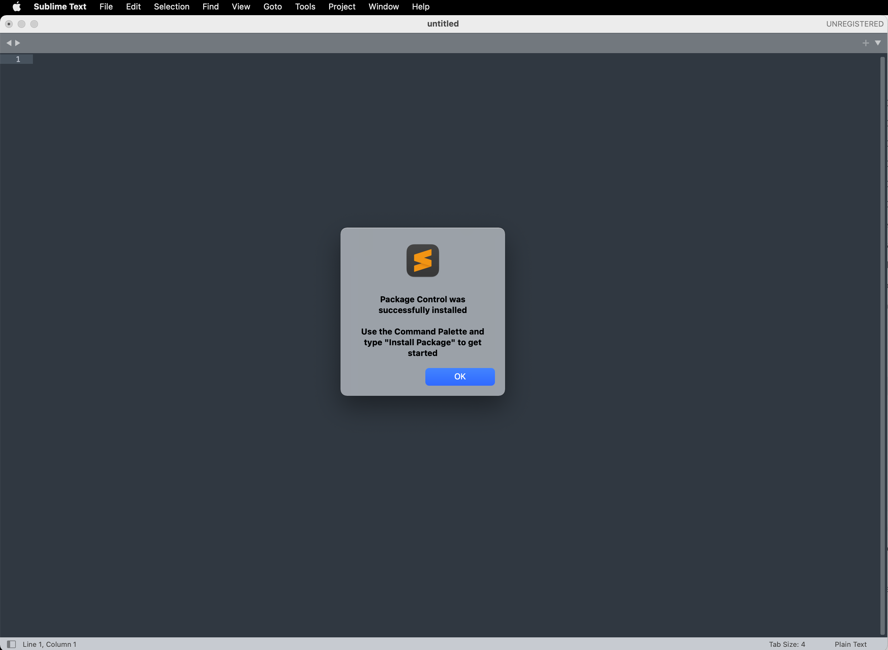
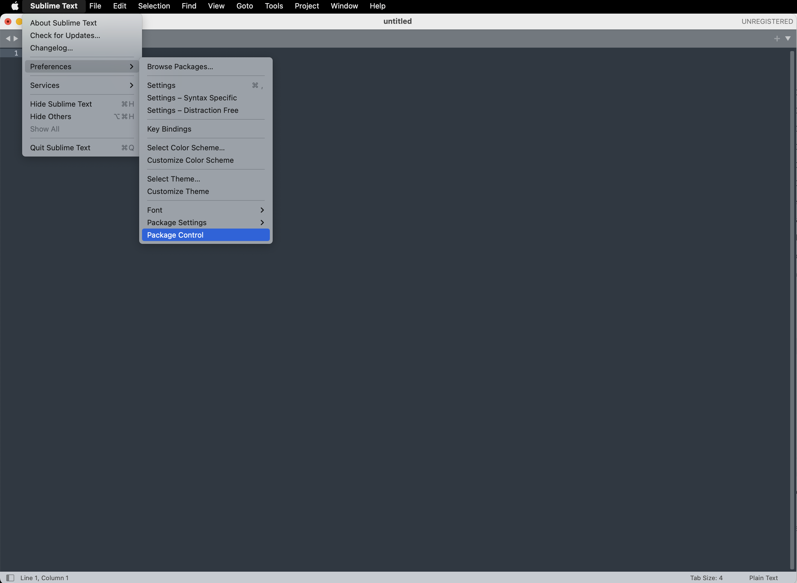
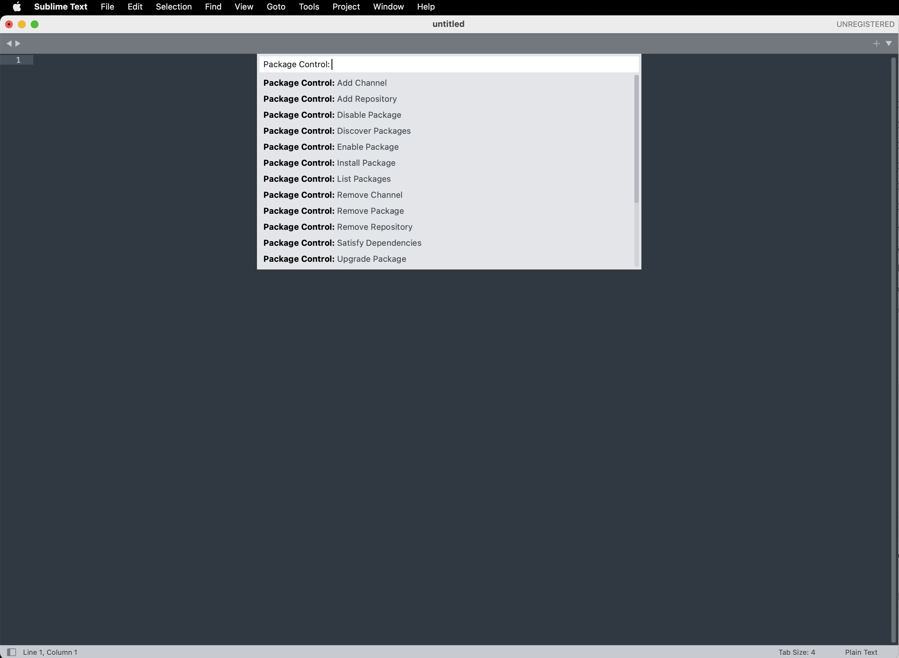
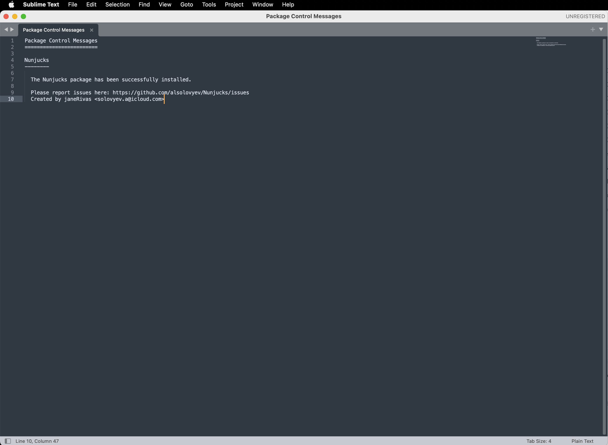
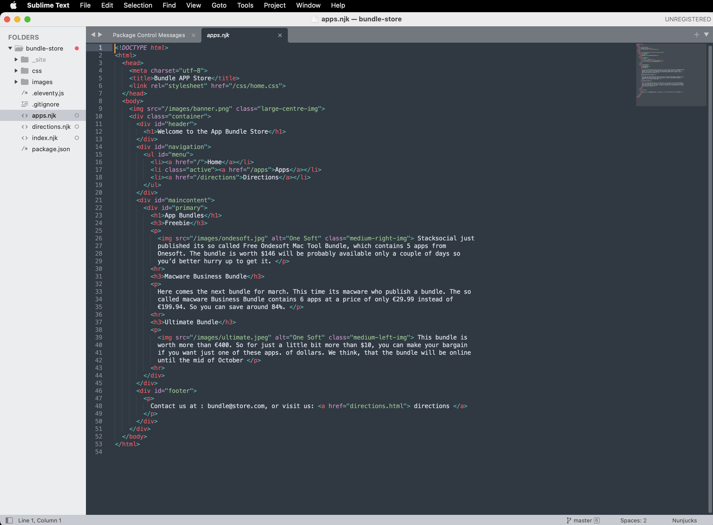
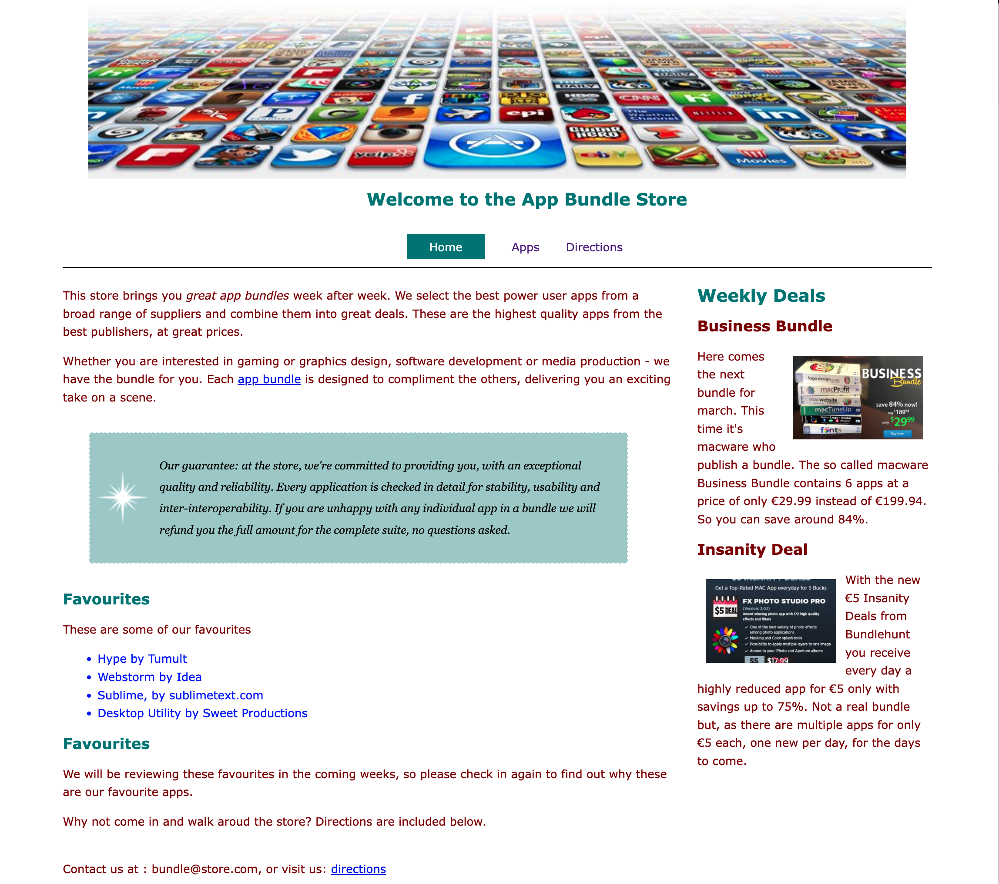

# Nunckucks

Currently all our markup is captured in **.html** files. However, strictly remaining with valid html files can be challenging for the development and maintaince of more sophisticated sites. In Web Development, a variety of **Templating Languages** fulfil various roles in more productive web development. Many of these languages are supersets of html.

We are going to switch all our html files to use the Nunchucks format, a superset of HTML:

- <https://mozilla.github.io/nunjucks/>

Start by rename all of the **.html** files to  use **.njk** file extension.

```bash
 └── bundle-store
      ├── apps.njk
      ├── css
      │   ├── grid.css
      │   ├── home.css
      │   ├── image.css
      │   └── nav.css
      ├── directions.njk
      ├── images
      │   ├── background.gif
      │   ├── banner.png
      │   ├── business.png
      │   ├── insanity.jpg
      │   ├── ondesoft.jpg
      │   └── ultimate.jpeg
      └── index.njk
```

Once the files have been renamed, your Sublime editor may no longer display the files with the helpful syntax colouring we expect from a programmers editor. We can configure Sublime to support Nunchucks however.

First, Select Tools->Install Package Controller...





Then select Preferences(or Settings)->Package Control:





Select **Install Package** and enter search for "nunchucks":



If installed successfully, when we open our project, we should expect syntax highlighting to be restored for njk files:



Having made all of the above changes, make sure web site is still available:

~~~bash
eleventy --serve
~~~

You may already be running the above command. Your site should still be available here:

- <http://localhost:8080/>

The site should display correctly:


