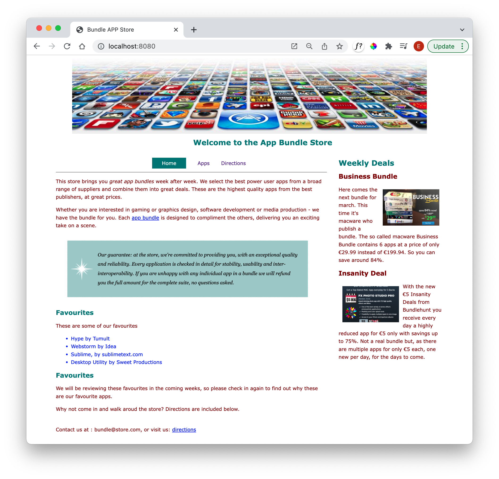
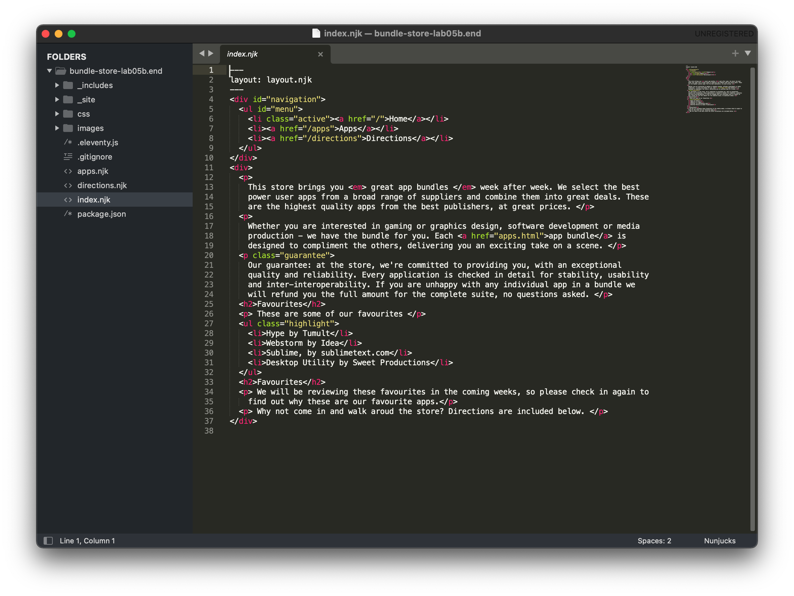

# Setup

This assumes you have completed lab 05b:

- <https://github.com/wit-hdip-comp-sci-2022/bundle-store/releases/tag/lab05b.end>

You can use your solution, or download the version above. If you do use this solution, you will need to:

- Extract the archive
- Open a Command Prompt/Terminal and navigate to the expanded archive
- Run this command:

~~~
eleventy --serve
~~~

- Open this site in the browser:

- <http://localhost:8080/>

You should see this site:

If you open Sublime text editor, the project may look like this:

## Notes

If you don't see the image and styles, be sure you have the `.eleventy.js` file that is included in the zip.