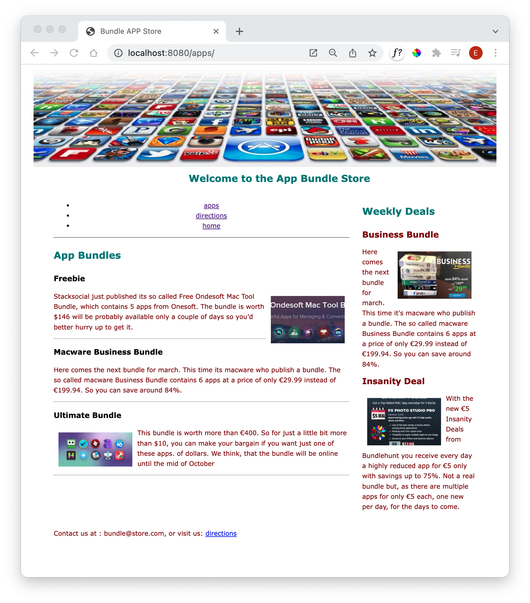

# Navigation Plugin

The Eleventy Navigation Plugin can provides support for managing navigation in a web site:

- <https://www.11ty.dev/docs/plugins/navigation/>

Getting this plugin working, requires a few one-off steps. 

First, stop running eleventy by entering Ctrl-C. The, in the same folder, enter the following command:

~~~bash
npm install @11ty/eleventy-navigation -D
~~~

You will see something like this:

~~~bash
added 2 packages, and audited 3 packages in 2s

1 package is looking for funding
  run `npm fund` for details

found 0 vulnerabilities
~~~

Next, open your **.eleventy.js** file (in your project folder). Currently it looks like this:

~~~javascript
module.exports = function(eleventyConfig) {
  eleventyConfig.addPassthroughCopy("css");
  eleventyConfig.addPassthroughCopy("images");  
};
~~~

Edit it to look like this:

~~~javascript
const eleventyNavigationPlugin = require("@11ty/eleventy-navigation");

module.exports = function(eleventyConfig) {
  eleventyConfig.addPassthroughCopy("css");
  eleventyConfig.addPassthroughCopy("images");  
  eleventyConfig.addPlugin(eleventyNavigationPlugin);
};
~~~

The above installs and configures the plugin for use in our project.

Each of our main pages will now need to be updated. We will be changing just the opening section - sometimes called the **Front Matter** section, delimited by `---` characters

At the start of each page, include this new section:

### index.njk

~~~markdown
---
layout: layout.njk
eleventyNavigation:
  key: Home
---
~~~

### apps.njk

~~~markdown
---
layout: layout.njk
eleventyNavigation:
  key: Apps
---
~~~

### directions.njk

~~~markdown
---
layout: layout.njk
eleventyNavigation:
  key: Directions
---
~~~

This section is not HTML, but it provides **metadata** about the page.

Now, change the nav partial to look like this:

### nav.njk

~~~html
 <nav id="navigation">
   {{ collections.all | eleventyNavigation | eleventyNavigationToHtml | safe }}
 </nav>
~~~

Make sure the eleventy sever is running:

~~~bash
eleventy --serve
~~~

The site will look like this:

The navigation should work - but has lost its style, and also the highlighting. We will fix this in the next step.

