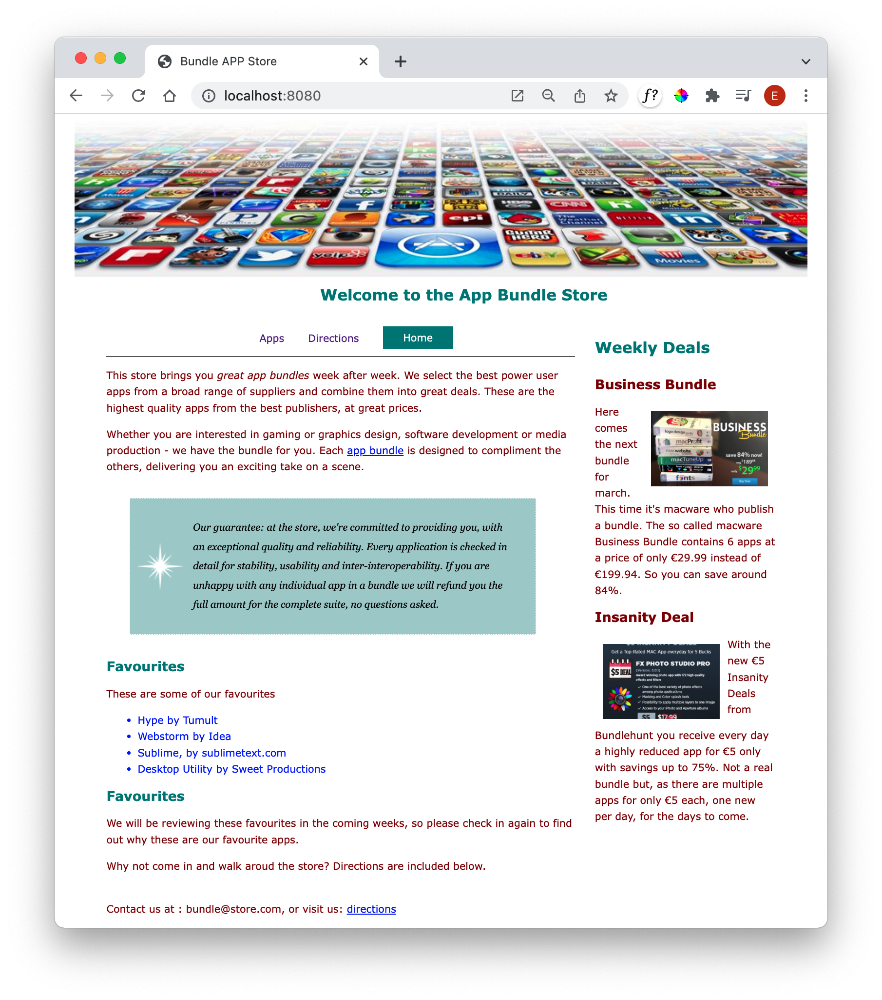
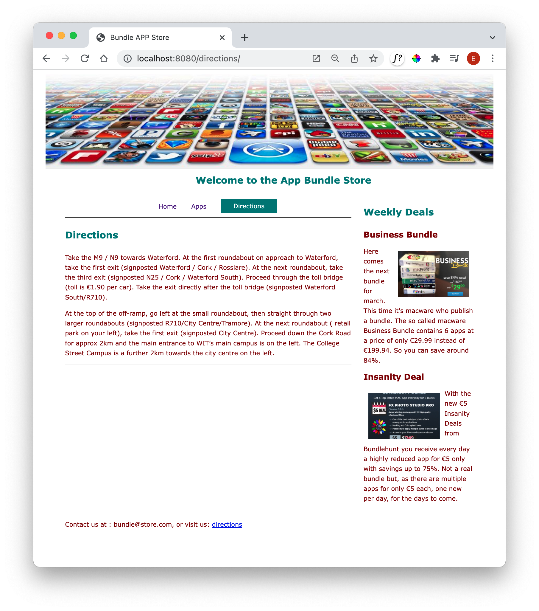

# Navigation Element

This is a revised nav.njk partial:

### nav.njk

~~~html
<nav id="navigation">
  
  <ul id="menu">
    
      <li class="active" >
        <a href="{{ entry.url | url }}">{{ entry.title }}</a>
      </li>
    
  </ul>
</nav>
~~~

This contains some specialised Nunchuck programming - which is not necessary to understand at this stage. However, you should be able to see the **menu** and **active** classes in use above. These are the styles we have designed to support the active tab presentation.

The site should now render more or less correctly:

However, the order seems to be incorrect - Home is last rather than first.

This is easily fixed by one more change to  front matter sections of each page, introducing an order parameter:

### index.njk

~~~markdown
---
layout: layout.njk
eleventyNavigation:
  key: Home
  order: 1
---
~~~

### apps.njk

~~~markdown
---
layout: layout.njk
eleventyNavigation:
  key: Apps
  order: 2
---
~~~

### directions.njk

~~~markdown
---
layout: layout.njk
eleventyNavigation:
  key: Directions
  order: 3
---
~~~

Check now that the navigation section is back in sequence:

