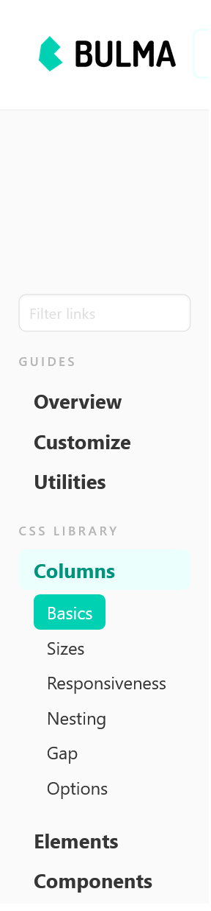

# Container

The CSS framework we are using is documented here:

- <https://bulma.io/documentation/components/>

Select 'Menu' to reveal Bulma's Columns, Elements, Components, Forms and Layouts:

We will be using perhaps 6 or 7 of these components.

The first one we will implement is container, you can find this under the Layout option in the menu:

- <https://bulma.io/documentation/layout/container/>

The container is a simple utility element that allows you to center content on larger viewports. It can be used in any context, but mostly as a direct child of one of the following:

We will add 'container' to the body element in the layout.njk:

### layout.njk

~~~html
  ...
    <body class="container">
  ...
~~~

All we have done is revise the 'body' element to have a class 'columns'. 

Make sure the change now, and make sure it adjust the margins like this:

Review the documentation again to get a general understanding of the Container style:

- <https://bulma.io/documentation/layout/container/>