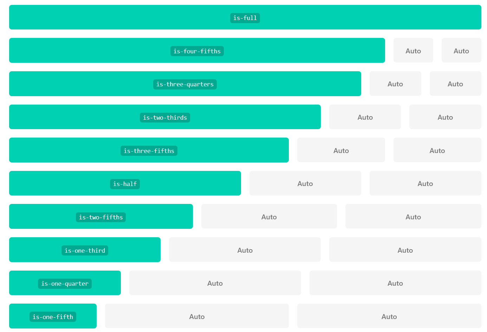

# Grid

We have carefully used the new grid CSS standard in our project, but have now removed it to use Bulma. This framework has its own grid system called Columns which is powered by Flexbox:

- <https://bulma.io/documentation/columns/basics/>

This is somewhat simpler to master, and has a number of features our implementation did not address.

Here is how we might revise `index.html` (not showing the contents of the article and the aside):

Building a columns layout with Bulma is very simple. First you add a 'columns' container. Then you add as many 'column' elements you want inside the 'columns' parent element. Each column will have an equal width, no matter how many columns.

### layout.njk

~~~html
  ...
     
    <main class="columns">  
      <section class="column is-three-quarters">   
        {{ content | safe }}
      </section>
      <aside class="column is-one-quarter">
        
      </aside>      
    </main>
    
  ...
~~~

If you want to change the size of a single column, you can use one of the following classes:
  * is-three-quarters
  * is-two-thirds
  * is-half
  * is-one-third
  * is-one-quarter
  * is-full

The other columns will fill up the remaining space automatically.

You can now use the following multiples of 20% as well:
  * is-four-fifths
  * is-three-fifths
  * is-two-fifths
  * is-one-fifth

Here is a representation of the column sizes:

When you add these class names this is the complete layout file:

### layout.njk

~~~html
<!DOCTYPE html>
<html>
  <head>
    <meta charset="utf-8">
    <title>Bundle APP Store</title>
    <link rel="stylesheet" href="https://cdn.jsdelivr.net/npm/bulma@0.9.4/css/bulma.min.css">
  </head>
  <body class="container">
    
    
    <main class="columns">  
      <section class="column is-three-quarters">   
        {{ content | safe }}
      </section>
      <aside class="column is-one-quarter">
        
      </aside>      
    </main>
    
  </body>
</html>
~~~

### header.njk

~~~html
<header class="columns">
  

    <h1> Welcome to the App Bundle Store </h1>
  

</header>
~~~

### footer.njk

~~~html
<footer class="columns">
  

    
 Contact us at : bundle@store.com, or visit us: <a href="directions.html"> directions</a> 

  

</footer>
~~~

In addition to quarters and fifths, Bulma also supports 12 column, offset columns and narrow columns in it's grid sizes:

- <https://bulma.io/documentation/columns/sizes/>

Standard CSS Grids that we used previously allowed for grids inside grids, for example deviding the centre section into a main content area and an aside. Bulma allows nested grids as a simple way to build responsive column designs. 

- <https://bulma.io/documentation/columns/nesting/>