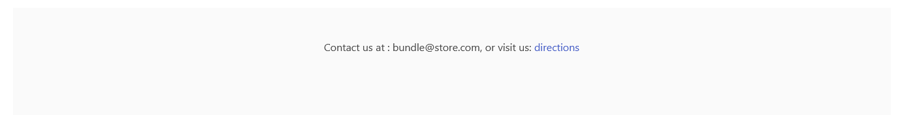

# Hero & Footer

Bulma CSS Framework layouts give us options for several common content areas such as Hero banners and Footers

- <https://bulma.io/documentation/layout/hero/>

In the header include we can change the welcome area to create an imposing hero banner to highlight the welcome text.

### header.njk

~~~html
<section class="hero">
  

    

      Welcome to the App Bundle Store
    

    

      The best App store on the internet
    

  

</section>
~~~

We have several options to change the colour and size of the hero banner. There are eight different colours to choose from using the following classes (resulting colour in brackets) after the hero class:
  * is-primary (green)
  * is-link (blue)
  * is-info (light blue)
  * is-success (brighter green)
  * is-warning (pale yellow)
  * is-danger (red)
There are also variations for the size of the hero banner:
  * is-small
  * is-medium
  * is-large
  * is-half-height 
  * is-full-height
  * is-full-height-with-nav-bar (we'll come back to this one)

Here is an example of stacking classes to add a grid line to the header class, create a full with column for the header and use *is-info* to add light blue background to an *is-small* sized hero banner:

~~~html
<header class="columns">
  

    <section class="hero is-info is-small">
      

        

          Welcome to the App Bundle Store
        

        

          The best App store on the internet
        

      

    </section>
  

</header>
~~~

Here is the resulting hero banner:

Similarly Bulma includes a Footer layout which can include lists, headings, columns, icons and buttons. Update the contents of the Footer include to have a footer class and inner div for content:

### footer.njk

~~~html
...
<footer class="footer">
  

    
 
      Contact us at : bundle@store.com, or visit us: <a   href="directions.html"> directions</a> 
    

  

</footer>
...
~~~

This creates a defined footer space at the end of the page

There are many variations to segments presented in detail in the documentation. For instance, the 'stacked' and 'piled' variations:

- https://bulma.io/documentation/layout/footer/

