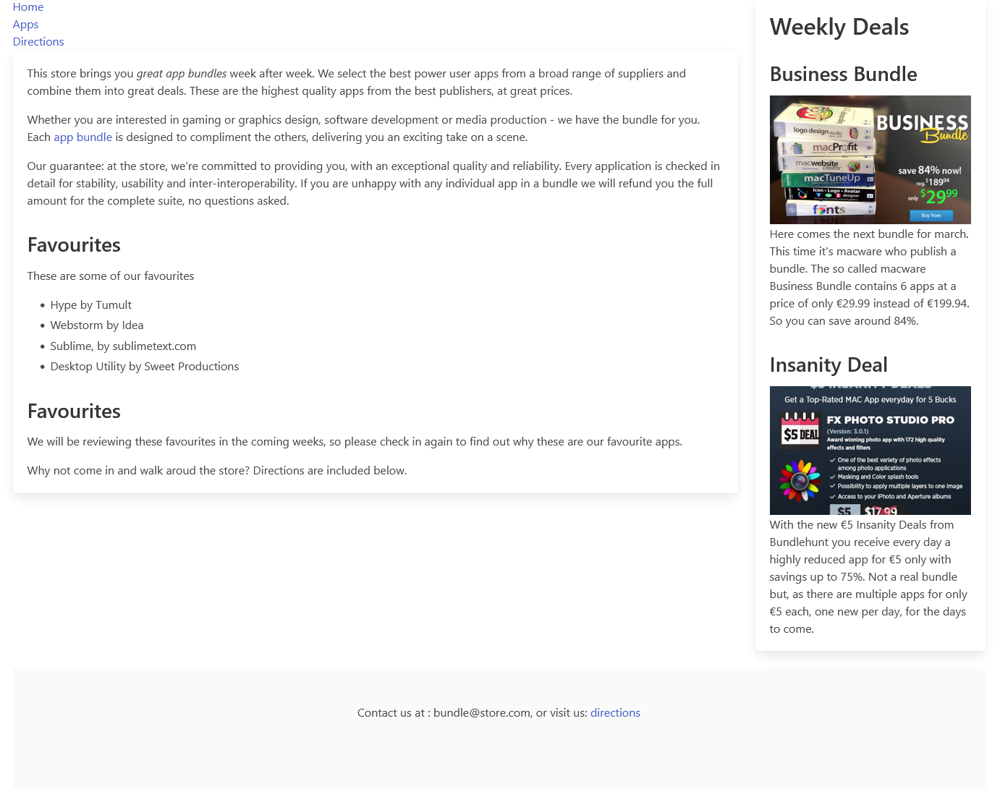
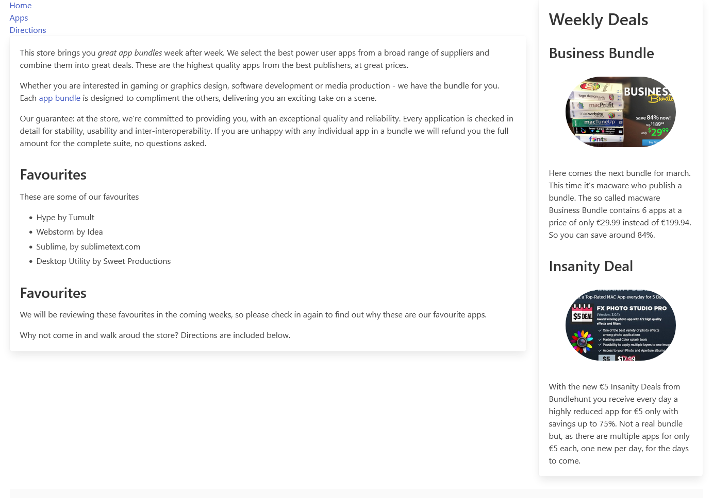

# Images

Because images can take a few seconds to load (or not at all), use the `image` container to specify a **precisely sized** container so that your layout isn't broken because of image loading or image errors.

- <https://bulma.io/documentation/elements/image/>

The header image is not displaying full width as it is only 851px wide. We would like this image to take up the full width of the screen. 

### layout.njk
Open the layout and change the class on the banner image to *image is-fullwidth*:

~~~html
...

...
~~~

### sidebar.njk
Open the sidebar and extend the image elements to have a new class 'ui image'

~~~html
...
<figure class="image ">
  
</figure> 
...
<figure class="image ">
   
</figure> 
...
~~~

The images are now resized to something more proportional to the context:

We can also impose some shape on the images:

- <https://bulma.io/documentation/elements/image/#rounded-images>

Try this:
~~~html
...
<figure class="image ">
  
</figure>
...
<figure class="image ">
   
</figure> 
...
~~~

