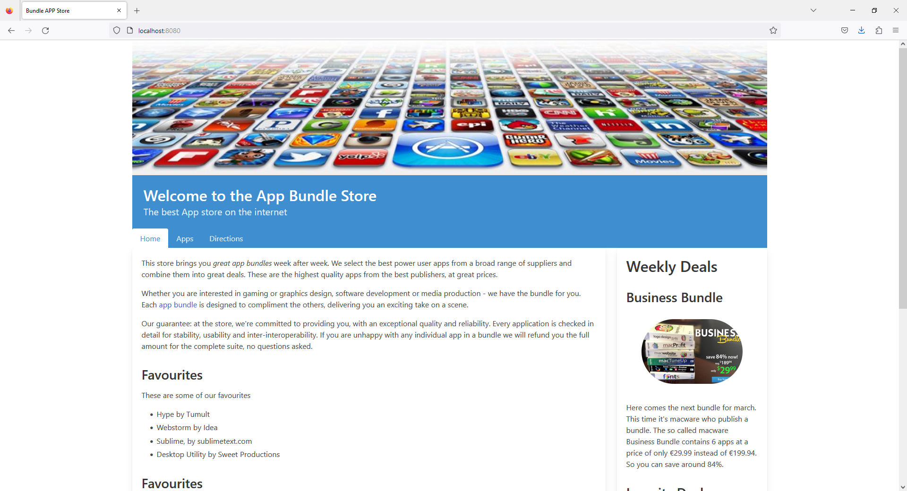

# Menus

The Bulma **navbar** component is a responsive horizontal **navbar** that can support images, links, buttons, and dropdowns.

- <https://bulma.io/documentation/components/navbar/>

Bulma also allows for navigation elements to be integrated into the Hero Banner, we are going to use this option. To do this we will move the navigation from the **layout.njk** to the Hero Banner in **header.njk**. We will use the sample navigation in `hero-foot`  as our guide

<https://bulma.io/documentation/layout/hero/#fullheight-hero-in-3-parts>

Firstly, we are going to delete the nav include in **layout.njk** before including it in **header.njk**, our content section will now look like this

#### layout.njk
~~~html
<section class="column is-three-quarters">          
  {{ content | safe }}
</section>
~~~

We will then add a new div with a class of `hero-foot`. Our nav.njk include will be inside this div. The full file will look like this:

#### header.njk
~~~html
<header class="columns">
  

    <section class="hero is-info is-small">
      

        

          Welcome to the App Bundle Store
        

        

          The best App store on the internet
        

      
      
      

        
      

    </section>
  

</header>
~~~

Here is a revised version of **nav.njk** which uses this feature:

## nav.njk

~~~html
<nav class="tabs is-boxed is-three-quarters">


  

    <ul>
            	
          <li  class="is-active"  > 
            <a href="{{ entry.url | url }}"> {{ entry.title }}</a>
          </li> 
      
    </ul>
  

</nav>

~~~

Note, as per the `hero-foot` nav example in the Bulma documentation we have changed the classes on the **nav** element. We have introduced a **div** element with a class `container`. We have also changed the active class on the list item to Bulma's `is-active`.

The navigation should work as before.

The navbar menu might be worth exploring in more detail:

- https://bulma.io/documentation/components/navbar/

