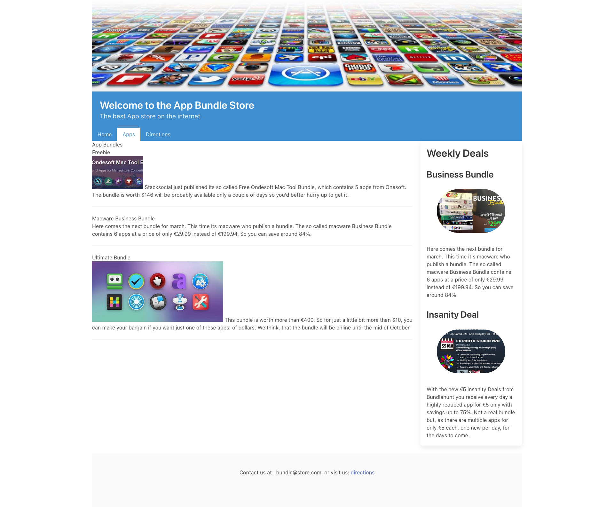
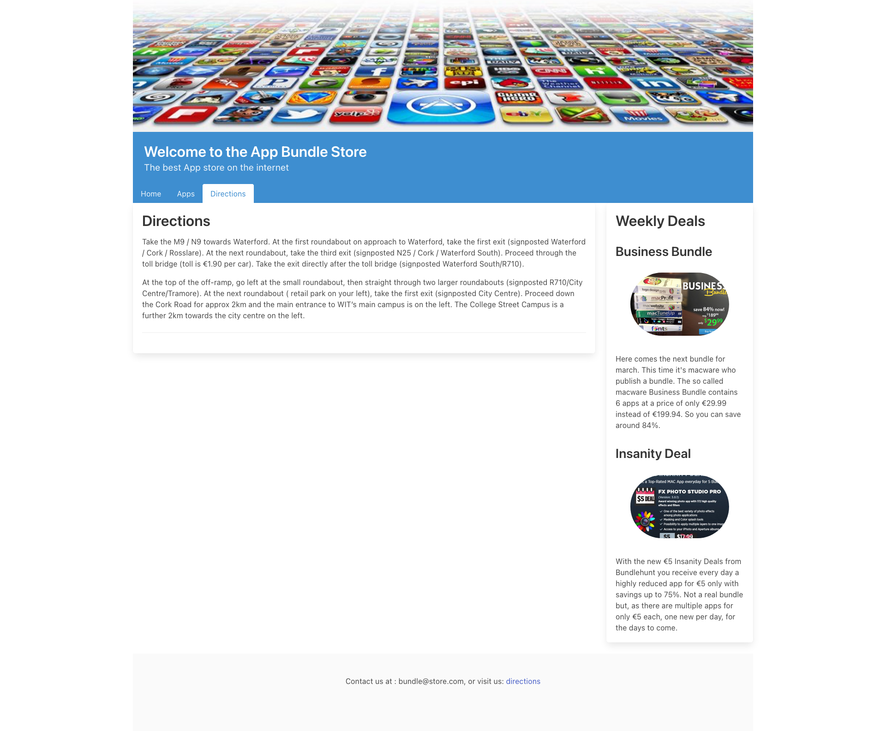

### Exercises 1:

Currently the Apps and Directions pages could be improved to also follow the box and content styles of the Home page:

### Exercises 2

Explore using Bulma's Section layout to change the look of the headings and paragraph sections on the Apps Page.

- <https://bulma.io/documentation/layout/section/>

### Exercises 3:

Have a look at the Card component:

- <https://bulma.io/documentation/components/card/>

Could you use this component productively in the sidebar?

### Exercises 4:

Experiment with other Bulma Elements, Components, Forms and Layouts to see what you can implement on your website

- <https://bulma.io/documentation/>