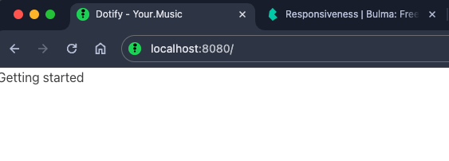

# Project

Create a new directory called `Dotify`.

Inside that, create a new file called `index.html` and a file called `README.md`

Add the following to `README.md`:

~~~
# Dotify

A web client for our music streaming service.

## Getting Started

### Install Eleventy

```bash
npm install -g @11ty/eleventy
```

### Run Eleventy

```bash
eleventy --serve
```

Now navigate to [http://localhost:8080](http://localhost:8080) to see your site.

Hot reloading is enabled, so any changes you make to your files will be reflected in the browser.

## Technologies

* [Eleventy](https://www.11ty.dev/)
* [Bulma](https://bulma.io/)

~~~

Create a new directory called `css` and a new directory called `js` and a new directory called `images`.

Your directory structure should look like this:

```bash
.
├── README.md
├── css
├── images
├── index.html
├── js
```
## HTML

Add the following to `index.html`:

```html
<!DOCTYPE html>
<html lang="en">
<head>
  <meta charset="utf-8">
  <meta name="viewport" content="width=device-width, initial-scale=1">
  <title>Dotify - Your.Music</title>
  <link rel="icon" type="image/png" sizes="32x32" href="/images/favicon.png" />
  <link rel="stylesheet" href="https://cdn.jsdelivr.net/npm/bulma@0.9.4/css/bulma.min.css" />
</head>
<body>
    <p>Getting started</p>
</body>
</html>
```

Dissecting the above:

* We have a doctype declaration - `<!DOCTYPE html>` - this is required for all HTML documents.
* We have an opening `<html>` tag with a `lang` attribute set to `en`.
* We have a `<head>` tag with a `<meta>` tag for `charset` and `viewport`. Viewport is set to `width=device-width, initial-scale=1` which is a good default for most web pages. It is important to have the viewport to ensure your web page is responsive.  Bulma is a mobile-first framework, so this is important.
  * [viewport meta](https://developer.mozilla.org/en-US/docs/Web/HTML/Viewport_meta_tag)
* We have a `<title>` tag with the text `Dotify - Your.Music`.
* We have a `<link>` tag with a `rel` attribute set to `icon` and a `type` attribute set to `image/png` and a `sizes` attribute set to `32x32`. The `href` attribute is set to `/images/favicon.png`. This is the favicon for the website. The favicon is the little icon that appears in the browser tab. It is important to have a favicon for your website. It is a small detail, but it is important.
* We have a `<link>` tag with a `rel` attribute set to `stylesheet` and a `href` attribute set to `https://cdn.jsdelivr.net/npm/bulma@0.9.4/css/bulma.min.css`. This is the Bulma CSS file. We are using a CDN to serve the CSS file. This is a good practice as it is faster and more reliable than serving the file from your own server.

Add the following images to your images directory:


Now run `eleventy --serve` and navigate to [http://localhost:8080](http://localhost:8080) to see your site.

You should see something similar to this:



Note the favicon in the browser tab, we love favicons.

Read this [wiki](https://en.wikipedia.org/wiki/Favicon) to learn more about favicons

So now that we have our project set up, we can start to build the application.

## eleventy.js

Create `.eleventy.js` in the root of your project and add the following:

```javascript
module.exports = function(eleventyConfig) {
  eleventyConfig.addPassthroughCopy("css");
  eleventyConfig.addPassthroughCopy("js");
  eleventyConfig.addPassthroughCopy("images");
};
```