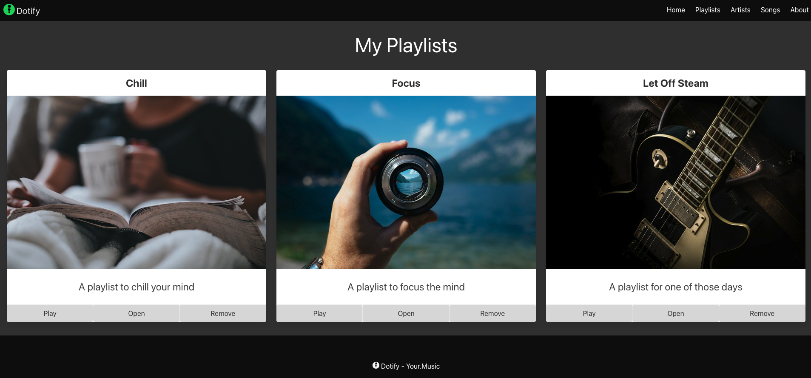
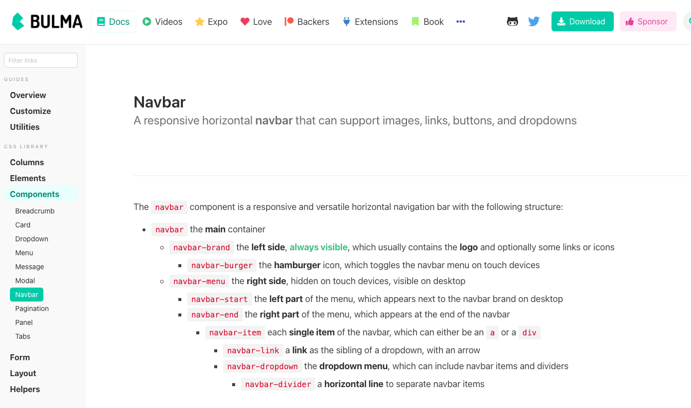
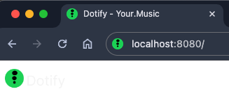
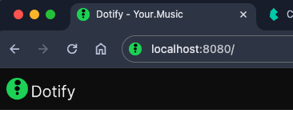
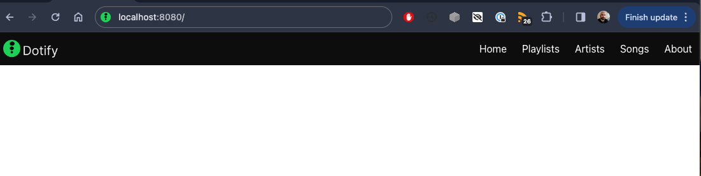

# Page Structure

Lets tackle the navigation bar at the top of the page. We will use the `navbar` component from Bulma to create a simple navigation bar.



## Navbar

Time to review the documentation for the [navbar](https://bulma.io/documentation/components/navbar/).



The navbar is a simple wrapper for positioning branding, navigation, and other elements into a concise navigation header. It's a responsive component that can be used to create a navigation bar for your website.

The navbar is a container that includes the `navbar-brand` and `navbar-menu` elements. The `navbar-brand` is the left side of the navbar and the `navbar-menu` is the right side of the navbar.

Review the bulma documentation as linked above, the navbar is made up of multiple elements so it is worth reviewing the documentation to understand how it works.

### Navbar Brand

Let's start with the brand. Add the following to the `body` tag in `index.html`:

```html
  <nav class="navbar">
    <div class="navbar-brand">
      <a class="navbar-item" href="#">
        
      </a>
    </div>
  </nav>
```

Diving into the above:

* We have a `nav` tag with a class of `navbar`. This is the container for the navbar. The class comes from Bulma.
* Inside the `nav` tag we have a `div` tag with a class of `navbar-brand`. This is the left side of the navbar. We use a div here as there is no specific tag to use for the brand in a navigation section.  We should always try to use the correct HTML tag for the job, but sometimes we have to use a `div` tag.
* We add a `navbar-item` that is a link that currently links to itself via the hash anchor.
* Next we add our logo



Hmmm, the logo isn't quite right, the logo is disappearing in the white background.

To follow the designs, we need to make the navbar black. To do this we should look at background colour [modifiers](https://bulma.io/documentation/helpers/color-helpers/#background-color).

Now we augment the navbar:

```html
  <nav class="navbar has-background-black">
```




Better.

### Navbar Menu

A navbar menu will contain all the links to navigate the website.

Add the following to your nav tag:

```html
    <div id="navbarMenu" class="navbar-menu">
      <div class="navbar-end has-background-black">
        <a class="navbar-item has-text-white">
          Home
        </a>
        <a class="navbar-item has-text-white">
          Playlists
        </a>
        <a class="navbar-item has-text-white">
          Artists
        </a>
        <a class="navbar-item has-text-white">
          Songs
        </a>
        <a class="navbar-item has-text-white">
          About
        </a>
      </div>
    </div>
```

So that the entire page looks like:

```html
<!DOCTYPE html>
<html lang="en">
<head>
  <meta charset="utf-8">
  <meta name="viewport" content="width=device-width, initial-scale=1">
  <title>Dotify - Your.Music</title>
  <link rel="icon" type="image/png" sizes="32x32" href="/images/favicon.png" />
  <link rel="stylesheet" href="https://cdn.jsdelivr.net/npm/bulma@0.9.4/css/bulma.min.css" />
</head>
<body>
  <nav class="navbar has-background-black">
    <div class="navbar-brand">
      <a class="navbar-item" href="#">
        
      </a>
    </div>
    <div id="navbarMenu" class="navbar-menu">
      <div class="navbar-end has-background-black">
        <a class="navbar-item has-text-white">
          Home
        </a>
        <a class="navbar-item has-text-white">
          Playlists
        </a>
        <a class="navbar-item has-text-white">
          Artists
        </a>
        <a class="navbar-item has-text-white">
          Songs
        </a>
        <a class="navbar-item has-text-white">
          About
        </a>
      </div>
    </div>
  </nav>
</body>
</html>
```

We now have a simple navigation bar.

