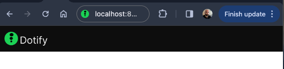
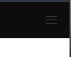
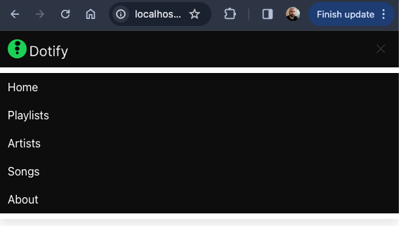

# Hamburger

Resize your browser and notice what happens to the navbar menu.



<image src="https://media.tenor.com/lndtLWwXZC0AAAAj/%D1%87%D1%82%D0%BE.gif">

Your menu has disappeared. This is because the navbar menu is hidden by default on mobile devices. This is a good thing. It is a mobile-first framework, so it is designed to be hidden on mobile devices. When the user clicks the hamburger icon, the menu will appear.

Wait, hamburger icon? What is that?

The hamburger icon is the three lines that you see on the right-hand side of the navbar. It is called a hamburger icon because it looks like a hamburger (kind of). It is a button that is used to toggle the navbar menu on and off. It is a common pattern on mobile websites.


Bulma supports hamburgers, let's add it.

Below the link that contains the brand, add the hamburger:

```html
    <span class="navbar-burger has-background-black" data-target="navbarMenu" aria-expanded="false">
        <span aria-hidden="true"></span>
        <span aria-hidden="true"></span>
        <span aria-hidden="true"></span>
    </span>
```

The entire navbar should now look like:

```html
<nav class="navbar has-background-black">
    <div class="navbar-brand">
      <a class="navbar-item" href="#">
        
      </a>
      <span class="navbar-burger has-background-black" data-target="navbarMenu" aria-expanded="false">
        <span aria-hidden="true"></span>
        <span aria-hidden="true"></span>
        <span aria-hidden="true"></span>
      </span>
    </div>
    <div id="navbarMenu" class="navbar-menu">
      <div class="navbar-end has-background-black">
        <a class="navbar-item has-text-white">
          Home
        </a>
        <a class="navbar-item has-text-white">
          Playlists
        </a>
        <a class="navbar-item has-text-white">
          Artists
        </a>
        <a class="navbar-item has-text-white">
          Songs
        </a>
        <a class="navbar-item has-text-white">
          About
        </a>
      </div>
    </div>
  </nav>
```

Reviewing the `navbar-burger`:

```html
    <span class="navbar-burger has-background-black" data-target="navbarMenu" aria-expanded="false">
        <span aria-hidden="true"></span>
        <span aria-hidden="true"></span>
        <span aria-hidden="true"></span>
    </span>
```

* Note the data-target attribute is set to `navbarMenu`. This is the id of the navbar menu. This is how the hamburger knows which menu to toggle.
* The aria-expanded attribute is set to `false`. This is an accessibility attribute. It is used to indicate whether the element, or another grouping element it controls, is currently expanded or collapsed. It is set to `false` because the menu is currently collapsed.
* The three spans are the three lines of the hamburger. They are empty because they are styled with CSS to look like the hamburger icon.

Now when we resize our browser, we see the hamburger icon:



Clicking it does nothing though. We need to add some JavaScript to make it work.  Let's read the [docs](https://bulma.io/documentation/components/navbar/#navbar-menu).


It state we must add the following JavaScript:

```javascript
document.addEventListener('DOMContentLoaded', () => {

  // Get all "navbar-burger" elements
  const $navbarBurgers = Array.prototype.slice.call(document.querySelectorAll('.navbar-burger'), 0);

  // Add a click event on each of them
  $navbarBurgers.forEach( el => {
    el.addEventListener('click', () => {

      // Get the target from the "data-target" attribute
      const target = el.dataset.target;
      const $target = document.getElementById(target);

      // Toggle the "is-active" class on both the "navbar-burger" and the "navbar-menu"
      el.classList.toggle('is-active');
      $target.classList.toggle('is-active');

    });
  });

});
```

OK, we don't know any JavaScript but let's trust the docs.

Create a script tag in the head of your HTML file and add the JavaScript:

```html
<head>
  <meta charset="utf-8">
  <meta name="viewport" content="width=device-width, initial-scale=1">
  <title>Dotify - Your.Music</title>
  <link rel="icon" type="image/png" sizes="32x32" href="/images/favicon.png" />
  <link rel="stylesheet" href="https://cdn.jsdelivr.net/npm/bulma@0.9.4/css/bulma.min.css" />
  <script>
    document.addEventListener('DOMContentLoaded', () => {

      // Get all "navbar-burger" elements
      const $navbarBurgers = Array.prototype.slice.call(document.querySelectorAll('.navbar-burger'), 0);

      // Add a click event on each of them
      $navbarBurgers.forEach(el => {
        el.addEventListener('click', () => {

          // Get the target from the "data-target" attribute
          const target = el.dataset.target;
          const $target = document.getElementById(target);

          // Toggle the "is-active" class on both the "navbar-burger" and the "navbar-menu"
          el.classList.toggle('is-active');
          $target.classList.toggle('is-active');

        });
      });

    });
  </script>
</head>
```

Now refresh your browser and click the hamburger icon. The menu should appear and disappear.



You have now added a hamburger icon to your navbar. This is a common pattern on mobile websites. It is a good idea to use it when you are using Bulma.

As for the JavaScript, we will review this later.