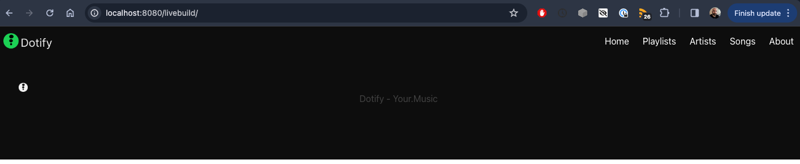
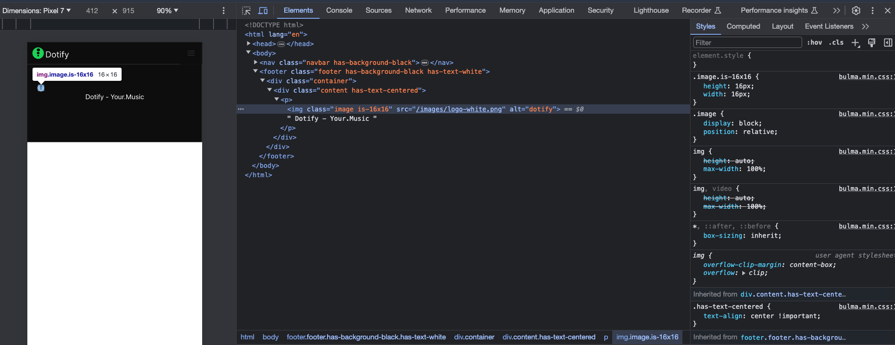
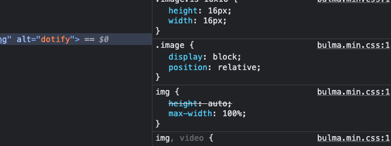

# Footer

Now we need a footer as per the designs:


Back to the [docs](https://bulma.io/documentation/layout/footer/)

After your `nav` element, add the following:

```html
  <footer class="footer has-background-black">
    <div class="container">
      <div class="content has-text-centered">
        <p>
           Dotify - Your.Music
        </p>
      </div>
    </div>
  </footer>
```


Not quite right, let's add the `has-text-white` modifier.

```html
  <footer class="footer has-background-black has-text-white">
    <div class="container">
      <div class="content has-text-centered">
        <p>
           Dotify - Your.Music
        </p>
      </div>
    </div>
  </footer>
```


Getting there, but our logo is seems to on the left on it's own. We are using the `image` class from Bulma, [docs](https://bulma.io/documentation/elements/image/).

Images are typically inline but it looks as though this image is forcing a new line via the use of `display: block`.  Let's see if we can verify that by inspecting the element in the browser.



Zooming in:



Success, we can see that `.image` from `bulma.min.css` is a block.

To correct this, we can use the `is-inline` modifier:

```html
  <footer class="footer has-background-black has-text-white">
    <div class="container">
      <div class="content has-text-centered">
        <p>
           Dotify - Your.Music
        </p>
      </div>
    </div>
  </footer>
```


OK, our footer's image and text are now centered.

Is that pizza here yet?????