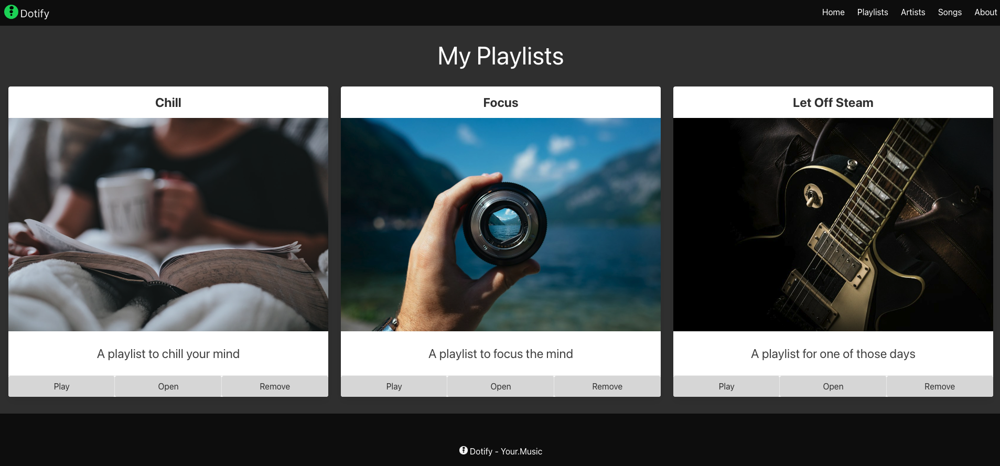
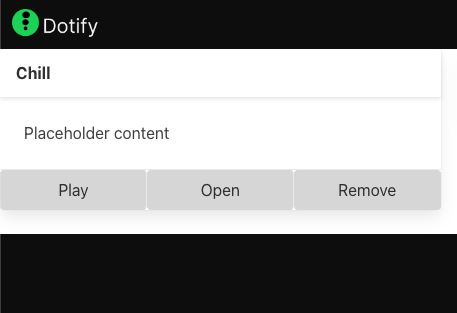

# Main Content and Cards

Due to the sale's team overly enthusiastic promises we have to stick this out.  We will focus on the main content from the design.



After some coffee, it is decided that we should use a column based layout.  We will use the `columns` class from Bulma, [docs](https://bulma.io/documentation/columns/).

To do this, we will create our main content section below the nav.

```html
  <main class="columns">
  </main>
```

Let's add 3 columns of equal width to the main content section.

```html
  <main class="columns">
    <div class="column is-4">
      <section>
        <p>Content Here</p>
      </section>
    </div>
    <div class="column is-4">
      <section>
        <p>Content Here</p>
      </section>
    </div>
    <div class="column is-4">
      <section>
        <p>Content Here</p>
      </section>
    </div>
  </main>
```

We've added 3 columns.  Within each column we have a `section` tag.  This is a semantic tag that represents a generic section of a document or application.  We use it to group together related elements.  We are going to place our card elements within these sections.

Your page should look like:


OK, not very interesting yet.  Let's add some cards.

We will use the `card` class from Bulma, [docs](https://bulma.io/documentation/components/card/).


Similar to the nav-bar, the card is made up of multiple elements so it is worth reviewing the documentation to understand how it works.

OK, so, our first card:

```html
      <section class="card">
        <header class="card-header">
        </header>
        <div class="card-image">
        </div>
        <article class="card-content">
          <p>Placeholder content</p>
        </article>
        <footer class="card-footer">
        </footer>
      </section>
```

We will be using the `card-header`, `card-image`, `card-content` and `card-footer` elements to create our card.

The header first, we will add a title for our playlist.

```html
      <section class="card">
        <header class="card-header">
          <p class="card-header-title">
            Chill
          </p>
        </header>
        <div class="card-image">
        </div>
        <article class="card-content">
          <p>Placeholder content</p>
        </article>
        <footer class="card-footer">
        </footer>
      </section>
```


And now for the footer:

```html
        <footer class="card-footer">
          <button class="card-footer-item button has-background-grey-lighter">Play</button>
          <button class="card-footer-item button has-background-grey-lighter">Open</button>
          <button class="card-footer-item button has-background-grey-lighter">Remove</button>
        </footer>
```


And some content:

```html
        <article class="card-content">
          <p class="content">
            A playlist to chill your mind
          </p>
        </article>
```


Alright, so now all we need is an image:

```html
        <div class="card-image">
          <figure class="image">
            
          </figure>
        </div>
```
We are using free images from [Unsplash](https://unsplash.com/) for our Proof of Concept (POC).

Be sure to select the free license when using images from Unsplash.


Our card is now:

```html
      <section class="card">
        <header class="card-header">
          <p class="card-header-title">
            Chill
          </p>
        </header>
        <div class="card-image">
          <figure class="image">
            
          </figure>
        </div>
        <article class="card-content">
          <p class="content is-size-4">
            A playlist to chill your mind
          </p>
        </article>
        <footer class="card-footer">
          <button class="card-footer-item button has-background-grey-lighter">Play</button>
          <button class="card-footer-item button has-background-grey-lighter">Open</button>
          <button class="card-footer-item button has-background-grey-lighter">Remove</button>
        </footer>
      </section>
```


Now just a little bit of CSS via modifiers to make it look a bit better.

First the heading:

```html
        <header class="card-header">
          <p class="card-header-title is-size-4 is-centered">
            Chill
          </p>
        </header>
```

Notice [is-size-4](https://bulma.io/documentation/helpers/typography-helpers/#size) and `is-centered`.  `is-centered` is mentioned in the card documentation.


Our content is not centered so we augment the card to have centered text:

```html
<section class="card has-text-centered">
```


Our full HTML is now:

```html
<!DOCTYPE html>
<html lang="en">
<head>
  <meta charset="utf-8">
  <meta name="viewport" content="width=device-width, initial-scale=1">
  <title>Dotify - Your.Music</title>
  <link rel="icon" type="image/png" sizes="32x32" href="/images/favicon.png" />
  <link rel="stylesheet" href="https://cdn.jsdelivr.net/npm/bulma@0.9.4/css/bulma.min.css" />
  <script>
    document.addEventListener('DOMContentLoaded', () => {

      // Get all "navbar-burger" elements
      const $navbarBurgers = Array.prototype.slice.call(document.querySelectorAll('.navbar-burger'), 0);

      // Add a click event on each of them
      $navbarBurgers.forEach(el => {
        el.addEventListener('click', () => {

          // Get the target from the "data-target" attribute
          const target = el.dataset.target;
          const $target = document.getElementById(target);

          // Toggle the "is-active" class on both the "navbar-burger" and the "navbar-menu"
          el.classList.toggle('is-active');
          $target.classList.toggle('is-active');

        });
      });

    });
  </script>
</head>
<body>
  <nav class="navbar has-background-black">
    <div class="navbar-brand">
      <a class="navbar-item" href="#">
        
      </a>
      <span class="navbar-burger has-background-black" data-target="navbarMenu" aria-expanded="false">
        <span aria-hidden="true"></span>
        <span aria-hidden="true"></span>
        <span aria-hidden="true"></span>
      </span>
    </div>
    <div id="navbarMenu" class="navbar-menu">
      <div class="navbar-end has-background-black">
        <a class="navbar-item has-text-white">
          Home
        </a>
        <a class="navbar-item has-text-white">
          Playlists
        </a>
        <a class="navbar-item has-text-white">
          Artists
        </a>
        <a class="navbar-item has-text-white">
          Songs
        </a>
        <a class="navbar-item has-text-white">
          About
        </a>
      </div>
    </div>
  </nav>
  <main class="columns">
    <div class="column is-4">
      <section class="card has-text-centered">
        <header class="card-header">
          <p class="card-header-title is-size-4 is-centered">
            Chill
          </p>
        </header>
        <div class="card-image">
          <figure class="image">
            
          </figure>
        </div>
        <article class="card-content">
          <p class="content is-size-4">
            A playlist to chill your mind
          </p>
        </article>
        <footer class="card-footer">
          <button class="card-footer-item button has-background-grey-lighter">Play</button>
          <button class="card-footer-item button has-background-grey-lighter">Open</button>
          <button class="card-footer-item button has-background-grey-lighter">Remove</button>
        </footer>
      </section>
    </div>
    <div class="column is-4">
      <section class="card has-text-centered dotify-card">
        <header class="card-header">
        </header>
        <div class="card-image">
        </div>
        <article class="card-content">
          <p>Placeholder content</p>
        </article>
        <footer class="card-footer">
        </footer>
      </section>
    </div>
    <div class="column is-4">
      <section class="card has-text-centered dotify-card">
        <header class="card-header">
        </header>
        <div class="card-image">
        </div>
        <article class="card-content">
          <p>Placeholder content</p>
        </article>
        <footer class="card-footer">
        </footer>
      </section>
    </div>
  </main>
  <footer class="footer has-background-black has-text-white">
    <div class="container">
      <div class="content has-text-centered">
        <p>
           Dotify - Your.Music
        </p>
      </div>
    </div>
  </footer>
</body>
</html>
```