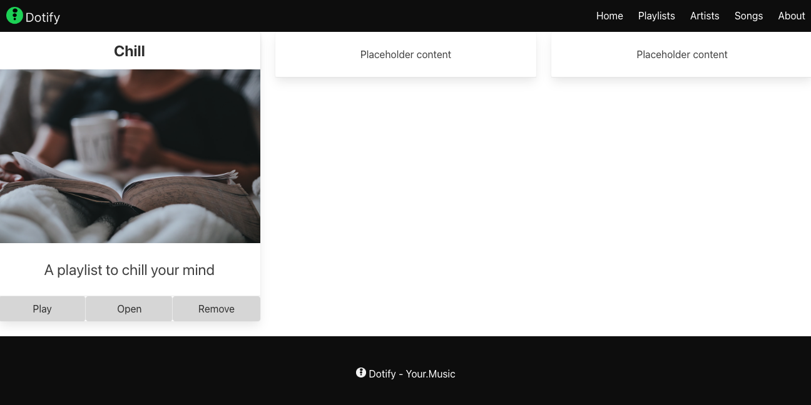
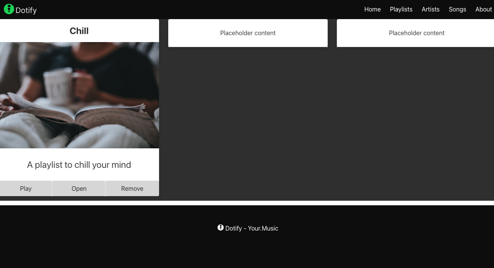
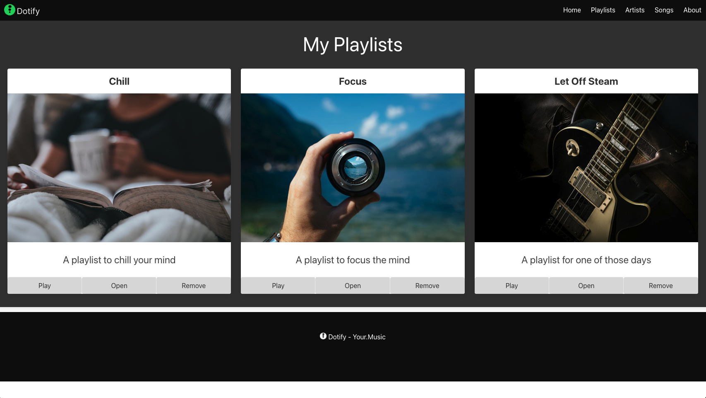
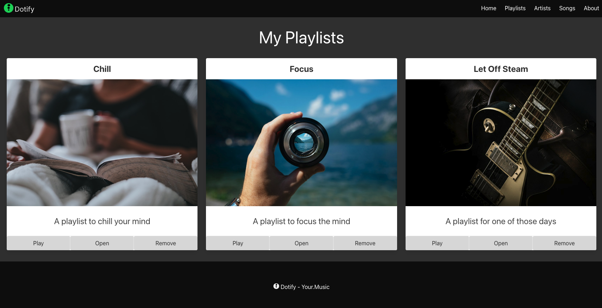

# Sitrep

OK, let's review:

The designs are:


And we have:



Looks as though we need a grey background on the body.  Let's fix that.

```html
    <main class="columns has-background-grey-darker">
```



Our content is a little squashed, let's add it to a `box`, we should also make our design multi line to support more than 3 cards.

```html
  <main class="columns is-multiline box has-background-grey-darker">
```

We should also add our heading before the cards.

```html
  <main class="columns is-multiline box has-background-grey-darker">
    <div class="column is-12 has-text-centered has-text-white">
      <p class="is-size-1">My Playlists</p>
    </div>
```

And our second card:

```html
    <div class="column is-4">
      <section class="card has-text-centered">
        <header class="card-header">
          <p class="card-header-title is-size-4 is-centered">
            Focus
          </p>
        </header>
        <div class="card-image">
          <figure class="image">
            
          </figure>
        </div>
        <article class="card-content">
          <p class="content is-size-4">
            A playlist to focus the mind
          </p>
        </article>
        <footer class="card-footer">
          <button class="card-footer-item button has-background-grey-lighter">Play</button>
          <button class="card-footer-item button has-background-grey-lighter">Open</button>
          <button class="card-footer-item button has-background-grey-lighter">Remove</button>
        </footer>
      </section>
    </div>
```

And our third:

```html
    <div class="column is-4">
      <section class="card has-text-centered">
        <header class="card-header">
          <p class="card-header-title is-size-4 is-centered">
            Let Off Steam
          </p>
        </header>
        <div class="card-image">
          <figure class="image">
            
          </figure>
        </div>
        <article class="card-content">
          <p class="content is-size-4">
            A playlist for one of those days
          </p>
        </article>
        <footer class="card-footer">
          <button class="card-footer-item button has-background-grey-lighter">Play</button>
          <button class="card-footer-item button has-background-grey-lighter">Open</button>
          <button class="card-footer-item button has-background-grey-lighter">Remove</button>
        </footer>
      </section>
    </div>
```

Perfect:



The designers review your implementation and ask why you've added extra white space between your cards and the footer. Also, if the page does not take up the entire vertical space, there is a large amount of white space at the bottom of the page.

To remedy this we set the background colour of the html element to black.


```html
<html class="has-background-black" lang="en">
```

There are likely more correct ways to correct this, but this is a quick fix as deadlines are looming.

Design are happy with the changes and the page is ready for the next stage of development.

Just to review, here is the entire page:

```html
<!DOCTYPE html>
<html class="has-background-black" lang="en">
<head>
  <meta charset="utf-8">
  <meta name="viewport" content="width=device-width, initial-scale=1">
  <title>Dotify - Your.Music</title>
  <link rel="icon" type="image/png" sizes="32x32" href="/images/favicon.png" />
  <link rel="stylesheet" href="https://cdn.jsdelivr.net/npm/bulma@0.9.4/css/bulma.min.css" />
  <script>
    document.addEventListener('DOMContentLoaded', () => {

      // Get all "navbar-burger" elements
      const $navbarBurgers = Array.prototype.slice.call(document.querySelectorAll('.navbar-burger'), 0);

      // Add a click event on each of them
      $navbarBurgers.forEach(el => {
        el.addEventListener('click', () => {

          // Get the target from the "data-target" attribute
          const target = el.dataset.target;
          const $target = document.getElementById(target);

          // Toggle the "is-active" class on both the "navbar-burger" and the "navbar-menu"
          el.classList.toggle('is-active');
          $target.classList.toggle('is-active');

        });
      });

    });
  </script>
</head>
<body>
  <nav class="navbar has-background-black">
    <div class="navbar-brand">
      <a class="navbar-item" href="#">
        
      </a>
      <span class="navbar-burger has-background-black" data-target="navbarMenu" aria-expanded="false">
        <span aria-hidden="true"></span>
        <span aria-hidden="true"></span>
        <span aria-hidden="true"></span>
      </span>
    </div>
    <div id="navbarMenu" class="navbar-menu">
      <div class="navbar-end has-background-black">
        <a class="navbar-item has-text-white">
          Home
        </a>
        <a class="navbar-item has-text-white">
          Playlists
        </a>
        <a class="navbar-item has-text-white">
          Artists
        </a>
        <a class="navbar-item has-text-white">
          Songs
        </a>
        <a class="navbar-item has-text-white">
          About
        </a>
      </div>
    </div>
  </nav>
  <main class="columns is-multiline box has-background-grey-darker">
    <div class="column is-12 has-text-centered has-text-white">
      <p class="is-size-1">My Playlists</p>
    </div>
    <div class="column is-4">
      <section class="card has-text-centered">
        <header class="card-header">
          <p class="card-header-title is-size-4 is-centered">
            Chill
          </p>
        </header>
        <div class="card-image">
          <figure class="image">
            
          </figure>
        </div>
        <article class="card-content">
          <p class="content is-size-4">
            A playlist to chill your mind
          </p>
        </article>
        <footer class="card-footer">
          <button class="card-footer-item button has-background-grey-lighter">Play</button>
          <button class="card-footer-item button has-background-grey-lighter">Open</button>
          <button class="card-footer-item button has-background-grey-lighter">Remove</button>
        </footer>
      </section>
    </div>
    <div class="column is-4">
      <section class="card has-text-centered">
        <header class="card-header">
          <p class="card-header-title is-size-4 is-centered">
            Focus
          </p>
        </header>
        <div class="card-image">
          <figure class="image">
            
          </figure>
        </div>
        <article class="card-content">
          <p class="content is-size-4">
            A playlist to focus the mind
          </p>
        </article>
        <footer class="card-footer">
          <button class="card-footer-item button has-background-grey-lighter">Play</button>
          <button class="card-footer-item button has-background-grey-lighter">Open</button>
          <button class="card-footer-item button has-background-grey-lighter">Remove</button>
        </footer>
      </section>
    </div>
    <div class="column is-4">
      <section class="card has-text-centered">
        <header class="card-header">
          <p class="card-header-title is-size-4 is-centered">
            Let Off Steam
          </p>
        </header>
        <div class="card-image">
          <figure class="image">
            
          </figure>
        </div>
        <article class="card-content">
          <p class="content is-size-4">
            A playlist for one of those days
          </p>
        </article>
        <footer class="card-footer">
          <button class="card-footer-item button has-background-grey-lighter">Play</button>
          <button class="card-footer-item button has-background-grey-lighter">Open</button>
          <button class="card-footer-item button has-background-grey-lighter">Remove</button>
        </footer>
      </section>
    </div>
  </main>
  <footer class="footer has-background-black has-text-white">
    <div class="container">
      <div class="content has-text-centered">
        <p>
           Dotify - Your.Music
        </p>
      </div>
    </div>
  </footer>
</body>
</html>
```

