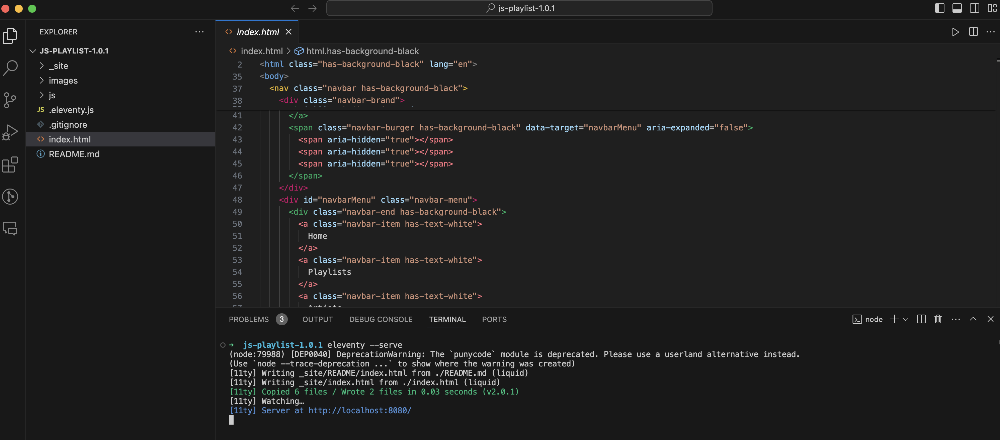
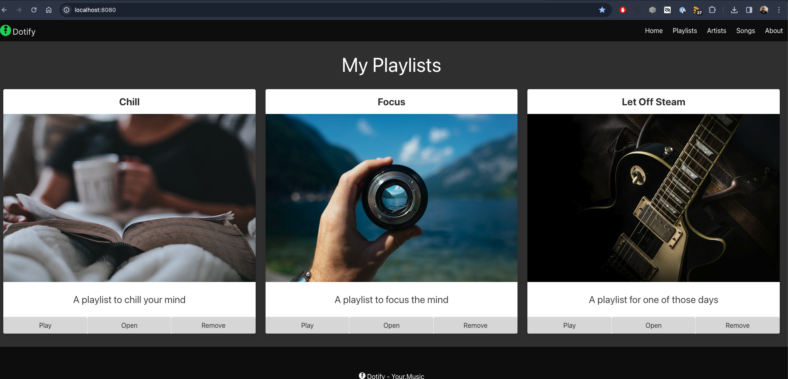

# The DOM

Now we will manipulate the DOM using JavaScript. The DOM is a tree-like structure that represents the HTML document. It is a way to interact with the HTML and CSS of a web page using JavaScript.

## Starter Project

Please download the completed source from the last lab (or use your own).

[Download Starter Project](./archive/js-playlist-1.0.1.zip).

Unzip the directory and open it in Sublime Text or your preferred editor/dev environment.

Run `eleventy --serve` to start the server and open the web page in your browser.

Open your browser to `http://localhost:8080` and you should see the following:

