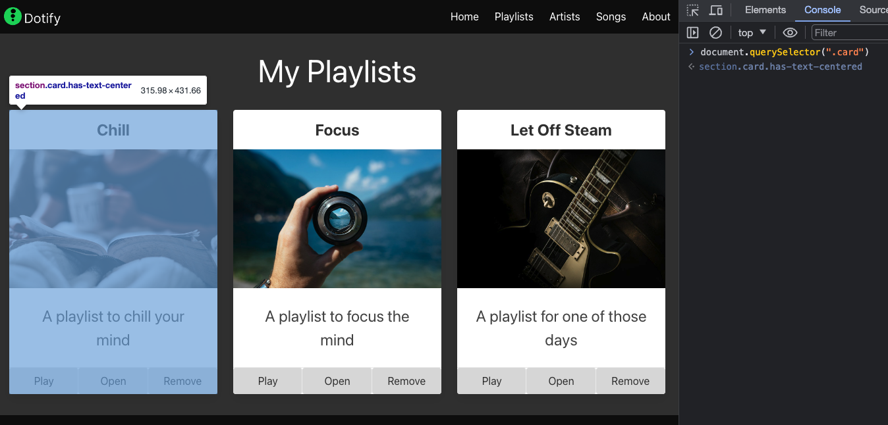
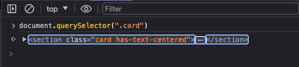
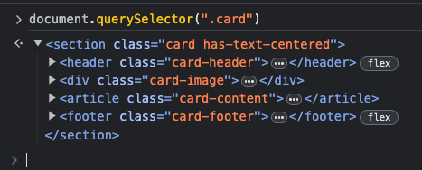
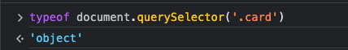
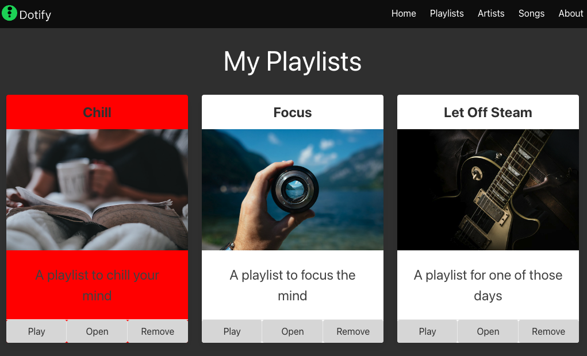

# document.querySelector()

With the homepage open, open the JavaScript console in the browser and type the following (and do not press enter yet):

```javascript
document.querySelector('.card');
```

(To open the JavaScript console, right-click on the page and select "Inspect" or "Inspect Element".  Then click on the "Console" tab.)



Notice that the left card is highlighted.  This is because the `document.querySelector()` method returns the first element that matches the specified selector.  In this case, the selector is `.card`, which matches the first card on the page.

Now press enter to execute the command.  The card will be returned in the console.



Click the arrow on the left to expand the HTML of the card.



Type the following in the console and press enter:

```javascript
typeof document.querySelector('.card');
```



It is a JavaScript object.

Type the following in the console and press enter:

```javascript
document.querySelector('.card').style.backgroundColor = 'red';
```



The background color of the card will change to red.

Type the following in the console and press enter:

```javascript
document.querySelector('.card').style.backgroundColor = '';
```

The background color of the card will return to its original color.