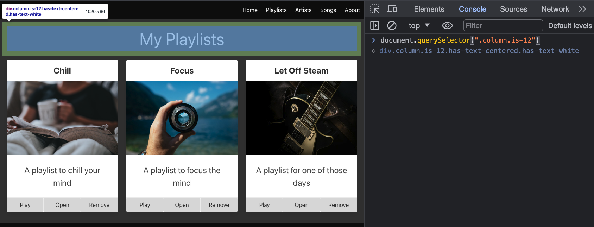

# getElementById()

So now, try to find the header

```javascript
document.querySelector(".column.is-12")
```




We might want to make it easter to find by adding an id to it.  Add an id to the header:

```javascript
document.querySelector(".column.is-12").setAttribute("id", "heading")
```

Now attempt:

```javascript
document.getElementById("heading")
```

And

```javascript
document.querySelector("#heading")
```

Note the difference between getElementById and querySelector.  querySelector can be used to select any element, while getElementById can only be used to select an element with an id.  querySelector is more flexible, but getElementById is faster.