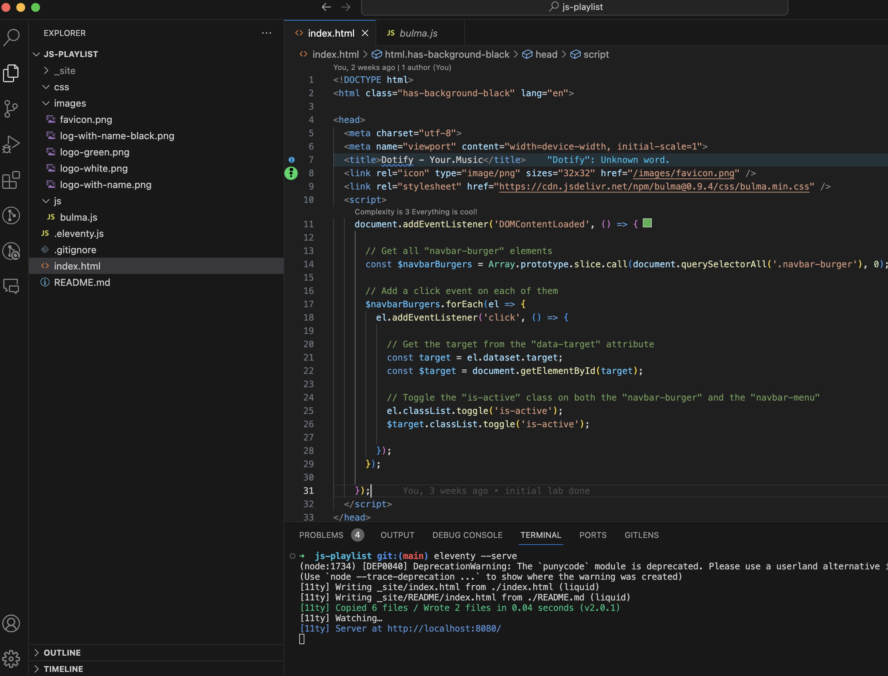
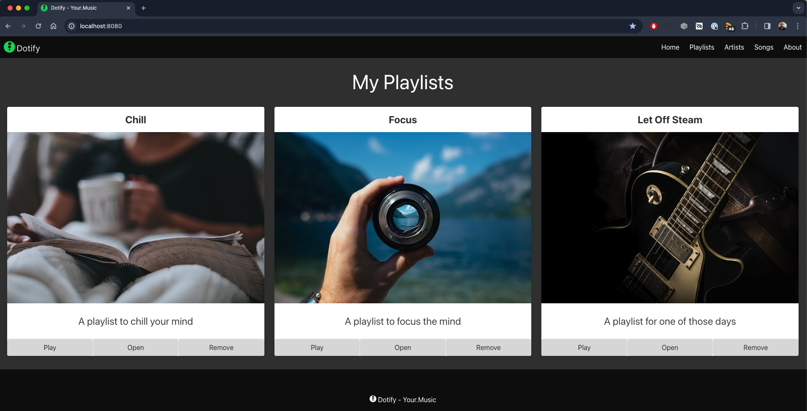

# Get Dofity going

Continuing from the completion of lab 8, or you can download the [source code](./archive/js-playlist-1.0.1.zip).

Open up the terminal in either sublime or vscode and run `eleventy --serve` to start the server. Navigate to `http://localhost:8080` to see the site.

