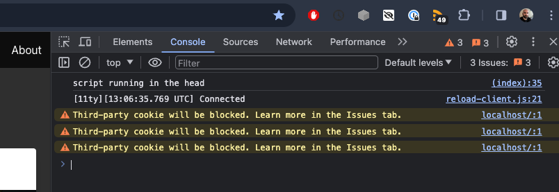

# The Script Tag

As you may remember from the last lab, we included JavaScript in the head without much explanation.

```html
<head>
  <meta charset="utf-8">
  <meta name="viewport" content="width=device-width, initial-scale=1">
  <title>Dotify - Your.Music</title>
  <link rel="icon" type="image/png" sizes="32x32" href="/images/favicon.png" />
  <link rel="stylesheet" href="https://cdn.jsdelivr.net/npm/bulma@0.9.4/css/bulma.min.css" />
  <script>
    document.addEventListener('DOMContentLoaded', () => {

      // Get all "navbar-burger" elements
      const $navbarBurgers = Array.prototype.slice.call(document.querySelectorAll('.navbar-burger'), 0);

      // Add a click event on each of them
      $navbarBurgers.forEach(el => {
        el.addEventListener('click', () => {

          // Get the target from the "data-target" attribute
          const target = el.dataset.target;
          const $target = document.getElementById(target);

          // Toggle the "is-active" class on both the "navbar-burger" and the "navbar-menu"
          el.classList.toggle('is-active');
          $target.classList.toggle('is-active');

        });
      });

    });
  </script>
</head>
```

Since bulma is a "no JavaScript" framework, we need to add JavaScript to make the navbar and hamburger menu work.

We will keep this script there and create a new script tag underneath.

After the closing `</script>` tag, add the following:

```html
  <script>
    console.log("script running in the head");
  </script>
```

Your entire head should look like this:

```html
<head>
  <meta charset="utf-8">
  <meta name="viewport" content="width=device-width, initial-scale=1">
  <title>Dotify - Your.Music</title>
  <link rel="icon" type="image/png" sizes="32x32" href="/images/favicon.png" />
  <link rel="stylesheet" href="https://cdn.jsdelivr.net/npm/bulma@0.9.4/css/bulma.min.css" />
  <script>
    document.addEventListener('DOMContentLoaded', () => {

      // Get all "navbar-burger" elements
      const $navbarBurgers = Array.prototype.slice.call(document.querySelectorAll('.navbar-burger'), 0);

      // Add a click event on each of them
      $navbarBurgers.forEach(el => {
        el.addEventListener('click', () => {

          // Get the target from the "data-target" attribute
          const target = el.dataset.target;
          const $target = document.getElementById(target);

          // Toggle the "is-active" class on both the "navbar-burger" and the "navbar-menu"
          el.classList.toggle('is-active');
          $target.classList.toggle('is-active');

        });
      });

    });
  </script>

  <script>
    console.log("script running in the head");
  </script>
</head>
```

Now open up the console in your browser and refresh the page. You should see the message "script running in the head" in the console.

`console.log` simply logs a message to the console. This is useful for debugging and understanding what is happening in your code.



As you can see the in the image above, "script running in the head" is logged to the console.

The subsequent message is a message from eleventy that allows auto reload of the page when you make changes to the code.

The third party cookie warnings are coming from the images we are pulling from unsplash.  You can ignore these for now, these are warning us that chrome is releasing an update to block all third party cookies in the future.

For more information, you might be interested to review [this google blog post](https://blog.google/products/chrome/privacy-sandbox-tracking-protection/)

We will attempt to fix this in the future as we reduce our reliance on third party images.  For now, we will ignore these warnings.