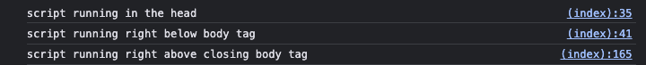
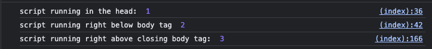
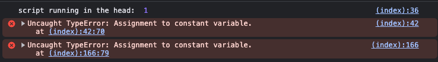

# Script in the body

Now that we have a script running in the head, let's add a script to the body.

In the body, add the following script right below the body tag

```html
  <script>
    console.log("script running right below body tag");
  </script>
```

Also add a script tag right above the closing body tag

```html
  <script>
    console.log("script running right above closing body tag");
  </script>
```

Your entire html page should look like this:

```html
<!DOCTYPE html>
<html class="has-background-black" lang="en">

<head>
  <meta charset="utf-8">
  <meta name="viewport" content="width=device-width, initial-scale=1">
  <title>Dotify - Your.Music</title>
  <link rel="icon" type="image/png" sizes="32x32" href="/images/favicon.png" />
  <link rel="stylesheet" href="https://cdn.jsdelivr.net/npm/bulma@0.9.4/css/bulma.min.css" />
  <script>
    document.addEventListener('DOMContentLoaded', () => {

      // Get all "navbar-burger" elements
      const $navbarBurgers = Array.prototype.slice.call(document.querySelectorAll('.navbar-burger'), 0);

      // Add a click event on each of them
      $navbarBurgers.forEach(el => {
        el.addEventListener('click', () => {

          // Get the target from the "data-target" attribute
          const target = el.dataset.target;
          const $target = document.getElementById(target);

          // Toggle the "is-active" class on both the "navbar-burger" and the "navbar-menu"
          el.classList.toggle('is-active');
          $target.classList.toggle('is-active');

        });
      });

    });
  </script>

  <script>
    console.log("script running in the head");
  </script>
</head>

<body>
  <script>
    console.log("script running right below body tag");
  </script>
  <!-- START NAV -->
  <nav class="navbar has-background-black">
    <div class="navbar-brand">
      <a class="navbar-item" href="#">
        
      </a>
      <span class="navbar-burger has-background-black" data-target="navbarMenu" aria-expanded="false">
        <span aria-hidden="true"></span>
        <span aria-hidden="true"></span>
        <span aria-hidden="true"></span>
      </span>
    </div>
    <div id="navbarMenu" class="navbar-menu">
      <div class="navbar-end has-background-black">
        <a class="navbar-item has-text-white">
          Home
        </a>
        <a class="navbar-item has-text-white">
          Playlists
        </a>
        <a class="navbar-item has-text-white">
          Artists
        </a>
        <a class="navbar-item has-text-white">
          Songs
        </a>
        <a class="navbar-item has-text-white">
          About
        </a>
      </div>
    </div>
  </nav>
  <!-- END NAV -->

  <main class="columns is-multiline box has-background-grey-darker">
    <div class="column is-12 has-text-centered has-text-white">
      <p class="is-size-1">My Playlists</p>
    </div>
    <div class="column is-4">
      <section class="card has-text-centered">
        <header class="card-header">
          <p class="card-header-title is-size-4 is-centered">
            Chill
          </p>
        </header>
        <div class="card-image">
          <figure class="image">
            
          </figure>
        </div>
        <article class="card-content">
          <p class="content is-size-4">
            A playlist to chill your mind
          </p>
        </article>
        <footer class="card-footer">
          <button class="card-footer-item button has-background-grey-lighter">Play</button>
          <button class="card-footer-item button has-background-grey-lighter">Open</button>
          <button class="card-footer-item button has-background-grey-lighter">Remove</button>
        </footer>
      </section>
    </div>
    <div class="column is-4">
      <section class="card has-text-centered">
        <header class="card-header">
          <p class="card-header-title is-size-4 is-centered">
            Focus
          </p>
        </header>
        <div class="card-image">
          <figure class="image">
            
          </figure>
        </div>
        <article class="card-content">
          <p class="content is-size-4">
            A playlist to focus the mind
          </p>
        </article>
        <footer class="card-footer">
          <button class="card-footer-item button has-background-grey-lighter">Play</button>
          <button class="card-footer-item button has-background-grey-lighter">Open</button>
          <button class="card-footer-item button has-background-grey-lighter">Remove</button>
        </footer>
      </section>
    </div>
    <div class="column is-4">
      <section class="card has-text-centered">
        <header class="card-header">
          <p class="card-header-title is-size-4 is-centered">
            Let Off Steam
          </p>
        </header>
        <div class="card-image">
          <figure class="image">
            
          </figure>
        </div>
        <article class="card-content">
          <p class="content is-size-4">
            A playlist for one of those days
          </p>
        </article>
        <footer class="card-footer">
          <button class="card-footer-item button has-background-grey-lighter">Play</button>
          <button class="card-footer-item button has-background-grey-lighter">Open</button>
          <button class="card-footer-item button has-background-grey-lighter">Remove</button>
        </footer>
      </section>
    </div>
  </main>

  <footer class="footer has-background-black has-text-white">
    <div class="container">
      <div class="content has-text-centered">
        <p>
           Dotify - Your.Music
        </p>
      </div>
    </div>
  </footer>
  <script>
    console.log("script running right above closing body tag");
  </script>
</body>

</html>
```

Refresh your browser and open up the console. You should see the following messages:



You can see the scripts are running in the order they are placed in the html file. This is important to understand as the order of scripts can affect how your application runs.

Alright, now let's augment the first script snippet in the head so that it introduces a variable to the scope of the webpage.

```html
  <script>
    let scriptNumber = 1;
    console.log("script running in the head: ", scriptNumber)
  </script>
```

and

```html
  <script>
    console.log("script running right below body tag ", scriptNumber += 1)
  </script>
```

and

```html
  <script>
    console.log("script running right above closing body tag ", scriptNumber += 1)
  </script>
```

Now refresh the page and open up the console. You should see the following messages:



So, what did we do?

We introduced a variable `scriptNumber` in the first script tag in the head. We then logged the value of `scriptNumber` to the console. We then incremented the value of `scriptNumber` in the script tag right below the body tag and then again in the script tag right above the closing body tag.

This is important to understand as it shows how variables can be introduced and manipulated in the scope of the webpage.

Try changing `let scriptNumber = 1;` to `const scriptNumber = 1;` and see what happens. You should see an error in the console. This is because `const` is a constant and cannot be changed.

