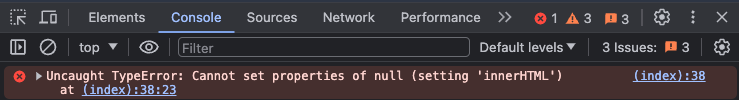
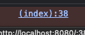
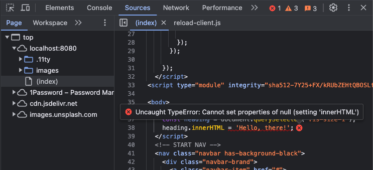
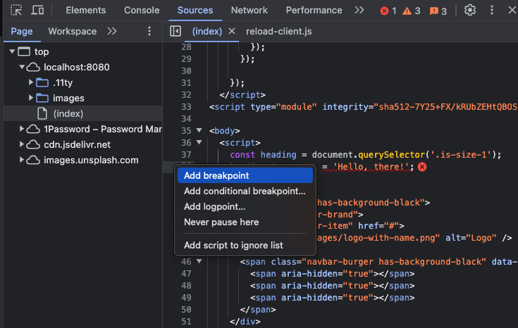
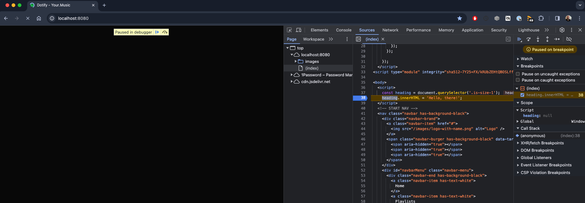
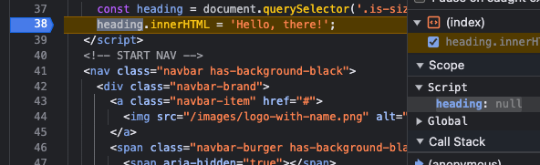
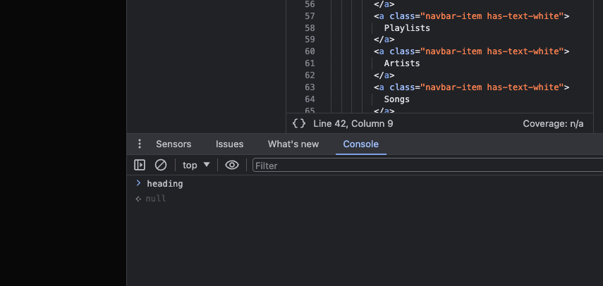
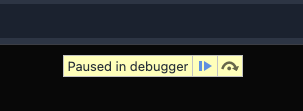
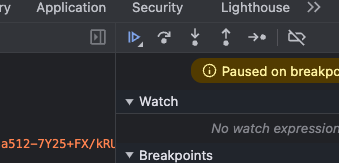
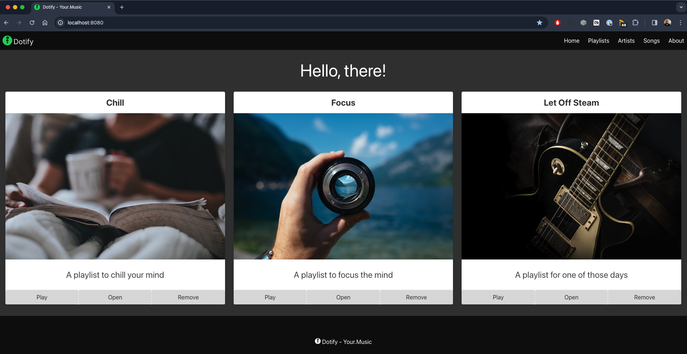

# Augment the DOM

Remove the three script elements that we introduced from the page.

Just before after body opening tag, add the following script:

```html
  <script>
    const heading = document.querySelector('.is-size-1');
    heading.innerHTML = 'Hello, there!';
  </script>
```

Refresh your page......


Oh, nothing happened. Let's see what's going on.

Open up the console and you should see the following error:



Click on the link to the index.html file to the right of the error message.



Look at this!



Chrome shows us the source code of the page and it highlights the line that is causing the error.

Alright, you might already know what is happening but let's add a breakpoint to the line that is causing the error.

Right click in the "gutter" to the left of the line number and select "Add breakpoint".



You can also just left click in the gutter to add a breakpoint.

Now refresh the page.



We are now paused at the line where we said the breakpoint.

We can see on the right hand side that the `heading` variable is `null`.



We can also evaluate expressions in the console while our code is paused.



You can resume your program by clicking either resume button:



or



The page will now render and the error can still be seen in the console.

Remove the breakpoint from the code by clicking on the breakpoint in the gutter.

Now, move script to just before the closing body tag.

Refresh the page.

Our heading has changed to "Hello, there!".



This demonstrates the importance of where you place your scripts in your HTML file.

In the first instance, the script was running before the page had fully loaded and the element we were trying to select was not yet available.  In the second instance, the script was running after the element had loaded.

But, there's more to this story. Let's add a new script tag to the head of the document.

```html
  <script>
    document.addEventListener('DOMContentLoaded', () => {
      const heading = document.querySelector('.is-size-1');
      heading.innerHTML = 'Hello, there!';
    });
  </script>
```

It works! Whoa, what the....?

We'll explain in the next section, for reference, your index.html file should look like this:

```html
<!DOCTYPE html>
<html class="has-background-black" lang="en">

<head>
  <meta charset="utf-8">
  <meta name="viewport" content="width=device-width, initial-scale=1">
  <title>Dotify - Your.Music</title>
  <link rel="icon" type="image/png" sizes="32x32" href="/images/favicon.png" />
  <link rel="stylesheet" href="https://cdn.jsdelivr.net/npm/bulma@0.9.4/css/bulma.min.css" />
  <script>
    document.addEventListener('DOMContentLoaded', () => {

      // Get all "navbar-burger" elements
      const $navbarBurgers = Array.prototype.slice.call(document.querySelectorAll('.navbar-burger'), 0);

      // Add a click event on each of them
      $navbarBurgers.forEach(el => {
        el.addEventListener('click', () => {

          // Get the target from the "data-target" attribute
          const target = el.dataset.target;
          const $target = document.getElementById(target);

          // Toggle the "is-active" class on both the "navbar-burger" and the "navbar-menu"
          el.classList.toggle('is-active');
          $target.classList.toggle('is-active');

        });
      });

    });
  </script>

  <script>
    document.addEventListener('DOMContentLoaded', () => {
      const heading = document.querySelector('.is-size-1');
      heading.innerHTML = 'Hello, there!';
    });
  </script>

</head>

<body>
  <!-- START NAV -->
  <nav class="navbar has-background-black">
    <div class="navbar-brand">
      <a class="navbar-item" href="#">
        
      </a>
      <span class="navbar-burger has-background-black" data-target="navbarMenu" aria-expanded="false">
        <span aria-hidden="true"></span>
        <span aria-hidden="true"></span>
        <span aria-hidden="true"></span>
      </span>
    </div>
    <div id="navbarMenu" class="navbar-menu">
      <div class="navbar-end has-background-black">
        <a class="navbar-item has-text-white">
          Home
        </a>
        <a class="navbar-item has-text-white">
          Playlists
        </a>
        <a class="navbar-item has-text-white">
          Artists
        </a>
        <a class="navbar-item has-text-white">
          Songs
        </a>
        <a class="navbar-item has-text-white">
          About
        </a>
      </div>
    </div>
  </nav>
  <!-- END NAV -->

  <main class="columns is-multiline box has-background-grey-darker">
    <div class="column is-12 has-text-centered has-text-white">
      <p class="is-size-1">My Playlists</p>
    </div>
    <div class="column is-4">
      <section class="card has-text-centered">
        <header class="card-header">
          <p class="card-header-title is-size-4 is-centered">
            Chill
          </p>
        </header>
        <div class="card-image">
          <figure class="image">
            
          </figure>
        </div>
        <article class="card-content">
          <p class="content is-size-4">
            A playlist to chill your mind
          </p>
        </article>
        <footer class="card-footer">
          <button class="card-footer-item button has-background-grey-lighter">Play</button>
          <button class="card-footer-item button has-background-grey-lighter">Open</button>
          <button class="card-footer-item button has-background-grey-lighter">Remove</button>
        </footer>
      </section>
    </div>
    <div class="column is-4">
      <section class="card has-text-centered">
        <header class="card-header">
          <p class="card-header-title is-size-4 is-centered">
            Focus
          </p>
        </header>
        <div class="card-image">
          <figure class="image">
            
          </figure>
        </div>
        <article class="card-content">
          <p class="content is-size-4">
            A playlist to focus the mind
          </p>
        </article>
        <footer class="card-footer">
          <button class="card-footer-item button has-background-grey-lighter">Play</button>
          <button class="card-footer-item button has-background-grey-lighter">Open</button>
          <button class="card-footer-item button has-background-grey-lighter">Remove</button>
        </footer>
      </section>
    </div>
    <div class="column is-4">
      <section class="card has-text-centered">
        <header class="card-header">
          <p class="card-header-title is-size-4 is-centered">
            Let Off Steam
          </p>
        </header>
        <div class="card-image">
          <figure class="image">
            
          </figure>
        </div>
        <article class="card-content">
          <p class="content is-size-4">
            A playlist for one of those days
          </p>
        </article>
        <footer class="card-footer">
          <button class="card-footer-item button has-background-grey-lighter">Play</button>
          <button class="card-footer-item button has-background-grey-lighter">Open</button>
          <button class="card-footer-item button has-background-grey-lighter">Remove</button>
        </footer>
      </section>
    </div>
  </main>

  <footer class="footer has-background-black has-text-white">
    <div class="container">
      <div class="content has-text-centered">
        <p>
           Dotify - Your.Music
        </p>
      </div>
    </div>
  </footer>
</body>

</html>
```