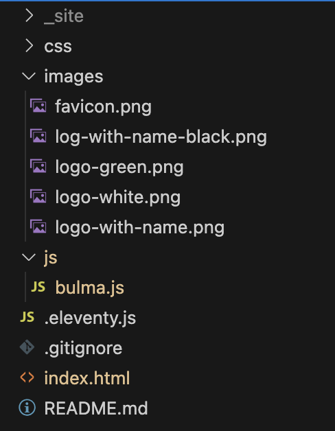

# JavaScript Files

Alright, it's time to get the JavaScript out of our HTML file and into its own file.

First, create a js folder in your project and create a new file called `bulma.js`.

Remove the following from index.html and paste it into `bulma.js`:

```javascript
document.addEventListener('DOMContentLoaded', () => {

  // Get all "navbar-burger" elements
  const $navbarBurgers = Array.prototype.slice.call(document.querySelectorAll('.navbar-burger'), 0);

  // Add a click event on each of them
  $navbarBurgers.forEach(el => {
    el.addEventListener('click', () => {

      // Get the target from the "data-target" attribute
      const target = el.dataset.target;
      const $target = document.getElementById(target);

      // Toggle the "is-active" class on both the "navbar-burger" and the "navbar-menu"
      el.classList.toggle('is-active');
      $target.classList.toggle('is-active');

    });
  });

});
```

Delete the script tags from the head of index.html also.

Refresh the page, and reduce the width of the screen until the hamburger appears. Click on the hamburger and notice that nothing happens. This is because the JavaScript is no longer in the HTML file.

Now, in the head of index.html, add the following script tag:

```html
<script src="js/bulma.js"></script>
```

You should also update your `.eleventy` config file to include the js directory, for example:

```javascript
module.exports = function(eleventyConfig) {
  eleventyConfig.addPassthroughCopy("css");
  eleventyConfig.addPassthroughCopy("js");
  eleventyConfig.addPassthroughCopy("images");
};
```

Refresh the page and notice that the hamburger menu works again.

You can now also delete the script that we used to change the heading text.

Your HTML should now look like this:

```html
<!DOCTYPE html>
<html class="has-background-black" lang="en">

<head>
  <meta charset="utf-8">
  <meta name="viewport" content="width=device-width, initial-scale=1">
  <title>Dotify - Your.Music</title>
  <link rel="icon" type="image/png" sizes="32x32" href="/images/favicon.png" />
  <link rel="stylesheet" href="https://cdn.jsdelivr.net/npm/bulma@0.9.4/css/bulma.min.css" />
  <script src="js/bulma.js"></script>
</head>

<body>
  <!-- START NAV -->
  <nav class="navbar has-background-black">
    <div class="navbar-brand">
      <a class="navbar-item" href="#">
        
      </a>
      <span class="navbar-burger has-background-black" data-target="navbarMenu" aria-expanded="false">
        <span aria-hidden="true"></span>
        <span aria-hidden="true"></span>
        <span aria-hidden="true"></span>
      </span>
    </div>
    <div id="navbarMenu" class="navbar-menu">
      <div class="navbar-end has-background-black">
        <a class="navbar-item has-text-white">
          Home
        </a>
        <a class="navbar-item has-text-white">
          Playlists
        </a>
        <a class="navbar-item has-text-white">
          Artists
        </a>
        <a class="navbar-item has-text-white">
          Songs
        </a>
        <a class="navbar-item has-text-white">
          About
        </a>
      </div>
    </div>
  </nav>
  <!-- END NAV -->

  <main class="columns is-multiline box has-background-grey-darker">
    <div class="column is-12 has-text-centered has-text-white">
      <p class="is-size-1">My Playlists</p>
    </div>
    <div class="column is-4">
      <section class="card has-text-centered">
        <header class="card-header">
          <p class="card-header-title is-size-4 is-centered">
            Chill
          </p>
        </header>
        <div class="card-image">
          <figure class="image">
            
          </figure>
        </div>
        <article class="card-content">
          <p class="content is-size-4">
            A playlist to chill your mind
          </p>
        </article>
        <footer class="card-footer">
          <button class="card-footer-item button has-background-grey-lighter">Play</button>
          <button class="card-footer-item button has-background-grey-lighter">Open</button>
          <button class="card-footer-item button has-background-grey-lighter">Remove</button>
        </footer>
      </section>
    </div>
    <div class="column is-4">
      <section class="card has-text-centered">
        <header class="card-header">
          <p class="card-header-title is-size-4 is-centered">
            Focus
          </p>
        </header>
        <div class="card-image">
          <figure class="image">
            
          </figure>
        </div>
        <article class="card-content">
          <p class="content is-size-4">
            A playlist to focus the mind
          </p>
        </article>
        <footer class="card-footer">
          <button class="card-footer-item button has-background-grey-lighter">Play</button>
          <button class="card-footer-item button has-background-grey-lighter">Open</button>
          <button class="card-footer-item button has-background-grey-lighter">Remove</button>
        </footer>
      </section>
    </div>
    <div class="column is-4">
      <section class="card has-text-centered">
        <header class="card-header">
          <p class="card-header-title is-size-4 is-centered">
            Let Off Steam
          </p>
        </header>
        <div class="card-image">
          <figure class="image">
            
          </figure>
        </div>
        <article class="card-content">
          <p class="content is-size-4">
            A playlist for one of those days
          </p>
        </article>
        <footer class="card-footer">
          <button class="card-footer-item button has-background-grey-lighter">Play</button>
          <button class="card-footer-item button has-background-grey-lighter">Open</button>
          <button class="card-footer-item button has-background-grey-lighter">Remove</button>
        </footer>
      </section>
    </div>
  </main>

  <footer class="footer has-background-black has-text-white">
    <div class="container">
      <div class="content has-text-centered">
        <p>
           Dotify - Your.Music
        </p>
      </div>
    </div>
  </footer>
</body>

</html>
```

And your project structure should look like this:



Don't worry about the .gitignore file.