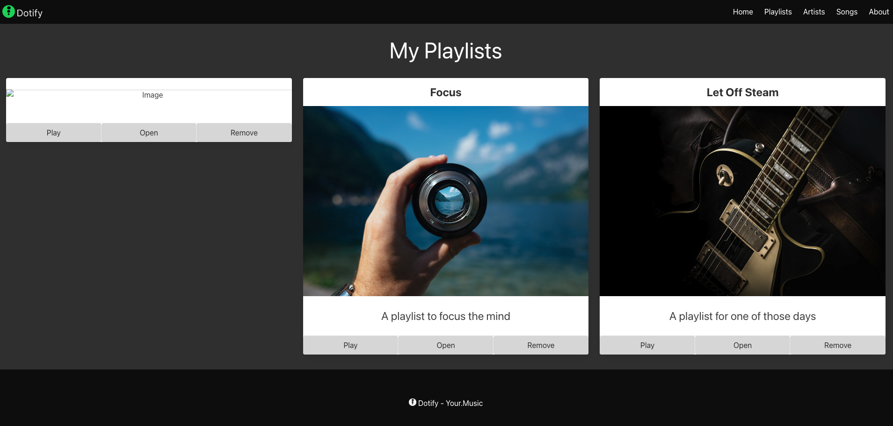
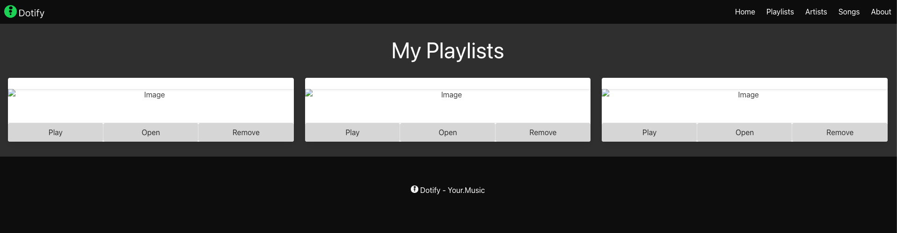

# Injecting Values with JavaScript

So now, we are going to remove all the values from our playlist cards.

First augment each card so the heading, image and description have unique IDs. For example, the first card could have the following IDs:

* `playlist-1-heading`
* `playlist-1-image`
* `playlist-1-description`

You should also remove values from these elements such that they are empty.

The heading is now:

```html
    <header class="card-header">
      <p id="playlist-1-heading" class="card-header-title is-size-4 is-centered">
      </p>
    </header>
```

The image is now:

```html
    
```
(note that we have removed the `src` attribute)

The description is now:

```html
    <article class="card-content">
      <p id="playlist-1-description" class="content is-size-4">
      </p>
    </article>
```

our complete card now looks like this:

```html
<div class="column is-4">
  <section class="card has-text-centered">
    <header class="card-header">
      <p id="playlist-1-heading" class="card-header-title is-size-4 is-centered">
      </p>
    </header>
    <div class="card-image">
      <figure class="image">
        
      </figure>
    </div>
    <article class="card-content">
      <p id="playlist-1-description" class="content is-size-4">
      </p>
    </article>
    <footer class="card-footer">
      <button class="card-footer-item button has-background-grey-lighter">Play</button>
      <button class="card-footer-item button has-background-grey-lighter">Open</button>
      <button class="card-footer-item button has-background-grey-lighter">Remove</button>
    </footer>
  </section>
</div>
```

And Dotify now looks like this:



Do this with the other two cards, for example, your second card could have the following IDs:

* `playlist-2-heading`
* `playlist-2-image`
* `playlist-2-description`


Dotify will now look pretty uninspiring:


