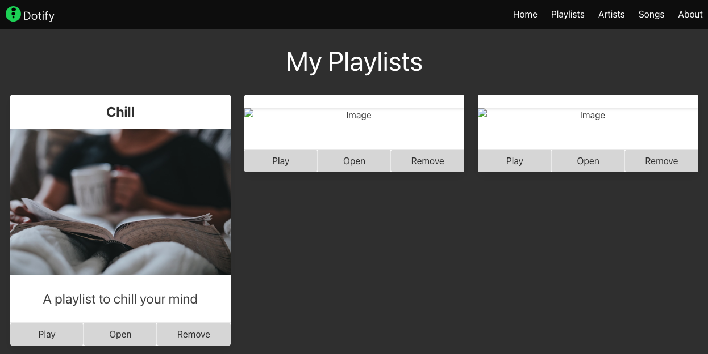

# Finally Adding Values

Now that we have our playlists page without any values, we are going to take what we've learned from this lab and the previous lab to add values to our page.

First, let's create a script in the heading that will run when we get the event that the DOM is loaded.

```html
<script>
  document.addEventListener('DOMContentLoaded', () => {
    console.log("Ready to go!")
  });
</script>
```

Refresh your page and you should now see the message "Ready to go!" in the console.

Now, let's add some values to our page.

```html
<script>
  document.addEventListener('DOMContentLoaded', () => {
    const playlistOneHeading = document.querySelector('#playlist-1-heading');
    playlistOneHeading.innerHTML = 'Chill';

    const playlistOneImage = document.querySelector('#playlist-1-image');
    playlistOneImage.src = 'https://source.unsplash.com/person-holding-coffee-mug-cspncX4cUnQ';

    const playlistOneDescription = document.querySelector('#playlist-1-description');
    playlistOneDescription.innerHTML = 'A playlist to chill your mind';
  });
</script>
```

Now if we refresh Dotify, we should see the first playlist card with the values we just added.



Your HTML should now look like:

```html
<!DOCTYPE html>
<html class="has-background-black" lang="en">

<head>
  <meta charset="utf-8">
  <meta name="viewport" content="width=device-width, initial-scale=1">
  <title>Dotify - Your.Music</title>
  <link rel="icon" type="image/png" sizes="32x32" href="/images/favicon.png" />
  <link rel="stylesheet" href="https://cdn.jsdelivr.net/npm/bulma@0.9.4/css/bulma.min.css" />
  <script src="js/bulma.js"></script>
  <script>
    document.addEventListener('DOMContentLoaded', () => {
      const playlistOneHeading = document.querySelector('#playlist-1-heading');
      playlistOneHeading.innerHTML = 'Chill';

      const playlistOneImage = document.querySelector('#playlist-1-image');
      playlistOneImage.src = 'https://source.unsplash.com/person-holding-coffee-mug-cspncX4cUnQ';

      const playlistOneDescription = document.querySelector('#playlist-1-description');
      playlistOneDescription.innerHTML = 'A playlist to chill your mind';
    });
  </script>
</head>

<body>
  <!-- START NAV -->
  <nav class="navbar has-background-black">
    <div class="navbar-brand">
      <a class="navbar-item" href="#">
        
      </a>
      <span class="navbar-burger has-background-black" data-target="navbarMenu" aria-expanded="false">
        <span aria-hidden="true"></span>
        <span aria-hidden="true"></span>
        <span aria-hidden="true"></span>
      </span>
    </div>
    <div id="navbarMenu" class="navbar-menu">
      <div class="navbar-end has-background-black">
        <a class="navbar-item has-text-white">
          Home
        </a>
        <a class="navbar-item has-text-white">
          Playlists
        </a>
        <a class="navbar-item has-text-white">
          Artists
        </a>
        <a class="navbar-item has-text-white">
          Songs
        </a>
        <a class="navbar-item has-text-white">
          About
        </a>
      </div>
    </div>
  </nav>
  <!-- END NAV -->

  <main class="columns is-multiline box has-background-grey-darker">
    <div class="column is-12 has-text-centered has-text-white">
      <p class="is-size-1">My Playlists</p>
    </div>
    <div class="column is-4">
      <section class="card has-text-centered">
        <header class="card-header">
          <p id="playlist-1-heading" class="card-header-title is-size-4 is-centered">
          </p>
        </header>
        <div class="card-image">
          <figure class="image">
            
          </figure>
        </div>
        <article class="card-content">
          <p id="playlist-1-description" class="content is-size-4">
          </p>
        </article>
        <footer class="card-footer">
          <button class="card-footer-item button has-background-grey-lighter">Play</button>
          <button class="card-footer-item button has-background-grey-lighter">Open</button>
          <button class="card-footer-item button has-background-grey-lighter">Remove</button>
        </footer>
      </section>
    </div>
    <div class="column is-4">
      <section class="card has-text-centered">
        <header class="card-header">
          <p id="playlist-2-heading" class="card-header-title is-size-4 is-centered">
          </p>
        </header>
        <div class="card-image">
          <figure class="image">
            
          </figure>
        </div>
        <article class="card-content">
          <p id="playlist-2-description" class="content is-size-4">
          </p>
        </article>
        <footer class="card-footer">
          <button class="card-footer-item button has-background-grey-lighter">Play</button>
          <button class="card-footer-item button has-background-grey-lighter">Open</button>
          <button class="card-footer-item button has-background-grey-lighter">Remove</button>
        </footer>
      </section>
    </div>
    <div class="column is-4">
      <section class="card has-text-centered">
        <header class="card-header">
          <p id="playlist-3-heading" class="card-header-title is-size-4 is-centered">
          </p>
        </header>
        <div class="card-image">
          <figure class="image">
            
          </figure>
        </div>
        <article class="card-content">
          <p id="playlist-3-description" class="content is-size-4">
          </p>
        </article>
        <footer class="card-footer">
          <button class="card-footer-item button has-background-grey-lighter">Play</button>
          <button class="card-footer-item button has-background-grey-lighter">Open</button>
          <button class="card-footer-item button has-background-grey-lighter">Remove</button>
        </footer>
      </section>
    </div>
  </main>

  <footer class="footer has-background-black has-text-white">
    <div class="container">
      <div class="content has-text-centered">
        <p>
           Dotify - Your.Music
        </p>
      </div>
    </div>
  </footer>
</body>
</html>
```

