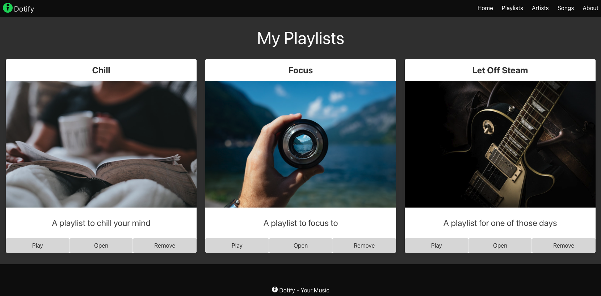

# Exercises

You can continue from the lab steps or download the [source code](./archive/js-playlist-1.1.0.zip) that includes the changes from the lab steps.

## 1. Update the remaining playlist cards

Update the remaining playlists cards, you can harvest the values from the snippet below:

```javascript
    const playlists = [
      {
          name: "Chill",
          description: "A playlist to chill your mind",
          imageUrl: "https://source.unsplash.com/person-holding-coffee-mug-cspncX4cUnQ"
      },
      {
          name:"Focus",
          description: "A playlist to focus to",
          imageUrl: "https://source.unsplash.com/person-holding-camera-lens-7KLa-xLbSXA"
      },
      {
          name: "Let Off Steam",
          description: "A playlist for one of those days",
          imageUrl: "https://source.unsplash.com/black-and-white-electric-guitar-TW-wknV1oZo"
      },
    ];
```

Feel free to copy and paste the code from the previous exercise and update the values accordingly.

```javascript
      const playlistOneHeading = document.querySelector('#playlist-1-heading');
      playlistOneHeading.innerHTML = 'Chill';

      const playlistOneImage = document.querySelector('#playlist-1-image');
      playlistOneImage.src = 'https://source.unsplash.com/person-holding-coffee-mug-cspncX4cUnQ';

      const playlistOneDescription = document.querySelector('#playlist-1-description');
      playlistOneDescription.innerHTML = 'A playlist to chill your mind';
```

Once complete, you should have three playlists cards with the following details:



If you have any issues, you can refer to the [solution](./archive/js-playlist-1.2.0.zip).

You might consider how this would be useful for adding values to your assignment, that is, creating a page that has no values and using JavaScript to add values.

Next week, we will refactor this code to work values from an array of objects and also import that data via JavaScript files instead of hardcoded at the top of the files.

## 2. Try it out on your assignment

If you have completed POC 1 of your assignment, how about you try to apply what you learned to add values to the POC page using JavaScript?

You will want to refactor your code after next weeks lectures but attempting to apply what you have done here to your assignment will really help you learn piece by piece.