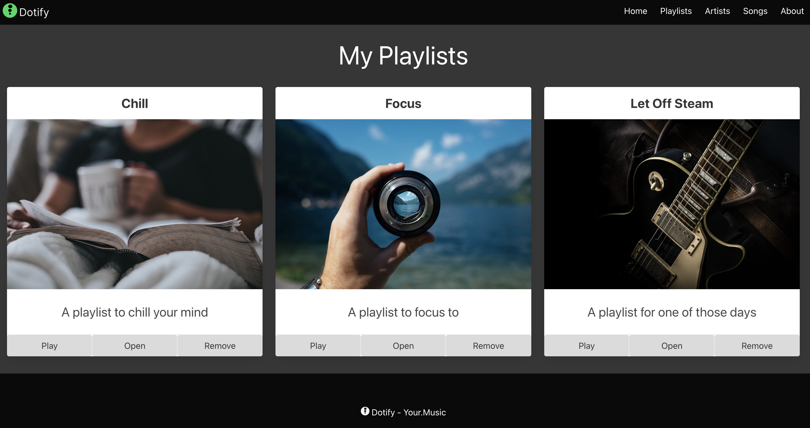

# Introduce a data model

Continuing from the end of the exercises last week or download the [source code](./archive/js-playlist-1.2.0.zip).

Unzip and `eleventy --serve` to start the server.



## Dynamic Number of Playlists

OK, so we have a list of playlists, but what if we want to add more playlists? The first step we are going to take is dynamically generate some HTML depending on our data MODEL.

What is a data model?

A data model is a way of representing the data that our application uses. In our case, we have a list of playlists. We could represent this as an array of objects, where each object represents a playlist.

```javascript
const playlists = [
    {
        name: "Chill",
        description: "A playlist to chill to",
        imageUrl: "https://source.unsplash.com/person-holding-coffee-mug-cspncX4cUnQ"
    },
    {
        name:"Focus",
        description: "A playlist to focus to",
        imageUrl: "https://source.unsplash.com/person-holding-camera-lens-7KLa-xLbSXA"
    },
    {
        name: "Let Off Steam",
        description: "A playlist for one of those days",
        imageUrl: "https://source.unsplash.com/black-and-white-electric-guitar-TW-wknV1oZo"
    },
];
```

Of course, there are no songs in our playlists yet, but we can add those later.

### Iterate and populate playlists

The first step we will take is to iterate over our data model.  We will then remove the repetition from the JavaScript in the head of our document.

```html
  <script>
    document.addEventListener('DOMContentLoaded', () => {
      const playlistOneHeading = document.querySelector('#playlist-1-heading');
      playlistOneHeading.innerHTML = 'Chill';

      const playlistOneImage = document.querySelector('#playlist-1-image');
      playlistOneImage.src = 'https://source.unsplash.com/person-holding-coffee-mug-cspncX4cUnQ';

      const playlistOneDescription = document.querySelector('#playlist-1-description');
      playlistOneDescription.innerHTML = 'A playlist to chill your mind';

      const playlistTwoHeading = document.querySelector('#playlist-2-heading');
      playlistTwoHeading.innerHTML = 'Focus';

      const playlistTwoImage = document.querySelector('#playlist-2-image');
      playlistTwoImage.src = 'https://source.unsplash.com/person-holding-camera-lens-7KLa-xLbSXA';

      const playlistTwoDescription = document.querySelector('#playlist-2-description');
      playlistTwoDescription.innerHTML = 'A playlist to focus to';

      const playlistThreeHeading = document.querySelector('#playlist-3-heading');
      playlistThreeHeading.innerHTML = 'Let Off Steam';

      const playlistThreeImage = document.querySelector('#playlist-3-image');
      playlistThreeImage.src = 'https://source.unsplash.com/black-and-white-electric-guitar-TW-wknV1oZo';

      const playlistThreeDescription = document.querySelector('#playlist-3-description');
      playlistThreeDescription.innerHTML = 'A playlist for one of those days';
    });
  </script>
  ```

  Reviewing this code we can see that we are:

  1. Selecting the elements we want to update
  2. Updating the content of those elements
  3. Repeating this for each playlist

This is a prime example of something we can put into a loop, so let's do that.

```html
  <script>
    document.addEventListener('DOMContentLoaded', () => {
      const playlists = [
        {
          name: "Chill",
          description: "A playlist to chill to",
          imageUrl: "https://source.unsplash.com/person-holding-coffee-mug-cspncX4cUnQ"
        },
        {
          name:"Focus",
          description: "A playlist to focus to",
          imageUrl: "https://source.unsplash.com/person-holding-camera-lens-7KLa-xLbSXA"
        },
        {
          name: "Let Off Steam",
          description: "A playlist for one of those days",
          imageUrl: "https://source.unsplash.com/black-and-white-electric-guitar-TW-wknV1oZo"
        },
      ];
    });
  </script>
```

Above we've added our data model, an array of playlists.  Each element in the array is an object with a name, description, and imageUrl.

```javascript
{
    name: "Chill",
    description: "A playlist to chill to",
    imageUrl: "https://source.unsplash.com/person-holding-coffee-mug-cspncX4cUnQ"
}
```

Time to loop.

```html
  <script>
    document.addEventListener('DOMContentLoaded', () => {
      const playlists = [
        {
          name: "Chill",
          description: "A playlist to chill to",
          imageUrl: "https://source.unsplash.com/person-holding-coffee-mug-cspncX4cUnQ"
        },
        {
          name: "Focus",
          description: "A playlist to focus to",
          imageUrl: "https://source.unsplash.com/person-holding-camera-lens-7KLa-xLbSXA"
        },
        {
          name: "Let Off Steam",
          description: "A playlist for one of those days",
          imageUrl: "https://source.unsplash.com/black-and-white-electric-guitar-TW-wknV1oZo"
        },
      ];


      for (let index = 0; index < playlists.length; index++) {
        const playlist = playlists[index] // playlists[0]

        const playlistHeading = document.querySelector(`#playlist-${index + 1}-heading`);
        playlistHeading.innerHTML = playlist.name;

        const playlistImage = document.querySelector(`#playlist-${index + 1}-image`);
        playlistImage.src = playlist.imageUrl;

        const playlistDescription = document.querySelector(`#playlist-${index + 1}-description`);
        playlistDescription.innerHTML = playlist.description;
      };
    });
  </script>
```

Dissecting the loop:

```javascript
for (let index = 0; index < playlists.length; index++){
```

Here we are using a classic `for` loop or numeric for-loop.  We start at 0 and continue until we reach the length of the playlists array.

* First we have the _initialization_ `let index = 0`, we have initialized a new variable called `index` and set it to 0. This is because arrays are zero-indexed, so the first element in the array is at index 0, `playlists[0]`.
* Next we have the _condition_ `index < playlists.length`, we will continue looping as long as `index` is less than the length of the `playlists` array.  Remember in this case, the length of the array is 3, but the last index is 2. `playlists.length === 3`, but the last index is `playlists[2]`.

* Finally, we have the _counter_ `index++`, this is shorthand for `index = index + 1`.  We are incrementing the value of `index` by 1 each time we loop. This is also known as the increment or decrement portion of the loop declaration.  This could also be known as the update expression or the iteration expression.

On the first iteration of the loop the index is zero, to access the first element in the array we use `playlists[0]`.

```javascript
for (let index = 0; index < playlists.length; index++) {
    const playlist = playlists[index] // playlists[0]
```

Next we are selecting the elements we want to update.

```javascript
const playlistHeading = document.querySelector(`#playlist-${index + 1}-heading`);
playlistHeading.innerHTML = playlist.name;

const playlistImage = document.querySelector(`#playlist-${index + 1}-image`);
playlistImage.src = playlist.imageUrl;

const playlistDescription = document.querySelector(`#playlist-${index + 1}-description`);
playlistDescription.innerHTML = playlist.description;
```

We use string interpolation to select the elements we want to update.  The backticks allow us to use `${}` to insert the value of `index + 1` into the string.  This is because the elements we want to update are `playlist-1-heading`, `playlist-1-image`, and `playlist-1-description`.  We are adding 1 to the index because arrays are zero-indexed, but we want to start at 1.

On the first iteration of the loop we use `playlists[0]` to update `playlist-1-heading`, `playlist-1-image`, and `playlist-1-description`.  On the second iteration we use `playlists[1]` to update `playlist-2-heading`, `playlist-2-image`, and `playlist-2-description`. Finally, on the third iteration we use `playlists[2]` to update `playlist-3-heading`, `playlist-3-image`, and `playlist-3-description`.

## The forEach method

Alright, so we've seen how to loop over an array using a `for` loop.  But there is another way to loop over an array, the `forEach` method.

The `forEach` method is a higher-order function that takes a callback function as an argument.  The callback function is called for each element in the array.

```javascript
  <script>
    document.addEventListener('DOMContentLoaded', () => {
      const playlists = [
        {
          name: "Chill",
          description: "A playlist to chill to",
          imageUrl: "https://source.unsplash.com/person-holding-coffee-mug-cspncX4cUnQ"
        },
        {
          name: "Focus",
          description: "A playlist to focus to",
          imageUrl: "https://source.unsplash.com/person-holding-camera-lens-7KLa-xLbSXA"
        },
        {
          name: "Let Off Steam",
          description: "A playlist for one of those days",
          imageUrl: "https://source.unsplash.com/black-and-white-electric-guitar-TW-wknV1oZo"
        },
      ];

      playlists.forEach((playlist, index) => {
        const playlistHeading = document.querySelector(`#playlist-${index + 1}-heading`);
        playlistHeading.innerHTML = playlist.name;

        const playlistImage = document.querySelector(`#playlist-${index + 1}-image`);
        playlistImage.src = playlist.imageUrl;

        const playlistDescription = document.querySelector(`#playlist-${index + 1}-description`);
        playlistDescription.innerHTML = playlist.description;
      });
    });
  </script>
```

Here we are calling [forEach](https://developer.mozilla.org/en-US/docs/Web/JavaScript/Reference/Global_Objects/Array/forEach) on the `playlists` array.  

```javascript
playlists.forEach((playlist, index) => {});
```

`forEach` accepts a function as it's first argument, that is outlined by `(playlist, index) => {}`.  This is an arrow function that takes two arguments, `playlist` and `index`.  The `playlist` argument is the current element in the array, and the `index` argument is the index of the current element.

This is the equivalent of using a classical function declaration.

```javascript
playlists.forEach(function(playlist, index) {});
```

Arrow function syntax is preferred not only because it is more concise, but it has a different scope than that of the classical function, we won't get into this as the arrow function is a more natural fit for new programmers and explaining it can cause confusion.  To dig in however, review the [documentation](https://developer.mozilla.org/en-US/docs/Web/JavaScript/Guide/Functions#arrow_functions).

In short, this means that arrow functions are more predictable and easier to reason about, therefore they are preferred.

Our HTML is now much cleaner and easier to read.

```html
<!DOCTYPE html>
<html class="has-background-black" lang="en">

<head>
  <meta charset="utf-8">
  <meta name="viewport" content="width=device-width, initial-scale=1">
  <title>Dotify - Your.Music</title>
  <link rel="icon" type="image/png" sizes="32x32" href="/images/favicon.png" />
  <link rel="stylesheet" href="https://cdn.jsdelivr.net/npm/bulma@0.9.4/css/bulma.min.css" />
  <script src="js/bulma.js"></script>
  <script>
    document.addEventListener('DOMContentLoaded', () => {
      const playlists = [
        {
          name: "Chill",
          description: "A playlist to chill to",
          imageUrl: "https://source.unsplash.com/person-holding-coffee-mug-cspncX4cUnQ"
        },
        {
          name: "Focus",
          description: "A playlist to focus to",
          imageUrl: "https://source.unsplash.com/person-holding-camera-lens-7KLa-xLbSXA"
        },
        {
          name: "Let Off Steam",
          description: "A playlist for one of those days",
          imageUrl: "https://source.unsplash.com/black-and-white-electric-guitar-TW-wknV1oZo"
        }
      ];

      playlists.forEach((playlist, index) => {
        const playlistHeading = document.querySelector(`#playlist-${index + 1}-heading`);
        playlistHeading.innerHTML = playlist.name;

        const playlistImage = document.querySelector(`#playlist-${index + 1}-image`);
        playlistImage.src = playlist.imageUrl;

        const playlistDescription = document.querySelector(`#playlist-${index + 1}-description`);
        playlistDescription.innerHTML = playlist.description;
      });
    });
  </script>
</head>

<body>
  <!-- START NAV -->
  <nav class="navbar has-background-black">
    <div class="navbar-brand">
      <a class="navbar-item" href="#">
        
      </a>
      <span class="navbar-burger has-background-black" data-target="navbarMenu" aria-expanded="false">
        <span aria-hidden="true"></span>
        <span aria-hidden="true"></span>
        <span aria-hidden="true"></span>
      </span>
    </div>
    <div id="navbarMenu" class="navbar-menu">
      <div class="navbar-end has-background-black">
        <a class="navbar-item has-text-white">
          Home
        </a>
        <a class="navbar-item has-text-white">
          Playlists
        </a>
        <a class="navbar-item has-text-white">
          Artists
        </a>
        <a class="navbar-item has-text-white">
          Songs
        </a>
        <a class="navbar-item has-text-white">
          About
        </a>
      </div>
    </div>
  </nav>
  <!-- END NAV -->

  <main class="columns is-multiline box has-background-grey-darker">
    <div class="column is-12 has-text-centered has-text-white">
      <p class="is-size-1">My Playlists</p>
    </div>
    <div class="column is-4">
      <section class="card has-text-centered">
        <header class="card-header">
          <p id="playlist-1-heading" class="card-header-title is-size-4 is-centered">
          </p>
        </header>
        <div class="card-image">
          <figure class="image">
            
          </figure>
        </div>
        <article class="card-content">
          <p id="playlist-1-description" class="content is-size-4">
          </p>
        </article>
        <footer class="card-footer">
          <button class="card-footer-item button has-background-grey-lighter">Play</button>
          <button class="card-footer-item button has-background-grey-lighter">Open</button>
          <button class="card-footer-item button has-background-grey-lighter">Remove</button>
        </footer>
      </section>
    </div>
    <div class="column is-4">
      <section class="card has-text-centered">
        <header class="card-header">
          <p id="playlist-2-heading" class="card-header-title is-size-4 is-centered">
          </p>
        </header>
        <div class="card-image">
          <figure class="image">
            
          </figure>
        </div>
        <article class="card-content">
          <p id="playlist-2-description" class="content is-size-4">
          </p>
        </article>
        <footer class="card-footer">
          <button class="card-footer-item button has-background-grey-lighter">Play</button>
          <button class="card-footer-item button has-background-grey-lighter">Open</button>
          <button class="card-footer-item button has-background-grey-lighter">Remove</button>
        </footer>
      </section>
    </div>
    <div class="column is-4">
      <section class="card has-text-centered">
        <header class="card-header">
          <p id="playlist-3-heading" class="card-header-title is-size-4 is-centered">
          </p>
        </header>
        <div class="card-image">
          <figure class="image">
            
          </figure>
        </div>
        <article class="card-content">
          <p id="playlist-3-description" class="content is-size-4">
          </p>
        </article>
        <footer class="card-footer">
          <button class="card-footer-item button has-background-grey-lighter">Play</button>
          <button class="card-footer-item button has-background-grey-lighter">Open</button>
          <button class="card-footer-item button has-background-grey-lighter">Remove</button>
        </footer>
      </section>
    </div>
  </main>

  <footer class="footer has-background-black has-text-white">
    <div class="container">
      <div class="content has-text-centered">
        <p>
           Dotify - Your.Music
        </p>
      </div>
    </div>
  </footer>
</body>

</html>
```
