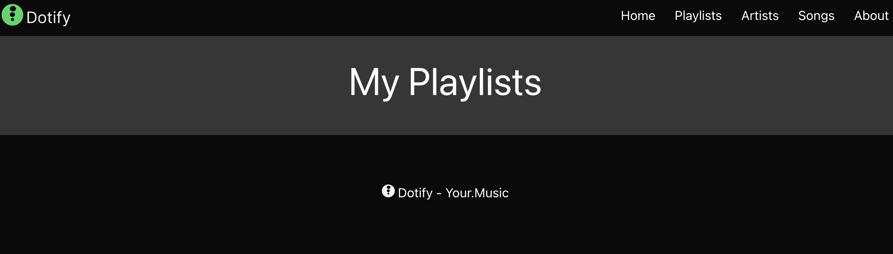
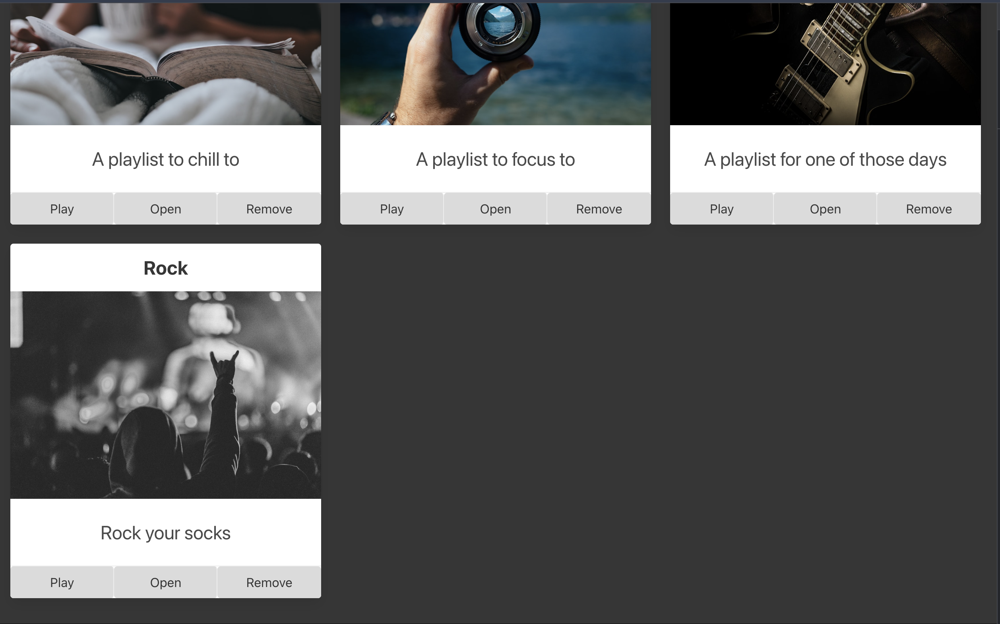
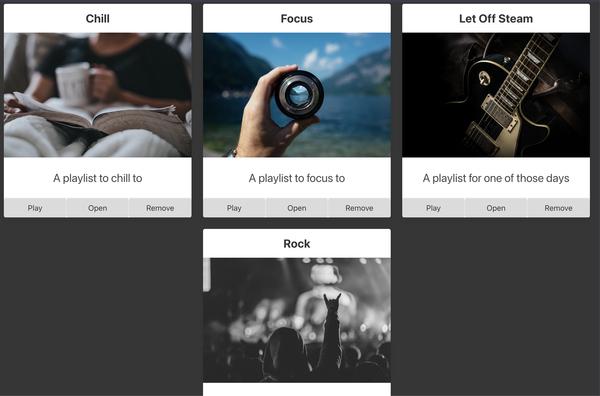

# Dynamic Playlist Components

We are getting somewhere but as we can see we are currently limited to three playlists. We want to be able to add as many playlists as we want.

Let's think how we could do this.

One approach we can take is to iterate over an array of playlists and render a `Playlist` component for each one.

This way, we can add as many playlists as we want to the array and they will all be rendered.

Note that we are using the term "component" very loosely here. We are not using React components, but rather a way to organize our code.

The first thing we should do is remove the hardcoded playlists from our `<main>`.

Our `<main>` is now simply:

```html
<main class="columns is-multiline box has-background-grey-darker">
  <div class="column is-12 has-text-centered has-text-white">
    <p class="is-size-1">My Playlists</p>
  </div>
</main>
```

Our page now looks like:



Very exciting, if you check the console, there will likely be JavaScript errors too.

Using template literals, we can dynamically add the playlists to the page.

```html
<script>
    document.addEventListener('DOMContentLoaded', () => {
      const playlists = [
        {
          name: "Chill",
          description: "A playlist to chill to",
          imageUrl: "https://source.unsplash.com/person-holding-coffee-mug-cspncX4cUnQ"
        },
        {
          name: "Focus",
          description: "A playlist to focus to",
          imageUrl: "https://source.unsplash.com/person-holding-camera-lens-7KLa-xLbSXA"
        },
        {
          name: "Let Off Steam",
          description: "A playlist for one of those days",
          imageUrl: "https://source.unsplash.com/black-and-white-electric-guitar-TW-wknV1oZo"
        }
      ];

      const main = document.querySelector('main');
      playlists.forEach((playlist, index) => {
        const element = `
        <div class="column is-4">
          <section class="card has-text-centered">
            <header class="card-header">
              <p class="card-header-title is-size-4 is-centered">
                ${playlist.name}
              </p>
            </header>
            <div class="card-image">
              <figure class="image">
                
              </figure>
            </div>
            <article class="card-content">
              <p class="content is-size-4">
                ${playlist.description}
              </p>
            </article>
            <footer class="card-footer">
              <button class="card-footer-item button has-background-grey-lighter">Play</button>
              <button class="card-footer-item button has-background-grey-lighter">Open</button>
              <button class="card-footer-item button has-background-grey-lighter">Remove</button>
            </footer>
          </section>
        </div>`
        main.innerHTML = main.innerHTML + element;
      });
    });
  </script>
  ```

  So what have we done here.

  1. We have removed the hardcoded playlists from the `<main>`.
  2. We have created an array of playlists.
  3. We have iterated over the playlists array using the `forEach` method.
  4. For each playlist, we have created a string of HTML using template literals.
  5. We have added the string of HTML to the `<main>`, `main.innerHTML = main.innerHTML + element;`

This is a good start and worth reviewing to ensure you understand what has happened here.

Note that we've simplified the HTML to use less id's as it is possible we won't be using them anymore.

Our page (or view) is now driven by the data in the playlists array. Test this out by adding another playlist to the array and refreshing.

```javascript
  const playlists = [
    {
      name: "Chill",
      description: "A playlist to chill to",
      imageUrl: "https://source.unsplash.com/person-holding-coffee-mug-cspncX4cUnQ"
    },
    {
      name: "Focus",
      description: "A playlist to focus to",
      imageUrl: "https://source.unsplash.com/person-holding-camera-lens-7KLa-xLbSXA"
    },
    {
      name: "Let Off Steam",
      description: "A playlist for one of those days",
      imageUrl: "https://source.unsplash.com/black-and-white-electric-guitar-TW-wknV1oZo"
    },
    {
      name: "Rock",
      description: "Rock your socks",
      imageUrl: "https://source.unsplash.com/grayscale-photo-of-person-in-hoodie-top-watching-a-concert-97p-JwqdyW4"
    }
  ];
```

We can see our new playlist has been added to the page.



What might be a nice optimization here is to center the playlists on the page so that when we have a number that isn't a multiple of 3, the playlists are centered.

We can do this by adding a class to the `<main>`, `is-centered`

```html
  <main class="columns is-multiline is-centered box has-background-grey-darker">
```



Our entire HTML is now:

```html
<!DOCTYPE html>
<html class="has-background-black" lang="en">

<head>
  <meta charset="utf-8">
  <meta name="viewport" content="width=device-width, initial-scale=1">
  <title>Dotify - Your.Music</title>
  <link rel="icon" type="image/png" sizes="32x32" href="/images/favicon.png" />
  <link rel="stylesheet" href="https://cdn.jsdelivr.net/npm/bulma@0.9.4/css/bulma.min.css" />
  <script src="js/bulma.js"></script>
  <script>
    document.addEventListener('DOMContentLoaded', () => {
      const playlists = [
        {
          name: "Chill",
          description: "A playlist to chill to",
          imageUrl: "https://source.unsplash.com/person-holding-coffee-mug-cspncX4cUnQ"
        },
        {
          name: "Focus",
          description: "A playlist to focus to",
          imageUrl: "https://source.unsplash.com/person-holding-camera-lens-7KLa-xLbSXA"
        },
        {
          name: "Let Off Steam",
          description: "A playlist for one of those days",
          imageUrl: "https://source.unsplash.com/black-and-white-electric-guitar-TW-wknV1oZo"
        },
        {
          name: "Rock",
          description: "Rock your socks",
          imageUrl: "https://source.unsplash.com/grayscale-photo-of-person-in-hoodie-top-watching-a-concert-97p-JwqdyW4"
        }
      ];

      const main = document.querySelector('main');
      playlists.forEach((playlist, index) => {
        const element = `
        <div class="column is-4">
          <section class="card has-text-centered">
            <header class="card-header">
              <p class="card-header-title is-size-4 is-centered">
                ${playlist.name}
              </p>
            </header>
            <div class="card-image">
              <figure class="image">
                
              </figure>
            </div>
            <article class="card-content">
              <p class="content is-size-4">
                ${playlist.description}
              </p>
            </article>
            <footer class="card-footer">
              <button class="card-footer-item button has-background-grey-lighter">Play</button>
              <button class="card-footer-item button has-background-grey-lighter">Open</button>
              <button class="card-footer-item button has-background-grey-lighter">Remove</button>
            </footer>
          </section>
        </div>`
        main.innerHTML = main.innerHTML + element;
      });
    });
  </script>
</head>

<body>
  <!-- START NAV -->
  <nav class="navbar has-background-black">
    <div class="navbar-brand">
      <a class="navbar-item" href="#">
        
      </a>
      <span class="navbar-burger has-background-black" data-target="navbarMenu" aria-expanded="false">
        <span aria-hidden="true"></span>
        <span aria-hidden="true"></span>
        <span aria-hidden="true"></span>
      </span>
    </div>
    <div id="navbarMenu" class="navbar-menu">
      <div class="navbar-end has-background-black">
        <a class="navbar-item has-text-white">
          Home
        </a>
        <a class="navbar-item has-text-white">
          Playlists
        </a>
        <a class="navbar-item has-text-white">
          Artists
        </a>
        <a class="navbar-item has-text-white">
          Songs
        </a>
        <a class="navbar-item has-text-white">
          About
        </a>
      </div>
    </div>
  </nav>
  <!-- END NAV -->

  <main class="columns is-multiline box has-background-grey-darker is-centered">
    <div class="column is-12 has-text-centered has-text-white">
      <p class="is-size-1">My Playlists</p>
    </div>
  </main>

  <footer class="footer has-background-black has-text-white">
    <div class="container">
      <div class="content has-text-centered">
        <p>
           Dotify - Your.Music
        </p>
      </div>
    </div>
  </footer>
</body>

</html>
```

