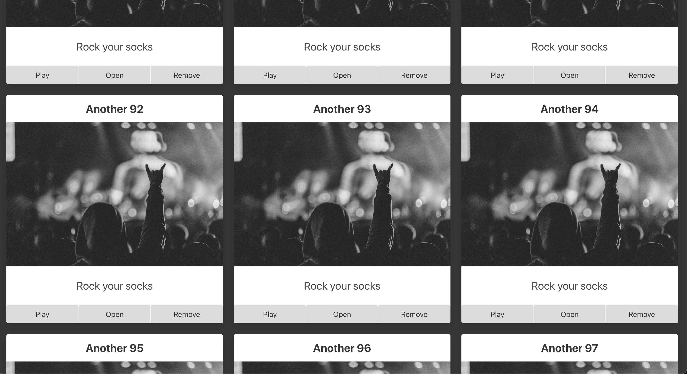
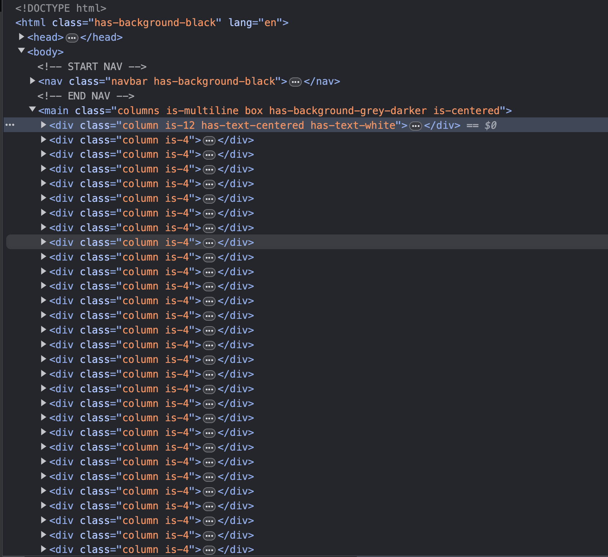

# Experimentation

Alright, add the following after the declaration of the playlist array.

```javascript
      for (let i = 0; i < 100; i++) {
        playlists.push({
          name: `Another ${i}`,
          description: "Rock your socks",
          imageUrl: "https://source.unsplash.com/grayscale-photo-of-person-in-hoodie-top-watching-a-concert-97p-JwqdyW4"
        })
      }
```

Refresh your page.





As you can see we've now added 100 more playlists.  See how far you can take it before your computer starts to slow down.

Again, this is a view driven by a data model.  We can add as many playlists as we like and the view will update accordingly.

Once you are done, remove the code you just added.