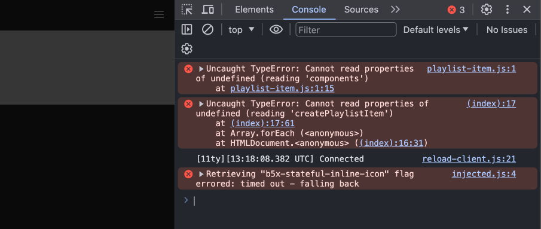
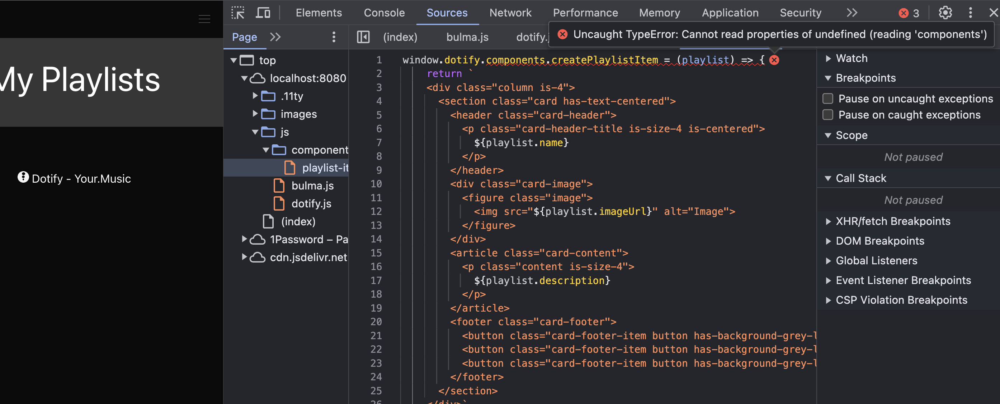
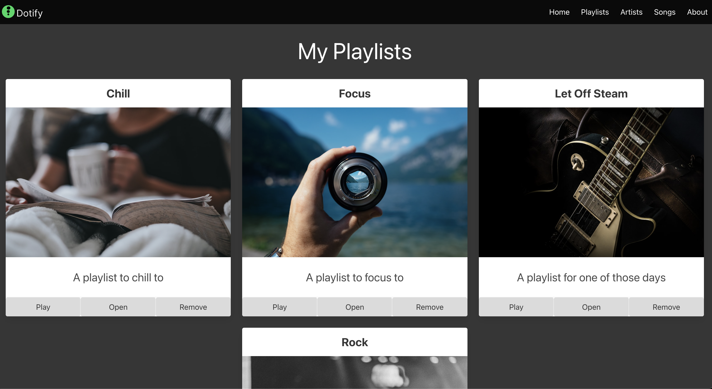

# Advanced: Name Spacing

If we review our scripts.

```html
  <script src="js/bulma.js"></script>
  <script src="js/components/playlist-item.js"></script>
  <script src="js/data-store.js"></script>
```

First, we have `bulma.js` which is a script that contains the Bulma CSS framework.  This script is a third-party script that we are using to help bulma.  For now this is relatively safe as it is.

Second, we have `components/playlist-item.js` which is a script that contains the `createPlaylistItem` function.  This script is a script that we have created and is specific to our application.

```javascript
const createPlaylistItem = (playlist) => {
    return `
    <div class="column is-4">
      <section class="card has-text-centered">
        <header class="card-header">
          <p class="card-header-title is-size-4 is-centered">
            ${playlist.name}
            ..........
```

Third, we have `data-store.js` that creates the `dataStore` object.

```javascript
const dataStore = {
    data: [
        {
            name: "Chill",
            description: "A pl
    ....
```

The last two scripts have added `createPlaylistItem` and `dataStore` to the global namespace (or scope).  This is not a good practice as it can lead to conflicts with other scripts that may be added to the page.

To assist with this, we are going to create a `dotify` namespace by creating a `dotify` object and adding our functions and objects to this object.

Modify `js/data-store.js` to be:

```javascript
window.dotify = {
    dataStore: {
        data: [
            {
                name: "Chill",
                description: "A playlist to chill to",
                imageUrl: "https://source.unsplash.com/person-holding-coffee-mug-cspncX4cUnQ"
            },
            {
                name: "Focus",
                description: "A playlist to focus to",
                imageUrl: "https://source.unsplash.com/person-holding-camera-lens-7KLa-xLbSXA"
            },
            {
                name: "Let Off Steam",
                description: "A playlist for one of those days",
                imageUrl: "https://source.unsplash.com/black-and-white-electric-guitar-TW-wknV1oZo"
            },
            {
                name: "Rock",
                description: "Rock your socks",
                imageUrl: "https://source.unsplash.com/grayscale-photo-of-person-in-hoodie-top-watching-a-concert-97p-JwqdyW4"
            }
        ],
        list() {
            return this.data
        },
    }
}
```

We we have added a `dotify` object to the global namespace via `window.dotify = `.  We have also added the `dataStore` object to the `dotify` object.  This means that the `dataStore` object is now accessible via `dotify.dataStore`.

Now augment the JavaScript to us `dotify.dataStore.list()`:

```javascript
    document.addEventListener('DOMContentLoaded', () => {
      const main = document.querySelector('main');
      dotify.dataStore.list().forEach((playlist) => {
        main.innerHTML = main.innerHTML + createPlaylistItem(playlist);
      });
    });
```

Now let's do similar in the `components/playlist-item.js` file.


```javascript
window.dotify.components.createPlaylistItem = (playlist) => {
    return `
    <div class="column is-4">
      <section class="card has-text-centered">
        <header class="card-header">
          <p class="card-header-title is-size-4 is-centered">
            ${playlist.name}
          </p>
        </header>
        <div class="card-image">
          <figure class="image">
            
          </figure>
        </div>
        <article class="card-content">
          <p class="content is-size-4">
            ${playlist.description}
          </p>
        </article>
        <footer class="card-footer">
          <button class="card-footer-item button has-background-grey-lighter">Play</button>
          <button class="card-footer-item button has-background-grey-lighter">Open</button>
          <button class="card-footer-item button has-background-grey-lighter">Remove</button>
        </footer>
      </section>
    </div>`
}
```

Also, update the `index.html` file to use the new function:

```javascript
    document.addEventListener('DOMContentLoaded', () => {
      const main = document.querySelector('main');
      dotify.dataStore.list().forEach((playlist) => {
        main.innerHTML = main.innerHTML + dotify.components.createPlaylistItem(playlist);
      });
    });
```

Refresh your page, what happens?  It does not work, why?

Let's review the console:



Focus on the first error:

```plaintext
Uncaught TypeError: Cannot read properties of undefined (reading 'components')
    at playlist-item.js:1:15
```

Click the link to playlist-item.js and review the code:



The problem here is that we cannot access `components` from `dotify` as we have not defined it.  We need to define our `dotify` object in a more controlled manner.

Create a new file `js/dotify.js` and add the following:

```javascript
window.dotify = {
    components: {},
    dataStore: {}
}
```

Now augment `data-store.js` to use the `dotify` object rather than define it's own

```javascript
dotify.dataStore.data =  [
    {
        name: "Chill",
        description: "A playlist to chill to",
        imageUrl: "https://source.unsplash.com/person-holding-coffee-mug-cspncX4cUnQ"
    },
    {
        name: "Focus",
        description: "A playlist to focus to",
        imageUrl: "https://source.unsplash.com/person-holding-camera-lens-7KLa-xLbSXA"
    },
    {
        name: "Let Off Steam",
        description: "A playlist for one of those days",
        imageUrl: "https://source.unsplash.com/black-and-white-electric-guitar-TW-wknV1oZo"
    },
    {
        name: "Rock",
        description: "Rock your socks",
        imageUrl: "https://source.unsplash.com/grayscale-photo-of-person-in-hoodie-top-watching-a-concert-97p-JwqdyW4"
    }
]

dotify.dataStore.list = () => {
    return dotify.dataStore.data
}
```

Instead of declaring a new object, we add the data and list functions to the `dotify.dataSource` object.

It is good practice to not declare new objects in each file, but rather to add to the `dotify` object in `dotify.js`

Now include `dotify` file in your `index.html`:

```html
  <script src="js/bulma.js"></script>
  <script src="js/dotify.js"></script>
  <script src="js/components/playlist-item.js"></script>
  <script src="js/data-store.js"></script>
```

_CAUTION_ be sure to include `dotify.js` before `components/playlist-item.js` and `data-store.js` as the `components` and `dataStore` objects are dependent on the `dotify` object.

Refresh the page and double check the console, it should load without errors.



# Solution Source Code

If you are having issues, compare with the solution code, available [here](./archive/js-playlist-1.4.0.zip)