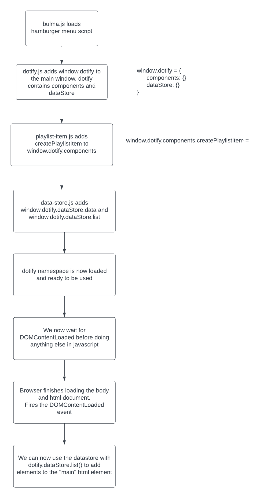

# Reflection

We did a lot here.

## Separation of Concerns

First off, we reduced the JavaScript on our `index.html` from:

```html
  <script>
    document.addEventListener('DOMContentLoaded', () => {
      const playlistOneHeading = document.querySelector('#playlist-1-heading');
      playlistOneHeading.innerHTML = 'Chill';

      const playlistOneImage = document.querySelector('#playlist-1-image');
      playlistOneImage.src = 'https://source.unsplash.com/person-holding-coffee-mug-cspncX4cUnQ';

      const playlistOneDescription = document.querySelector('#playlist-1-description');
      playlistOneDescription.innerHTML = 'A playlist to chill your mind';

      const playlistTwoHeading = document.querySelector('#playlist-2-heading');
      playlistTwoHeading.innerHTML = 'Focus';

      const playlistTwoImage = document.querySelector('#playlist-2-image');
      playlistTwoImage.src = 'https://source.unsplash.com/person-holding-camera-lens-7KLa-xLbSXA';

      const playlistTwoDescription = document.querySelector('#playlist-2-description');
      playlistTwoDescription.innerHTML = 'A playlist to focus to';

      const playlistThreeHeading = document.querySelector('#playlist-3-heading');
      playlistThreeHeading.innerHTML = 'Let Off Steam';

      const playlistThreeImage = document.querySelector('#playlist-3-image');
      playlistThreeImage.src = 'https://source.unsplash.com/black-and-white-electric-guitar-TW-wknV1oZo';

      const playlistThreeDescription = document.querySelector('#playlist-3-description');
      playlistThreeDescription.innerHTML = 'A playlist for one of those days';
    });
  </script>
  ```

  To this:

```html
  <script>
    document.addEventListener('DOMContentLoaded', () => {
      const main = document.querySelector('main');
      dotify.dataStore.list().forEach((playlist) => {
        main.innerHTML = main.innerHTML + dotify.components.createPlaylistItem(playlist);
      });
    });
  </script>
```

Great!  BUT, we have introduced more complexity as we are now managing multiple files.

The advantages of what we have done are:

* Separation of concerns:  We have separated the data from the view.
* Reusability:  We can reuse the `dataStore` object in other parts of our application.
* Maintainability:  We can easily update the data in the `dataStore` object without having to touch the HTML.  We can even change it to pull data from a server without changing the HTML (mostly).

The concept of a data driven website may be new to you but it is a common pattern in web development.  It is a good practice to separate your data from your view.

## Name Spacing

We also introduced a new concept, our own namespace, `dotify`.  This is a common pattern in JavaScript to avoid naming conflicts with other libraries.

We have also used the `window` object to add our `dotify` object to the global namespace.

Conflicts are still possible but in reality, the browser runs and interprets code locally so that is always the case, no matter what website you are on.

You can obfuscate and complicate to make it more difficult, but in the end, it is always possible to get around it, browser extensions exist to help you augment and modify any website you visit.  However, if you think about it, you can only do this on your local machine, essentially to yourself so unless you are trying to hack yourself, it is not a big deal.

This is why you see security and intellectual property implemented in a more controlled environment, like a server, where you can control the environment and access to the code.  (That's not to say that front end security is not important, it is.)

## Review of JS loading

```html
<!DOCTYPE html>
<html class="has-background-black" lang="en">

<head>
  <meta charset="utf-8">
  <meta name="viewport" content="width=device-width, initial-scale=1">
  <title>Dotify - Your.Music</title>
  <link rel="icon" type="image/png" sizes="32x32" href="/images/favicon.png" />
  <link rel="stylesheet" href="https://cdn.jsdelivr.net/npm/bulma@0.9.4/css/bulma.min.css" />
  <script src="js/bulma.js"></script>
  <script src="js/dotify.js"></script>
  <script src="js/components/playlist-item.js"></script>
  <script src="js/data-store.js"></script>
  <script>
    document.addEventListener('DOMContentLoaded', () => {
      const main = document.querySelector('main');
      dotify.dataStore.list().forEach((playlist) => {
        main.innerHTML = main.innerHTML + dotify.components.createPlaylistItem(playlist);
      });
    });
  </script>
</head>

<body>
....
</body>

</html>
```

