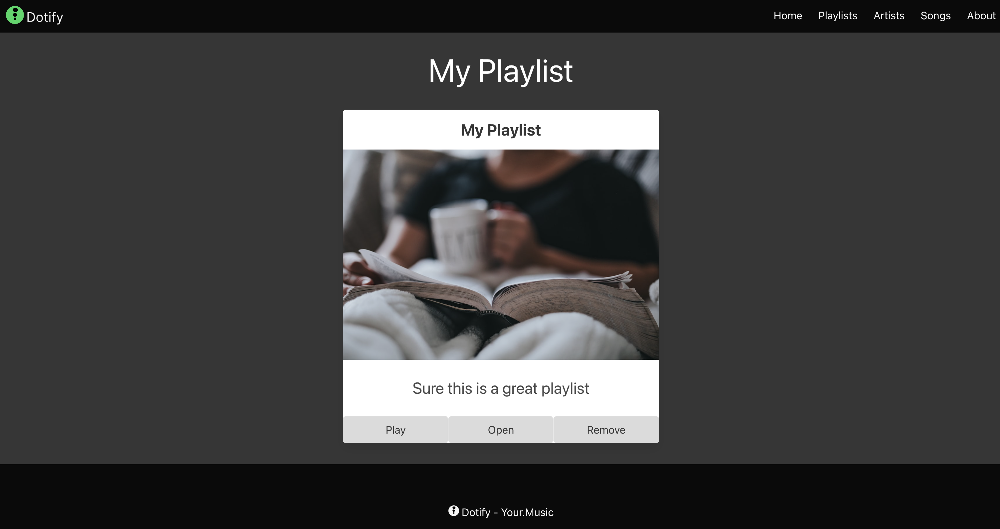

# Playlist Page

Let's now add a specific page to show the details of our playlists so that when we click on a playlist, we can see the songs that are part of it.

Either continue from last week or download the source code from the previous lab - [here](./archives/js-playlist-1.4.0.zip)

First, let's create a rough design.  Our design team has been working for minutes and come up with the following:


Mind blowing, take the weekend off team!

Create a file named `playlist.html` and let's put in the basic starter HTML.  We are going to hardcode our values while we get the layout right.

```html
<!DOCTYPE html>
<html class="has-background-black" lang="en">

<head>
    <meta charset="utf-8">
    <meta name="viewport" content="width=device-width, initial-scale=1">
    <title>Dotify - Your.Music</title>
    <link rel="icon" type="image/png" sizes="32x32" href="/images/favicon.png" />
    <link rel="stylesheet" href="https://cdn.jsdelivr.net/npm/bulma@0.9.4/css/bulma.min.css" />
    <script src="js/bulma.js"></script>
    <script src="js/dotify.js"></script>
    <script src="js/components/playlist-item.js"></script>
    <script src="js/data-store.js"></script>
</head>

<body>
    <!-- START NAV -->
    <nav class="navbar has-background-black">
        <div class="navbar-brand">
            <a class="navbar-item" href="#">
                
            </a>
            <span class="navbar-burger has-background-black" data-target="navbarMenu" aria-expanded="false">
                <span aria-hidden="true"></span>
                <span aria-hidden="true"></span>
                <span aria-hidden="true"></span>
            </span>
        </div>
        <div id="navbarMenu" class="navbar-menu">
            <div class="navbar-end has-background-black">
                <a class="navbar-item has-text-white">
                    Home
                </a>
                <a class="navbar-item has-text-white">
                    Playlists
                </a>
                <a class="navbar-item has-text-white">
                    Artists
                </a>
                <a class="navbar-item has-text-white">
                    Songs
                </a>
                <a class="navbar-item has-text-white">
                    About
                </a>
            </div>
        </div>
    </nav>
    <!-- END NAV -->

    <main class="columns is-multiline box has-background-grey-darker is-centered">
        <div class="column is-12 has-text-centered has-text-white">
            <p class="is-size-1">My Playlist</p>
        </div>
    </main>

    <footer class="footer has-background-black has-text-white">
        <div class="container">
            <div class="content has-text-centered">
                <p>
                     Dotify - Your.Music
                </p>
            </div>
        </div>
    </footer>
</body>

</html>
```

If eleventy is not running, start it up with `eleventy --serve` in your terminal.

Now navigate to `http://localhost:8080/playlist` in your browser.


OK so we have our basic layout and we have a placeholder for our playlist name.

It's seems the design team did a much better job than we initially thought and reused our playlist item component.  Let's add that to our playlist page just after the playlist name.

```html
        <div class="column is-4">
            <section class="card has-text-centered">
                <header class="card-header">
                    <p class="card-header-title is-size-4 is-centered">
                        My Playlist
                    </p>
                </header>
                <div class="card-image">
                    <figure class="image">
                        
                    </figure>
                </div>
                <article class="card-content">
                    <p class="content is-size-4">
                        Sure this is a great playlist
                    </p>
                </article>
                <footer class="card-footer">
                    <button class="card-footer-item button has-background-grey-lighter">Play</button>
                    <button class="card-footer-item button has-background-grey-lighter">Open</button>
                    <button class="card-footer-item button has-background-grey-lighter">Remove</button>
                </footer>
            </section>
        </div>
```



ALrighty, reviewing our design:


Time to add the table, since the playlist item component is a width of 4, let's set up our table to have a width of 8.

Directly after our playlist item, add a column of width 8:

```html
        <div class="column is-8">
        </div>
```


Alright, time to add the table.

Reviewing the designs, we can see we have 3 columns, Title, Artist and Duration.

To start out, we can declare our table within the column:

```html
        <div class="column is-8">
            <table class="table">
                <thead>
                    <tr>
                        <th>Title</th>
                        <th>Artist</th>
                        <th>Duration</th>
                    </tr>
                </thead>
        </div>
```


Great, let's add some rows, our entire table should now look like:

```html
        <table class="table is-fullwidth">
                <thead>
                    <tr>
                        <th>Title</th>
                        <th>Artist</th>
                        <th>Duration</th>
                    </tr>
                </thead>
                <tbody>
                    <tr>
                        <td>The Grudge</td>
                        <td>Tool</td>
                        <td>8:35</td>
                    </tr>
                    <tr>
                        <td>The Grudge</td>
                        <td>Tool</td>
                        <td>8:35</td>
                    </tr>
                    <tr>
                        <td>The Grudge</td>
                        <td>Tool</td>
                        <td>8:35</td>
                    </tr>
                </tbody>
            </table>
```


Great, we have our table, but I think it would look better if it was centered vertically.  Let's add a class to our column to center the content.

We are going to add it to the `main` for now, as it is something we want all our elements to inherit at this time.

```html
    <main class="columns is-multiline box has-background-grey-darker is-centered is-vcentered">
```

Note the use of `is-vcentered` in the class list.

Review the docs [Bulma Columns](https://bulma.io/documentation/columns/options/#vertical-alignment)


Alright, it looks OK, the jury is still out on whether we'll keep it but let's see how it goes. (The placement of the table depends on the amount of data on the page so it might be an accessibility problem).

Now our entire HTML for the playlist page should look like:

```html
<!DOCTYPE html>
<html class="has-background-black" lang="en">

<head>
    <meta charset="utf-8">
    <meta name="viewport" content="width=device-width, initial-scale=1">
    <title>Dotify - Your.Music</title>
    <link rel="icon" type="image/png" sizes="32x32" href="/images/favicon.png" />
    <link rel="stylesheet" href="https://cdn.jsdelivr.net/npm/bulma@0.9.4/css/bulma.min.css" />
    <script src="js/bulma.js"></script>
    <script src="js/dotify.js"></script>
    <script src="js/components/playlist-item.js"></script>
    <script src="js/data-store.js"></script>
</head>

<body>
    <!-- START NAV -->
    <nav class="navbar has-background-black">
        <div class="navbar-brand">
            <a class="navbar-item" href="#">
                
            </a>
            <span class="navbar-burger has-background-black" data-target="navbarMenu" aria-expanded="false">
                <span aria-hidden="true"></span>
                <span aria-hidden="true"></span>
                <span aria-hidden="true"></span>
            </span>
        </div>
        <div id="navbarMenu" class="navbar-menu">
            <div class="navbar-end has-background-black">
                <a class="navbar-item has-text-white">
                    Home
                </a>
                <a class="navbar-item has-text-white">
                    Playlists
                </a>
                <a class="navbar-item has-text-white">
                    Artists
                </a>
                <a class="navbar-item has-text-white">
                    Songs
                </a>
                <a class="navbar-item has-text-white">
                    About
                </a>
            </div>
        </div>
    </nav>
    <!-- END NAV -->

    <main class="columns is-multiline box has-background-grey-darker is-centered is-vcentered">
        <div class="column is-12 has-text-centered has-text-white">
            <p class="is-size-1">My Playlist</p>
        </div>
        <div class="column is-4">
            <section class="card has-text-centered">
                <header class="card-header">
                    <p class="card-header-title is-size-4 is-centered">
                        My Playlist
                    </p>
                </header>
                <div class="card-image">
                    <figure class="image">
                        
                    </figure>
                </div>
                <article class="card-content">
                    <p class="content is-size-4">
                        Sure this is a great playlist
                    </p>
                </article>
                <footer class="card-footer">
                    <button class="card-footer-item button has-background-grey-lighter">Play</button>
                    <button class="card-footer-item button has-background-grey-lighter">Open</button>
                    <button class="card-footer-item button has-background-grey-lighter">Remove</button>
                </footer>
            </section>
        </div>
        <div class="column is-8">
            <table class="table is-fullwidth">
                <thead>
                    <tr>
                        <th>Title</th>
                        <th>Artist</th>
                        <th>Duration</th>
                    </tr>
                </thead>
                <tbody>
                    <tr>
                        <td>The Grudge</td>
                        <td>Tool</td>
                        <td>8:35</td>
                    </tr>
                    <tr>
                        <td>The Grudge</td>
                        <td>Tool</td>
                        <td>8:35</td>
                    </tr>
                    <tr>
                        <td>The Grudge</td>
                        <td>Tool</td>
                        <td>8:35</td>
                    </tr>
                </tbody>
            </table>
        </div>
    </main>

    <footer class="footer has-background-black has-text-white">
        <div class="container">
            <div class="content has-text-centered">
                <p>
                     Dotify - Your.Music
                </p>
            </div>
        </div>
    </footer>
</body>

</html>
```
