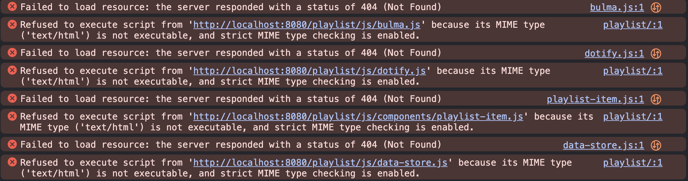

# Data driven playlist

So we have now created the HTML for our playlist, but we still need to add the data to it. We will use JavaScript to do this.

Ensure we have all our JavaScript imported in our HTML file, our `head` should look like:

```html
<head>
    <meta charset="utf-8">
    <meta name="viewport" content="width=device-width, initial-scale=1">
    <title>Dotify - Your.Music</title>
    <link rel="icon" type="image/png" sizes="32x32" href="/images/favicon.png" />
    <link rel="stylesheet" href="https://cdn.jsdelivr.net/npm/bulma@0.9.4/css/bulma.min.css" />
    <script src="js/bulma.js"></script>
    <script src="js/dotify.js"></script>
    <script src="js/components/playlist-item.js"></script>
    <script src="js/data-store.js"></script>
</head>
```

Make a copy of playlist.html as it will be useful to have the original file to refer back to.

The next step is to remove the hardcoded HTML from our `main` element, our main simply now becomes:

```html
    <main class="columns is-multiline box has-background-grey-darker is-centered is-vcentered">
        <div class="column is-12 has-text-centered has-text-white">
            <p class="is-size-1"></p>
        </div>
    </main>
```


So let's add an area for our playlist title.

In the `p` element, add an id of `playlist-title`:

```html
    <main class="columns is-multiline box has-background-grey-darker is-centered is-vcentered">
        <div class="column is-12 has-text-centered has-text-white">
            <p id="playlist-title" class="is-size-1"></p>
        </div>
    </main>
```

OK, check your browser console, we can see that we have JavaScript import errors:



If we revisit our `head` we can see that we are using relative paths for our JavaScript imports. We need to change these to absolute paths.

```html
    <script src="js/bulma.js"></script>
    <script src="js/dotify.js"></script>
    <script src="js/components/playlist-item.js"></script>
    <script src="js/data-store.js"></script>
```

This worked for index as eleventy puts the index.html in the root of the site, but for playlist.html it is in a subfolder. We need to change the paths to be absolute.

```html
    <script src="/js/bulma.js"></script>
    <script src="/js/dotify.js"></script>
    <script src="/js/components/playlist-item.js"></script>
    <script src="/js/data-store.js"></script>
```

Note that this will also be correct in our index, so update that too.

Now in the `head` underneath the JavaScript imports, add a script tag:

```html
<script>
    document.addEventListener('DOMContentLoaded', () => {
        // hardcode which playlist for now to Chill
        const playlist = dotify.dataStore.list().find(item => item.name === "Chill");
        console.log(playlist);
    });
</script>
```

Revisiting all of this:

`    document.addEventListener('DOMContentLoaded',` will wait for the DOM to be fully loaded before running the code inside the function.

```javascript
() => {
        // hardcode which playlist for now to Chill
        const playlist = dotify.dataStore.list().find(item => item.name === "Chill");
        console.log(playlist);
    }
```

This in an arrow function that will query the data store for the playlist with the name "Chill" and log it to the console.

`dotify.dataStore.list()` returns an array and we can then find the correct playlist by using the `find` method. This will return the first item in the array that matches the condition in the function.

If we now refresh the page, we can see that the playlist object is logged to the console:


Let's set our playlist title to the name of the playlist. In the `DOMContentLoaded` function, add the following line:

```javascript
document.getElementById('playlist-title').textContent = playlist.name;
```

Such that, our entire script now looks like:

```html
    <script>
        document.addEventListener('DOMContentLoaded', () => {
            // hardcode which playlist for now to Chill
            const playlist = dotify.dataStore.list().find(item => item.name === "Chill");
            document.getElementById('playlist-title').textContent = playlist.name;
        });
    </script>
```


Great, our title is now data driven.

Let's add the playlist item to the left so as before in `index.html` we can do the following:

```javascript
const main = document.querySelector('main');
main.innerHTML = main.innerHTML + dotify.components.createPlaylistItem(playlist);
```

Our entire script now looks like:

```html
    <script>
        document.addEventListener('DOMContentLoaded', () => {
            // hardcode which playlist for now to Chill
            const playlist = dotify.dataStore.list().find(item => item.name === "Chill");
            document.getElementById('playlist-title').textContent = playlist.name;

            const main = document.querySelector('main');
            main.innerHTML = main.innerHTML + dotify.components.createPlaylistItem(playlist);
        });
    </script>
```


Notice that we have added our playlist item and that we have the dev console open as we are working away so that we see any errors that may occur.

Also notice how we have reused a bunch of code from last week. This is the power of components and data driven development. We can reuse code and data to create new features.

Hopefully, this has given you a solid sense of achievement that all your work was worth it.
