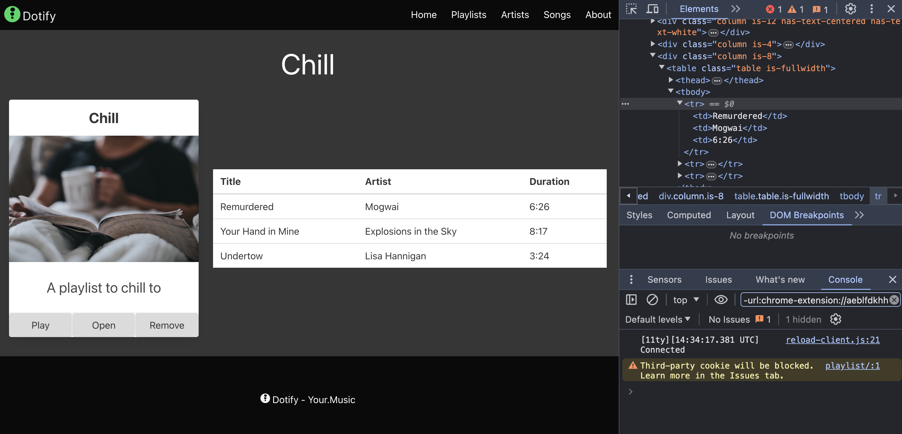

# The Table Component

In this section, we will create a table component that will display the playlist items. This will be a simple table with a header row and a row for each playlist item.

Let's review our existing component in `js/components/playlist-item.js`:

```javascript
window.dotify.components.createPlaylistItem = (playlist) => {
    return `
    <div class="column is-4">
      <section class="card has-text-centered">
        <header class="card-header">
          <p class="card-header-title is-size-4 is-centered">
            ${playlist.name}
          </p>
        </header>
        <div class="card-image">
          <figure class="image">
            
          </figure>
        </div>
        <article class="card-content">
          <p class="content is-size-4">
            ${playlist.description}
          </p>
        </article>
        <footer class="card-footer">
          <button class="card-footer-item button has-background-grey-lighter">Play</button>
          <button class="card-footer-item button has-background-grey-lighter">Open</button>
          <button class="card-footer-item button has-background-grey-lighter">Remove</button>
        </footer>
      </section>
    </div>`
};
```

Taking inspiration from this, let's create a new component in `js/components/playlist-list.js`.  `playlist-list` may sound strange but naming our component `playlist-table` would imply that this component will always be a table, maybe it will, but using a generic name allows us to change the implementation later without changing the name.

```javascript
window.dotify.components.createPlaylistList = (songs) => {
};
```
OK, so this is the basic structure of our component. We will pass in an array of songs and return a string that represents the HTML for the component.

The first thing we need to do is update our data model to include the songs. In `js/data-store.js` add a songs array to the first playlist:

```javascript
dotify.dataStore.data = [
    {
        name: "Chill",
        description: "A playlist to chill to",
        imageUrl: "https://source.unsplash.com/person-holding-coffee-mug-cspncX4cUnQ",
        songs: [{
            artist: "Mogwai",
            title: "Remurdered",
            duration: "6:26"
        }, {
            artist: "Explosions in the Sky",
            title: "Your Hand in Mine",
            duration: "8:17"
        }, {
            artist: "Lisa Hannigan",
            title: "Undertow",
            duration: "3:24"
        }]
    },
    {
        name: "Focus",
        description: "A playlist to focus to",
        imageUrl: "https://source.unsplash.com/person-holding-camera-lens-7KLa-xLbSXA"
    },
    {
        name: "Let Off Steam",
        description: "A playlist for one of those days",
        imageUrl: "https://source.unsplash.com/black-and-white-electric-guitar-TW-wknV1oZo"
    },
    {
        name: "Rock",
        description: "Rock your socks",
        imageUrl: "https://source.unsplash.com/grayscale-photo-of-person-in-hoodie-top-watching-a-concert-97p-JwqdyW4"
    }
]

dotify.dataStore.list = () => {
    return dotify.dataStore.data
}
```

Zooming in:

```javascript
{
    name: "Chill",
    description: "A playlist to chill to",
    imageUrl: "https://source.unsplash.com/person-holding-coffee-mug-cspncX4cUnQ",
    songs: [{
        artist: "Mogwai",
        title: "Remurdered",
        duration: "6:26"
    }, {
        artist: "Explosions in the Sky",
        title: "Your Hand in Mine",
        duration: "8:17"
    }, {
        artist: "Lisa Hannigan",
        title: "Undertow",
        duration: "3:24"
    }]
    }
```

We now have an array of songs in the `Chill` playlist. We will use this data in our new component.

For our component we will:

1. Create a table that is 8 columns wide.
2. The first row will be the header row with the columns `Artist`, `Title`, and `Duration`.
3. For each song, we will create a row with the artist, title, and duration.

Let's give that a try:

```javascript
window.dotify.components.createPlaylistList = (songs) => {
    let list = `
    <div class="column is-8">
        <table class="table is-fullwidth">
            <thead>
                <tr>
                    <th>Title</th>
                    <th>Artist</th>
                    <th>Duration</th>
                </tr>
            </thead>
            <tbody>
`
    songs.forEach(song => {
        list += `
                <tr>
                    <td>${song.title}</td>
                    <td>${song.artist}</td>
                    <td>${song.duration}</td>
                </tr>
        `
    })
    return list += `
            </tbody>
        </table>
    </div>
    `
}
```

There's a lot going here.  First we create a string that includes some hardcoded information:

```javascript
    let list = `
    <div class="column is-8">
        <table class="table is-fullwidth">
            <thead>
                <tr>
                    <th>Title</th>
                    <th>Artist</th>
                    <th>Duration</th>
                </tr>
            </thead>
            <tbody>
`
```

Then we loop through each song in the `songs` array and add a row to the table for each song:

```javascript
    songs.forEach(song => {
        list += `
                <tr>
                    <td>${song.title}</td>
                    <td>${song.artist}</td>
                    <td>${song.duration}</td>
                </tr>
        `
    })
```

Finally, we close the table and return the string:

```javascript
    return list += `
            </tbody>
        </table>
    </div>
    `
```

Now we need to update our `playlist.html` to use this new component.

In the `head` add a script tag to import the new component:

```html
    <script src="/js/components/playlist-item.js"></script>
    <script src="/js/components/playlist-list.js"></script>
```

Now add to the `main` element by passing the playlists songs to `createPlaylistList`:

```javascript
main.innerHTML = main.innerHTML + dotify.components.createPlaylistList(playlist.songs);
```

Let's see the full script:

```javascript
document.addEventListener('DOMContentLoaded', () => {
    // hardcode which playlist for now to Chill
    const playlist = dotify.dataStore.list().find(item => item.name === "Chill");
    document.getElementById('playlist-title').textContent = playlist.name;

    const main = document.querySelector('main');
    main.innerHTML = main.innerHTML + dotify.components.createPlaylistItem(playlist);
    main.innerHTML = main.innerHTML + dotify.components.createPlaylistList(playlist.songs);
});
```

If we refresh the page, we can see the table of songs:



The createPlaylistList component is working as expected but it is a little hard to read. We can improve this in the following way:

```javascript
window.dotify.components.createPlaylistList = (songs) => {
    const songsToRows = songs.map(song => {
        return `
        <tr>
            <td>${song.title}</td>
            <td>${song.artist}</td>
            <td>${song.duration}</td>
        </tr>`
    });
    return  `
    <div class="column is-8">
        <table class="table is-fullwidth">
            <thead>
                <tr>
                    <th>Title</th>
                    <th>Artist</th>
                    <th>Duration</th>
                </tr>
            </thead>
            <tbody>
            ${songsToRows.join()}
            </tbody>
        </table>
    </div>`
}
```

Here we use the `map` function to create an array of strings for each song. We then use the `join` function to join the array of strings into a single string.  This results in the return statement being much cleaner and you can see the structure of the table more clearly.  This makes the component easier to read and maintain.

Take a step back and add some console logs to the `createPlaylistList` function to see what is happening:

```javascript
window.dotify.components.createPlaylistList = (songs) => {
    console.log('songs', songs);
    const songsToRows = songs.map(song => {
        console.log('song', song);
        return `
        <tr>
            <td>${song.title}</td>
            <td>${song.artist}</td>
            <td>${song.duration}</td>
        </tr>`
    });
    console.log('songsToRows', songsToRows);
    return  `
    <div class="column is-8">
        <table class="table is-fullwidth">
            <thead>
                <tr>
                    <th>Title</th>
                    <th>Artist</th>
                    <th>Duration</th>
                </tr>
            </thead>
            <tbody>
            ${songsToRows.join()}
            </tbody>
        </table>
    </div>`
}
```

You could even add breakpoints as we have done in previous labs.

Our entire HTML for `playlist.html` now looks like:

```html
<!DOCTYPE html>
<html class="has-background-black" lang="en">

<head>
    <meta charset="utf-8">
    <meta name="viewport" content="width=device-width, initial-scale=1">
    <title>Dotify - Your.Music</title>
    <link rel="icon" type="image/png" sizes="32x32" href="/images/favicon.png" />
    <link rel="stylesheet" href="https://cdn.jsdelivr.net/npm/bulma@0.9.4/css/bulma.min.css" />
    <script src="/js/bulma.js"></script>
    <script src="/js/dotify.js"></script>
    <script src="/js/components/playlist-item.js"></script>
    <script src="/js/components/playlist-list.js"></script>
    <script src="/js/data-store.js"></script>
    <script>
        document.addEventListener('DOMContentLoaded', () => {
            // hardcode which playlist for now to Chill
            const playlist = dotify.dataStore.list().find(item => item.name === "Chill");
            document.getElementById('playlist-title').textContent = playlist.name;

            const main = document.querySelector('main');
            main.innerHTML = main.innerHTML + dotify.components.createPlaylistItem(playlist);
            main.innerHTML = main.innerHTML + dotify.components.createPlaylistList(playlist.songs);
        });
    </script>
</head>

<body>
    <!-- START NAV -->
    <nav class="navbar has-background-black">
        <div class="navbar-brand">
            <a class="navbar-item" href="#">
                
            </a>
            <span class="navbar-burger has-background-black" data-target="navbarMenu" aria-expanded="false">
                <span aria-hidden="true"></span>
                <span aria-hidden="true"></span>
                <span aria-hidden="true"></span>
            </span>
        </div>
        <div id="navbarMenu" class="navbar-menu">
            <div class="navbar-end has-background-black">
                <a class="navbar-item has-text-white">
                    Home
                </a>
                <a class="navbar-item has-text-white">
                    Playlists
                </a>
                <a class="navbar-item has-text-white">
                    Artists
                </a>
                <a class="navbar-item has-text-white">
                    Songs
                </a>
                <a class="navbar-item has-text-white">
                    About
                </a>
            </div>
        </div>
    </nav>
    <!-- END NAV -->

    <main class="columns is-multiline box has-background-grey-darker is-centered is-vcentered">
        <div class="column is-12 has-text-centered has-text-white">
            <p id="playlist-title" class="is-size-1"></p>
        </div>
    </main>

    <footer class="footer has-background-black has-text-white">
        <div class="container">
            <div class="content has-text-centered">
                <p>
                     Dotify - Your.Music
                </p>
            </div>
        </div>
    </footer>
</body>

</html>
```