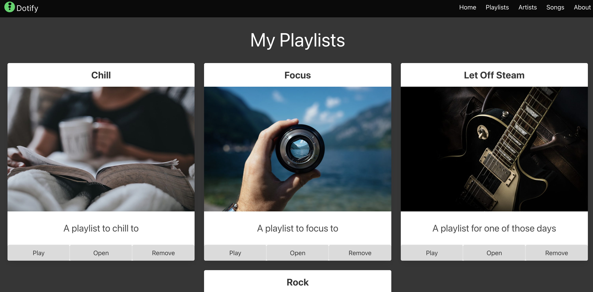

# Linking our Pages Together

We now have two pages in our site but they are living in isolation.

index.html:




playlists.html:


The first step we'll take is augment the `Open` button on the index page to link to the playlist page.

To keep things simple, we will augment our `Open` button from a `button` to an `a` tag. This will allow us to link to the playlist page without the use of JavaScript events.

Open up `js/components/playlist-item.js` and change the `button` to an `a` tag:

From:

```html
<button class="card-footer-item button has-background-grey-lighter">Play</button>
<button class="card-footer-item button has-background-grey-lighter">Open</button>
<button class="card-footer-item button has-background-grey-lighter">Remove</button>
```

To:

```html
<a class="card-footer-item button has-background-grey-lighter">Play</a>
<a href="/playlist" class="card-footer-item button has-background-grey-lighter">Open</a>
<a class="card-footer-item button has-background-grey-lighter">Remove</a>
```

Also note that we have added an `href` attribute to the `a` tag in the middle, the `Open` button. This is the URL that the browser will navigate to when the link is clicked.

Also note that our link still looks and behaves like a button. This is because we have kept the `button` class on the `a` tag.

Click the button on the chill playlist and you should be taken to the playlist page.

OK, now click the button on the focus playlist and you should be taken to the playlist page.....

But wait a minute:


This isn't the Focus playlist, this is the Chill playlist. What's going on?

The issue is that we are hardcoding the playlist name in the JavaScript on the playlist page. We need to pass the playlist name from the index page to the playlist page.

We can do this by adding a query parameter to the URL. This is a key value pair that is added to the URL after a `?`. For example:

```
http://localhost:8080/playlist?name=Focus
```

We can then read this query parameter in the JavaScript on the playlist page.

First, let's update the `href` attribute on the `a` tag in `js/components/playlist-item.js` to include the query parameter:

```html
<a href="/playlist?name=${playlist.name}" class="card-footer-item button has-background-grey-lighter">Open</a>
```

This will add the query parameter `name` with the value of the playlist name to the URL.

Click it and notice that our query parameter disappears....


This is due to how the web server that Eleventy uses is configured to redirect `/playlist` to `/playlist/`. This is a common configuration to ensure that all URLs end with a `/` or a file extension.

To fix this, we need to update the `href` attribute to include the trailing `/` in `js/components/playlist-item.js`:

```html
<a href="/playlist/?name=${playlist.name}" class="card-footer-item button has-background-grey-lighter">Open</a>
```


Now when we refresh and click the `Open` button on the Focus playlist, we are taken to the playlist page with the query parameter in the URL:


Now we need to read this query parameter in the JavaScript on the playlist page.


Open `playlist.html` and add the following script tag to the head:

```html
<script>
    document.addEventListener('DOMContentLoaded', () => {
        const urlParams = new URLSearchParams(window.location.search);
        const playlistName = urlParams.get('name');
        console.log(playlistName);
        // remaining code below
    });
</script>
```

Open up your console, you should see the name:


Great!  Now, let's use it to select the correct playlist from the data store.

```html
<script>
    document.addEventListener('DOMContentLoaded', () => {
        const urlParams = new URLSearchParams(window.location.search);
        const playlistName = urlParams.get('name');

        const playlist = dotify.dataStore.list().find(item => item.name === playlistName);
        document.getElementById('playlist-title').textContent = playlist.name;

        const main = document.querySelector('main');
        main.innerHTML = main.innerHTML + dotify.components.createPlaylistItem(playlist);
        main.innerHTML = main.innerHTML + dotify.components.createPlaylistList(playlist.songs);
    });
</script>
```

Zooming in a bit:

```javascript
const urlParams = new URLSearchParams(window.location.search);
const playlistName = urlParams.get('name');

const playlist = dotify.dataStore.list().find(item => item.name === playlistName);
```

We replaced the hardcoded playlist name with the query parameter. We then use this to find the correct playlist in the data store.

Check out the documentation for UrlSearchParams [here](https://developer.mozilla.org/en-US/docs/Web/API/URLSearchParams).