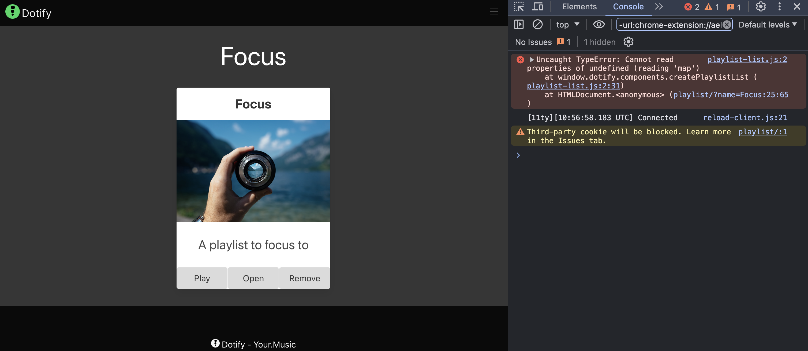
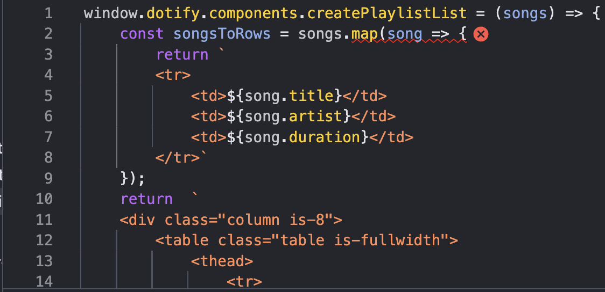
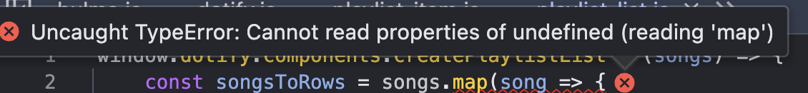
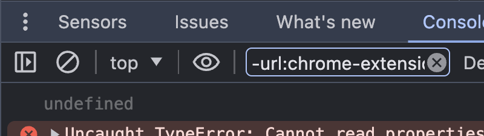
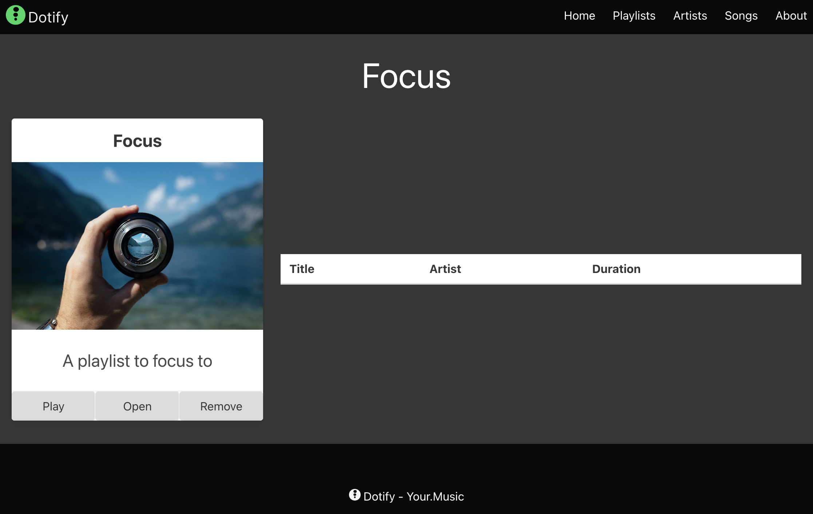

# We got problems....

OK, we can successfully link to our playlist page but try to click any other playlist and see what happens.



Oh, not good.  We have an error.

```text
Uncaught TypeError: Cannot read properties of undefined (reading 'map')
    at window.dotify.components.createPlaylistList (playlist-list.js:2:31)
    at HTMLDocument.<anonymous> (playlist/?name=Focus:25:65)
window.dotify.components.createPlaylistList @ playlist-list.js:2
(anonymous) @ playlist/?name=Focus:25
reload-client.js:21
```
``
Click the link to `playlist-list.js:2:31` and the source code will be highlighted.





So, something is undefined, let's add some console logs to see what is going on.

```javascript
window.dotify.components.createPlaylistList = (songs) => {
    console.log(songs);
    const songsToRows = songs.map(song => {
        return `
        <tr>
```

Ah, it looks as though our `songs` array is undefined.



Interesting, our focus playlist has no songs, we should add some, but, before then, let's make our page happy by dealing with the issue.

We have a couple of options, we could check if the songs array is undefined before we try to map it, or we could provide a default value.

Let's go with the default value.

```javascript
window.dotify.components.createPlaylistList = (songs = []) => {
    const songsToRows = songs.map(song => {
        return `
        <tr>
```
OK, so what we have done here is use a `default parameter` in the function definition.  This will set the value of `songs` to an empty array if it is not provided.

```javascript
(songs = []) => {}
```

Try it out and see if it works.



As you can see, our page now renders.

If we had used an if statement to check if `songs` was undefined, it would look like this:

```javascript
window.dotify.components.createPlaylistList = (songs) => {
    if (!songs) {
        return '';
    }
    const songsToRows = songs.map(song => {
        return `
        <tr>
```

But here we have now increased the complexity of our code by adding an if statement and we also have to consider what to return.

By defaulting the value via a `default parameter`, we get the table with it's heading but with no rows if there are no songs.  This helps the page render correctly and is a simpler solution.

This is an example of `defensive programming` where we anticipate potential issues and handle them in a way that allows the program to continue running.

It must be said that if we created an application with `data validation` we would not have this issue, that is, not allow a playlist object be created without an array called songs, but we are keeping things simple for now.

It is possible to be too defensive in your programming and it can lead to code that is difficult to read and maintain but in this case it is a simple solution.  As you grow as a software engineer you will learn when to be defensive and when not to be.

## Exercise
Add some songs to your focus playlist and see if they render, go to `/js/datastore`.
