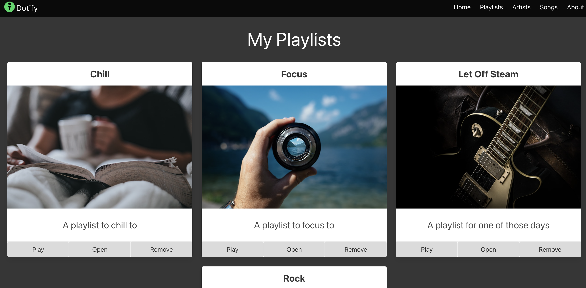
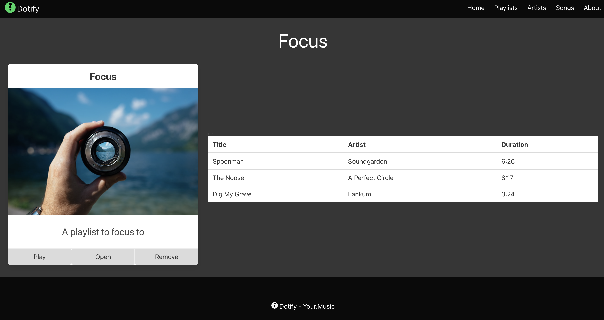
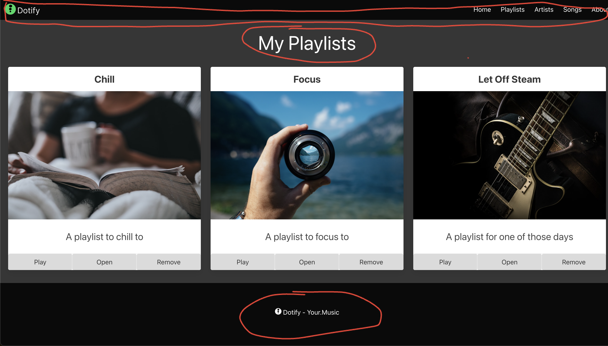
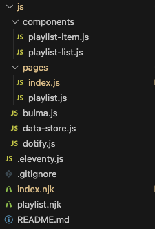

# Templates

We now have 2 pages in our site, the index and the playlist page.  We have a lot of repeated code in these pages, so let's refactor this into a template.

Let's review both pages.

`index.html`:



`playlist.html`:



Let's review the html for the index page:

```html
<!DOCTYPE html>
<html class="has-background-black" lang="en">

<head>
  <meta charset="utf-8">
  <meta name="viewport" content="width=device-width, initial-scale=1">
  <title>Dotify - Your.Music</title>
  <link rel="icon" type="image/png" sizes="32x32" href="/images/favicon.png" />
  <link rel="stylesheet" href="https://cdn.jsdelivr.net/npm/bulma@0.9.4/css/bulma.min.css" />
  <script src="/js/bulma.js"></script>
  <script src="/js/dotify.js"></script>
  <script src="/js/components/playlist-item.js"></script>
  <script src="/js/data-store.js"></script>
  <script>
    document.addEventListener('DOMContentLoaded', () => {
      const main = document.querySelector('main');
      dotify.dataStore.list().forEach((playlist) => {
        main.innerHTML = main.innerHTML + dotify.components.createPlaylistItem(playlist);
      });
    });
  </script>
</head>

<body>
  <!-- START NAV -->
  <nav class="navbar has-background-black">
    <div class="navbar-brand">
      <a class="navbar-item" href="#">
        
      </a>
      <span class="navbar-burger has-background-black" data-target="navbarMenu" aria-expanded="false">
        <span aria-hidden="true"></span>
        <span aria-hidden="true"></span>
        <span aria-hidden="true"></span>
      </span>
    </div>
    <div id="navbarMenu" class="navbar-menu">
      <div class="navbar-end has-background-black">
        <a class="navbar-item has-text-white">
          Home
        </a>
        <a class="navbar-item has-text-white">
          Playlists
        </a>
        <a class="navbar-item has-text-white">
          Artists
        </a>
        <a class="navbar-item has-text-white">
          Songs
        </a>
        <a class="navbar-item has-text-white">
          About
        </a>
      </div>
    </div>
  </nav>
  <!-- END NAV -->

  <main class="columns is-multiline box has-background-grey-darker is-centered">
    <div class="column is-12 has-text-centered has-text-white">
      <p class="is-size-1">My Playlists</p>
    </div>
  </main>

  <footer class="footer has-background-black has-text-white">
    <div class="container">
      <div class="content has-text-centered">
        <p>
           Dotify - Your.Music
        </p>
      </div>
    </div>
  </footer>
</body>

</html>
```

We can likely create a layout that reuses the red circle pieces below:



To create a layout, we need to create a new file in the `_includes` folder called `layout.njk`.

```html
<!DOCTYPE html>
<html class="has-background-black" lang="en">

<head>
  <meta charset="utf-8" />
  <meta name="viewport" content="width=device-width, initial-scale=1" />
  <title>Dotify - Your.Music</title>
  <link rel="icon" type="image/png" sizes="32x32" href="/images/favicon.png" />
  <link rel="stylesheet" href="https://cdn.jsdelivr.net/npm/bulma@0.9.4/css/bulma.min.css" />
  <script src="/js/bulma.js"></script>
  <script src="/js/dotify.js"></script>
  <script src="/js/components/playlist-item.js"></script>
  <script src="/js/data-store.js"></script>
  
    <script src="{{ script }}"></script>
  
</head>

<body>
  
  <main class="columns is-multiline box has-background-grey-darker is-centered is-vcentered">
    
    {{ content | safe }}
  </main>
  
</body>

</html>
```

Alright, let's break this down.

We have a `layout.njk` file that contains the structure of our page.  

Notice our script tag is now a conditional.  This is because we may want to include a script on a page we will pass this in as a variable when we render the page.  If there's no script, we will add the tag (and cause an error/warning log that might confuse us in the future, keep it clean folks.)

We have a `nav` and `footer` that are included in the layout.  We also have a `main` element that contains a `header` element with an `id` of `page-heading`.  This is where we will place the title of the page.

We also have a `content` block that will be replaced with the content of the page.

Now let's create each of the partials to fit in our layout.

First, let's create the `nav.njk` file in the `_includes` folder.

```html
  <nav class="navbar has-background-black">
    <div class="navbar-brand">
      <a class="navbar-item" href="#">
        
      </a>
      <span class="navbar-burger has-background-black" data-target="navbarMenu" aria-expanded="false">
        <span aria-hidden="true"></span>
        <span aria-hidden="true"></span>
        <span aria-hidden="true"></span>
      </span>
    </div>
    <div id="navbarMenu" class="navbar-menu">
      <div class="navbar-end has-background-black">
        <a class="navbar-item has-text-white">
          Home
        </a>
        <a class="navbar-item has-text-white">
          Playlists
        </a>
        <a class="navbar-item has-text-white">
          Artists
        </a>
        <a class="navbar-item has-text-white">
          Songs
        </a>
        <a class="navbar-item has-text-white">
          About
        </a>
      </div>
    </div>
  </nav>
```

Now the `header.njk` file in the `_includes` folder.

```html
  <header class="column is-12 has-text-centered has-text-white">
    <p id="page-heading" class="is-size-1">{{ title }}</p>
  </header>
```

Note the change to the `id` in the `p` element to `page-heading` and the addition of the `title` variable.  Also note that we moved to a `header` element from a `div` element to be more semantically correct.

Great, next we create the `footer.njk` file in the `_includes` folder.

```html
  <footer class="footer has-background-black has-text-white">
    <div class="container">
      <div class="content has-text-centered">
        <p>
           Dotify - Your.Music
        </p>
      </div>
    </div>
  </footer>
```


OK, let's try use this, make a directory `js` directory `js/pages` folder called `index.js` and add the following from `index.html`:

```javascript
document.addEventListener('DOMContentLoaded', () => {
  const main = document.querySelector('main');
  dotify.dataStore.list().forEach((playlist) => {
    main.innerHTML = main.innerHTML + dotify.components.createPlaylistItem(playlist);
  });
});
```

Now let's update our `index.html` file to use the layout.

Rename `index.html` to `index.njk` and update the file to use the layout as follows:

```html
---
layout: layout.njk
title: My Playlists
script: /js/pages/index.js
---

{# Currently all content is dynamic but you can add content here to save on javascript #}
```

This is certainly interesting, we've abstracted ourselves into a place where we have no actual content in our `index.njk` file.

I will admit this is a little jarring but let's run with it and see how we do, we added a comment to remind us that we can add content here if we want to save on JavaScript and prove that we "meant to do this".

OK, delete your `_site` folder and run `eleventy --serve` to rebuild your site.

Your `http://localhost:8080` should look the same as before.

If you have issues:

1. Ensure you create the `js/pages` directory and the `index.js` file.
2. Ensure you have the `layout.njk`, `nav.njk`, `header.njk`, and `footer.njk` files in the `_includes` folder.
3. Ensure you have updated the `index.njk` file to use the layout as above.

# Exercise

If all is in working order, let's do the same for the `playlist.html` file.

1. Create playlist.js in the `js/pages` folder.
2. Copy the JavaScript from `playlist.html` to `playlist.js` (do not include the script tags)
3. Update the `playlist.html` file to use the layout.


