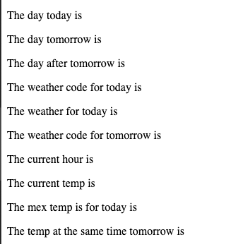
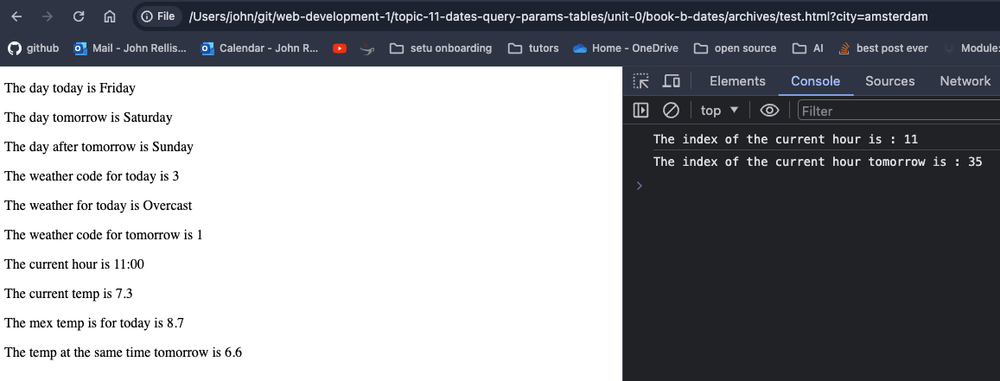
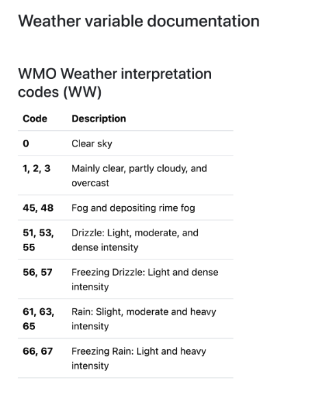

# Using Day JS to access and format Data

Download the zip file from [here](./archives/Archive.zip) and extract it.

Open up `test.html`.



Let's look at the source code:

```html
<html lang="en">
<head>
    <meta charset="UTF-8">
    <meta name="viewport" content="width=device-width, initial-scale=1.0">
    <title>Test Data</title>
    <script src="lab_weather_data.js"></script>
    <script src="https://cdn.jsdelivr.net/npm/dayjs@1/dayjs.min.js"></script>
    <script>
        document.addEventListener("DOMContentLoaded", () => {
            const urlParams = new URLSearchParams(window.location.search);
            const currentCity = urlParams.get('city');
            const dailyData = weatherData[currentCity + "_daily"].daily
            const hourlyData = weatherData[currentCity + "_hourly"].hourly
```

Specifically:

```javascript
const urlParams = new URLSearchParams(window.location.search);
const currentCity = urlParams.get('city');
```

This looks as though we need to pass a query parameter to the URL to get the data for a specific city.

Let's try that, add `?city=amsterdam` after `test.html` in the URL.

The data for amsterdam should now be displayed in the console.



You can see from the source code that we are using the `weatherData` object to get the data for the city.

```javascript
const urlParams = new URLSearchParams(window.location.search);
const currentCity = urlParams.get('city');
const dailyData = weatherData[currentCity + "_daily"].daily
const hourlyData = weatherData[currentCity + "_hourly"].hourly

let weather = 'Unknown'
const weatherCode = dailyData.weather_code[0];
if(weatherCode === 0){
    weather = "Clear Sky"; // or weatherImage = /images/weatherIcons/clearsky.png
} else if(weatherCode >= 1 && weatherCode <= 3){
    weather = "Overcast"; // or weatherImage = /images/weatherIcons/overcast.png
}
```

We then find the HTML elements and set the values:

```javascript
const weatherCodeTodayElement = document.getElementById("weatherCodeToday");
const weatherTodayElement = document.getElementById("weatherToday");
const weatherCodeTomorrowElement = document.getElementById("weatherCodeTomorrow");

weatherCodeTodayElement.innerHTML = weatherCode;
weatherTodayElement.innerHTML = weather;
weatherCodeTomorrowElement.innerHTML = dailyData.weather_code[1];
```


Note:



Moving dow the file you can see the use of day.js

```javascript
const now = dayjs(); // create a new date object that represents this time
const currentHour = now.hour(); // 0 - 23 as a number
```

And usage of dayjs to format:

```javascript
dayElement.innerHTML = now.format("dddd");
tomorrowElement.innerHTML = now.add(1, 'day').format("dddd");
dayAfterTomorrowElement.innerHTML = now.add(2, 'day').format("dddd");
```