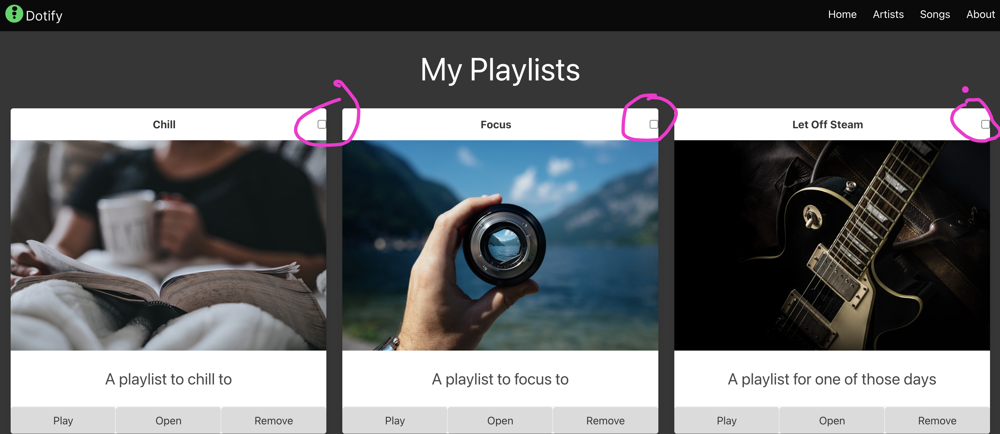

# Favourite Playlists

Either continue from last week or download the source code from the previous lab - [here](./archives/js-playlist-1.6.0.zip)

Alright, time to add a feature to Dotify that allows users to mark playlists as favourites.

Let's take a stab at it.

Step one, we are going to add a checkbox to each playlist item. When the checkbox is checked, the playlist will be marked as a favourite. This won't look pretty, but it will help us get the feature working.

Let's aim for this initially:



So the first thing we need to do is add this our playlist item component.

Open `js/components/playlist-item.js` and add the following code under the `p` element that contains the title

```html
<input type="checkbox" id="fave-${playlist.name}" class="checkbox"/>
```

This makes our entire component look like this:

```javascript
window.dotify.components.createPlaylistItem = (playlist) => {
    return `
    <div class="column is-4">
      <section class="card has-text-centered">
        <header class="card-header">
          <p class="card-header-title is-centered">
            ${playlist.name}
          </p>
          <input type="checkbox" id="fave-${playlist.name}" class="checkbox"/>
        </header>
        <div class="card-image">
          <figure class="image">
            
          </figure>
        </div>
        <article class="card-content">
          <p class="content is-size-4">
            ${playlist.description}
          </p>
        </article>
        <footer class="card-footer">
          <a class="card-footer-item button has-background-grey-lighter">Play</a>
          <a href="/playlist/?name=${playlist.name}" class="card-footer-item button has-background-grey-lighter">Open</a>
          <a class="card-footer-item button has-background-grey-lighter">Remove</a>
        </footer>
      </section>
    </div>`
}
```

This should render a checkbox next to each playlist item title.

Start your eleventy server and check that the checkboxes are rendering correctly.


## Responding to clicks

Now that we have the checkboxes rendering, we need to respond to clicks on them.

Inputs in HTML can have a click event listener attached to them. We can use this to listen for clicks on the checkboxes.  This needs to be added in javascript.

Ip up `js/pages/index.js` and add the following code:

```javascript
  document.querySelectorAll("[id^=fave-]").forEach(checkbox => {
    checkbox.addEventListener('click', (event)=> {
      console.log(event.target);
      console.log(event.target.id)
      console.log(event.target.checked)
    })
  });
  ```

  Our entire `index.js` file should look like this:

  ```javascript
document.addEventListener('DOMContentLoaded', () => {
  const main = document.querySelector('main');
  dotify.dataStore.list().forEach((playlist) => {
    main.innerHTML = main.innerHTML + dotify.components.createPlaylistItem(playlist);
  });
  document.querySelectorAll("[id^=fave-]").forEach(checkbox => {
    checkbox.addEventListener('click', (event)=> {
      console.log(event.target);
      console.log(event.target.id)
      console.log(event.target.checked)
    })
  });
});
```

Zooming back in on the code we just added.

```javascript
document.querySelectorAll("[id^=fave-]")
```

Here we are using querySelectorAll to select all elements that have an id that starts with `fave-`. This is because we have given our checkboxes an id that starts with `fave-` followed by their name. `<input type="checkbox" id="fave-${playlist.name}" class="checkbox"/>`

This is an advanced selector, but it is very useful when you want to select multiple elements that have a common pattern in their id.

Check out the documentation [here](https://www.w3schools.com/cssref/sel_attr_begin.php) and [here](https://developer.mozilla.org/en-US/docs/Web/CSS/Attribute_selectors)

Note that this is only required because we are iterating over a list of playlists and creating a checkbox for each one. If you only had one (or many known) checkbox, you could just give it an id and select it directly.

We then iterate over all of these checkboxes and add a click handler to each one.

```javascript
  document.querySelectorAll("[id^=fave-]").forEach(checkbox => {
    checkbox.addEventListener('click', (event)=> {
      console.log(event.target);
      console.log(event.target.id)
      console.log(event.target.checked)
    })
  });
```

Note that we are passing a function to forEach:
```javascript
(checkbox) => {
    checkbox.addEventListener('click', (event)=> {
      console.log(event.target);
      console.log(event.target.id)
      console.log(event.target.checked)
    })
  }
```

This is a function that takes a checkbox as an argument and adds a click event listener to it. The event listener logs the event target to the console.

Try clicking on the checkboxes and check the console to see the output.


We can see in the console that:

* `event.target` is the checkbox that was clicked
* `event.target.id` is the id of the checkbox that was clicked e.g. `fave-Focus`
* `event.target.checked` is a boolean that tells us if the checkbox is checked or not.

Alright, now refresh the page.

Notice that the checkboxes are unchecked. This is because we are not persisting the state of the checkboxes. We need to store the state of the checkboxes in local storage.