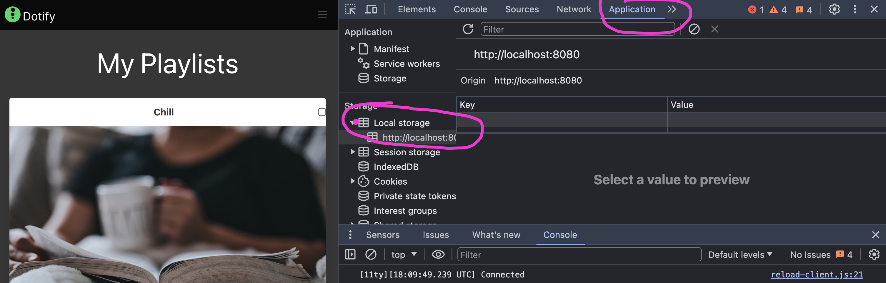
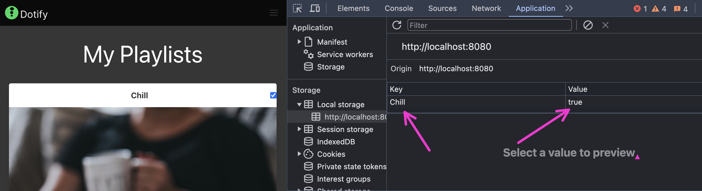
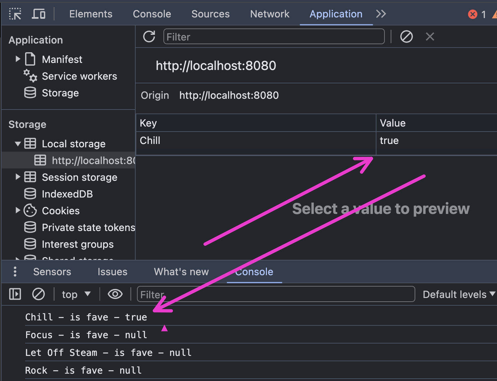
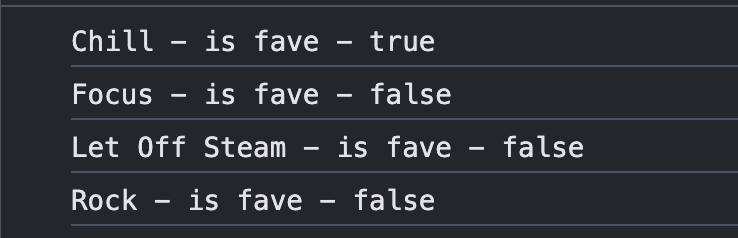
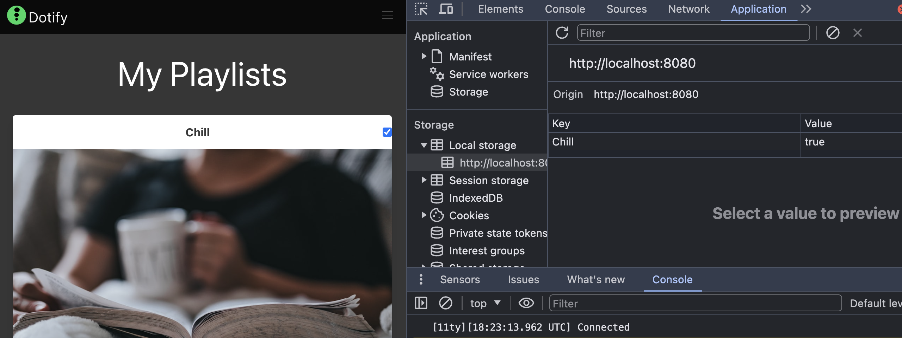
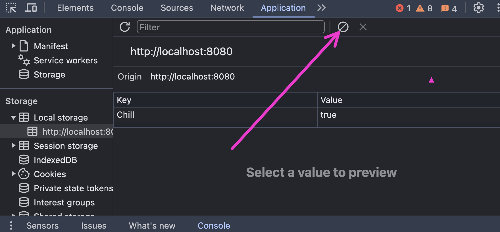

# Local Storage

Local storage is a way to store data in the browser. It is a key-value store that is available to all pages from the same origin. This means that data stored in local storage is available to all pages from the same domain.

Local storage is a great way to store data that you want to persist between page loads. For example, you could use local storage to store user preferences, or to store the state of a form.

In this lesson, we will use local storage to store the state of the checkboxes in our playlist.

## Storing the state of the checkboxes

We will store the state of the checkboxes in local storage. When a checkbox is clicked, we will update the state in local storage.

First, let's create a function that will update the state in local storage.

```javascript
document.querySelectorAll("[id^=fave-]").forEach(checkbox => {
  checkbox.addEventListener('click', (event) => {
    const playlistName = event.target.id.replace('fave-','');
    const isFavourite =  event.target.checked;
    localStorage.setItem(playlistName, isFavourite);
  })
});
```

Now run the site and click with the console open. Navigate to the Application tab in the developer tools, select local storage and you will see the state of the checkboxes stored in local storage when you click on them.



And when you click:



Refresh the page.....

Oh, our checkboxes are still unchecked. This is because we are not reading the state from local storage when the page loads.

## Reading the state of the checkboxes

We will read the state of the checkboxes from local storage when the page loads. We will then set the state of the checkboxes based on the state in local storage.

Let's use console.log to see what is stored in local storage.

Add the following code to the end of your script:

```javascript
  document.querySelectorAll("[id^=fave-]").forEach(checkbox => {
    const playlistName = checkbox.id.replace('fave-','');
    const isFavourite = localStorage.getItem(playlistName);
    console.log(`${playlistName} - is fave - ${isFavourite}`);
  });
```

We can see here that we are iterating over all the checkboxes and getting the state of each one from local storage.



All is not what it seems though, it may look like we are saving boolean values to local storage, but in reality, we are saving strings. This is because local storage can only store strings. When we get the value from local storage, it is a string. We need to convert it to a boolean before we can use it or check it's exact value.

Update the code to convert the string to a boolean:

```javascript
  document.querySelectorAll("[id^=fave-]").forEach(checkbox => {
    const playlistName = checkbox.id.replace('fave-','');
    const isFavourite = localStorage.getItem(playlistName) === 'true';
    console.log(`${playlistName} - is fave - ${isFavourite}`);
  });
```



OK, now we have the state of the checkboxes from local storage. We can now set the state of the checkboxes based on the state in local storage.

```javascript
  document.querySelectorAll("[id^=fave-]").forEach(checkbox => {
    const playlistName = checkbox.id.replace('fave-','');
    const isFavourite = localStorage.getItem(playlistName) === 'true';
    checkbox.checked = isFavourite;
  });
```

Now when we refresh the page, we can see that the checkboxes are checked based on the state in local storage.



Our entire `index.js` file should look like this:

```javascript
document.addEventListener('DOMContentLoaded', () => {
  const main = document.querySelector('main');
  dotify.dataStore.list().forEach((playlist) => {
    main.innerHTML = main.innerHTML + dotify.components.createPlaylistItem(playlist);
  });

  document.querySelectorAll("[id^=fave-]").forEach(checkbox => {
    checkbox.addEventListener('click', (event) => {
      const playlistName = event.target.id.replace('fave-','');
      const isFavourite =  event.target.checked;
      localStorage.setItem(playlistName, isFavourite);
    })
  });

  document.querySelectorAll("[id^=fave-]").forEach(checkbox => {
    const playlistName = checkbox.id.replace('fave-','');
    const isFavourite = localStorage.getItem(playlistName) === 'true';
    checkbox.checked = isFavourite;
  });
});
```

Note that you can clear the local storage by running `localStorage.clear()` in the console or by clicking the clear button in the Application tab in the developer tools.



## Exercise

Experiment with clearing the local storage and refreshing the page. Check that the checkboxes are unchecked when the page loads.

Add some console.logs to the code to help you understand what is happening.